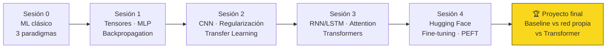

<div align="center">

# 🧠 Deep Learning: de los fundamentos a los Transformers

### Curso completo de 32 horas + nivelación de ML (4 h) — aula virtual en GitHub

**[🌐 Portal interactivo del aula](https://felmco.github.io/deeplearning-class/)** ·
**[📖 Programa académico completo](Programa_Completo_Deep_Learning_Transformers_32h.md)** ·
**[🚀 Proyecto final](proyecto/README.md)**


*Un curso donde cada concepto se explica en cuatro niveles:*
**intuición → representación visual → formulación matemática → implementación verificable**

Autoría: **Future Tales, LLC** · Actualización: julio 2026

</div>

---

## 🎯 ¿Qué es este repositorio?

Este repositorio **es el aula**. No hay slides: todo el contenido del curso vive aquí, en páginas
navegables con fórmulas, diagramas, animaciones, simuladores interactivos, notebooks ejecutables
y código fuente comentado. El curso introduce **Deep Learning** desde sus fundamentos matemáticos
y computacionales hasta el uso práctico de arquitecturas modernas basadas en **Transformers**,
evitando tratar las librerías como una "caja negra".

> **Criterio rector:** primero se construyen tensores, grafos computacionales, funciones de
> pérdida, backpropagation y ciclos de entrenamiento; luego se estudian MLP, CNN, RNN/LSTM,
> atención y Transformers; finalmente se reutilizan modelos preentrenados con Hugging Face y
> se entrega un proyecto reproducible en GitHub.

## 🗺️ Mapa del curso (nivelación + 4 sesiones × 8 horas)

| Sesión | Eje temático | Laboratorio | Material del aula |
|:---:|---|---|---|
| **0** | Nivelación de Machine Learning: supervisado, no supervisado y reforzado; modelos clásicos | Modelos de scikit-learn + Q-learning | [📔 Sesión 0](sesiones/00-fundamentos-ml.md) |
| **1** | Fundamentos: tensores, MLP, activaciones, loss, gradientes, backpropagation, training loop | MLP sobre `make_moons` | [📘 Sesión 1](sesiones/01-fundamentos.md) |
| **2** | Visión y entrenamiento robusto: CNN, convolución, regularización, optimizadores, ResNet, transfer learning | CNN sobre FashionMNIST | [📗 Sesión 2](sesiones/02-cnn-vision.md) |
| **3** | Secuencias y Transformers: embeddings, RNN/LSTM, atención, multi-head, positional encoding | Atención y bloque Transformer desde cero | [📙 Sesión 3](sesiones/03-secuencias-transformers.md) |
| **4** | Modelos preentrenados: Hugging Face, fine-tuning, PEFT/LoRA, evaluación, riesgos, entrega | DistilBERT + proyecto integrador | [📕 Sesión 4](sesiones/04-hugging-face-proyecto.md) |



## 🕹️ Simuladores interactivos del curso

Manipula los conceptos en vivo desde el navegador (GitHub Pages):

| Simulador | Concepto que ilustra |
|---|---|
| [🧪 MLP Playground](https://felmco.github.io/deeplearning-class/interactivos/mlp-playground.html) | Entrena una MLP en tu navegador y observa la frontera de decisión |
| [⛰️ Descenso de gradiente](https://felmco.github.io/deeplearning-class/interactivos/descenso-gradiente.html) | Learning rate, momentum y trayectorias sobre la superficie de pérdida |
| [📈 Funciones de activación](https://felmco.github.io/deeplearning-class/interactivos/activaciones.html) | Sigmoid, tanh, ReLU y GELU con sus derivadas |
| [🔍 Convolución 2D](https://felmco.github.io/deeplearning-class/interactivos/convolucion.html) | Kernels, stride, padding y feature maps paso a paso |
| [🎯 Scaled dot-product attention](https://felmco.github.io/deeplearning-class/interactivos/atencion.html) | Q·Kᵀ, escala, máscara causal y softmax en una matriz interactiva |
| [🌡️ Softmax y temperatura](https://felmco.github.io/deeplearning-class/interactivos/softmax-temperatura.html) | Logits → probabilidades; temperatura, top-k y top-p |
| [🌊 Positional encoding](https://felmco.github.io/deeplearning-class/interactivos/positional-encoding.html) | Ondas sinusoidales que codifican posición |

## 📓 Notebooks de laboratorio

| # | Notebook | Sesión | Contenido |
|:---:|---|:---:|---|
| 00 | [`00_ml_clasico.ipynb`](notebooks/00_ml_clasico.ipynb) | 0 | ML clásico: 5 modelos supervisados, k-means/PCA y Q-learning |
| 00b | [`00b_guia_modelos_clasicos.ipynb`](notebooks/00b_guia_modelos_clasicos.ipynb) | 0 | Guía de campo: cada modelo clásico con fórmula, código comentado y su visualización |
| 01 | [`01_tensors_autograd.ipynb`](notebooks/01_tensors_autograd.ipynb) | 1 | Tensores, shapes, broadcasting y autograd visible |
| 02 | [`02_mlp_training.ipynb`](notebooks/02_mlp_training.ipynb) | 1 | MLP para `make_moons`: training loop, curvas y frontera |
| 03 | [`03_cnn_fashionmnist.ipynb`](notebooks/03_cnn_fashionmnist.ipynb) | 2 | CNN completa: augmentation, BatchNorm, análisis de errores |
| 04 | [`04_sequences_rnn.ipynb`](notebooks/04_sequences_rnn.ipynb) | 3 | Tokenización, embeddings, RNN/LSTM y máscaras |
| 05 | [`05_attention_from_scratch.ipynb`](notebooks/05_attention_from_scratch.ipynb) | 3 | Attention y bloque Transformer desde cero, con pruebas |
| 06 | [`06_hf_finetuning.ipynb`](notebooks/06_hf_finetuning.ipynb) | 4 | Fine-tuning de DistilBERT con `Trainer` de Hugging Face |

## 📂 Estructura del repositorio

```text
deeplearning-class/
├── README.md                  ← estás aquí (portada del aula)
├── Programa_Completo_...md    ← programa académico completo (32 h)
├── sesiones/                  ← las sesiones del curso, 0–4 (el contenido del aula)
├── notebooks/                 ← 8 laboratorios ejecutables
├── src/                       ← código fuente comentado (data, models, train, evaluate, utils)
├── tests/                     ← pruebas de shapes y smoke tests
├── configs/                   ← configuraciones YAML de experimentos (mlp, cnn, transformer)
├── docs/                      ← sitio GitHub Pages: portal + simuladores + figuras
│   ├── index.html             ← portal interactivo del aula
│   ├── interactivos/          ← simuladores HTML/JS
│   └── assets/figuras/        ← visualizaciones y animaciones generadas con Python
├── remotion/                  ← proyecto Remotion: animaciones de video renderizables
├── proyecto/                  ← brief, checkpoints, rúbrica y model card del proyecto final
├── recursos/                  ← simuladores externos, papers, librerías y plataformas
├── app/                       ← demo Gradio del clasificador final
└── .github/                   ← CI (smoke test) y plantilla de pull request
```

## ⚙️ Preparación del entorno

Requisitos: **Python 3.11+**, **VS Code** (extensiones Python y Jupyter), **Git** y cuenta de GitHub.

```bash
# 1. Clonar el repositorio
git clone https://github.com/felmco/deeplearning-class.git
cd deeplearning-class

# 2. Crear y activar el entorno virtual
python -m venv .venv
source .venv/bin/activate        # macOS / Linux
# .venv\Scripts\Activate.ps1     # Windows PowerShell

# 3. Instalar PyTorch según tu hardware (CPU / CUDA / MPS)
#    → usa el selector oficial: https://pytorch.org/get-started/locally/

# 4. Instalar el resto de dependencias
pip install -r requirements.txt

# 5. Registrar el kernel de Jupyter
python -m ipykernel install --user --name deeplearning-class --display-name "Deep Learning Course"

# 6. Verificar la instalación
python -m src.utils
```

## 🧭 Cómo estudiar con este repositorio

1. **Lee la sesión** en `sesiones/` — cada concepto trae intuición, visual, fórmula y código.
2. **Juega con el simulador** correspondiente antes de escribir código: formula una hipótesis.
3. **Ejecuta el notebook** del laboratorio y completa los experimentos obligatorios.
4. **Responde el exit ticket** al final de cada sesión sin mirar tus notas.
5. **Haz commit y push** de tu trabajo siguiendo las [convenciones de Git del curso](recursos/git-flujo.md).

## 📊 Evaluación

| Componente | Peso | Evidencia |
|---|---:|---|
| Quizzes y exit tickets | 10% | Comprensión de shapes, fórmulas y decisiones |
| Laboratorio 1: MLP | 15% | Notebook, curvas, frontera y reflexión |
| Laboratorio 2: CNN | 15% | Experimentos comparados y análisis de errores |
| Laboratorio 3: atención/Transformer | 15% | Implementación, pruebas de shapes y heatmap |
| [Proyecto final](proyecto/README.md) | 40% | Repositorio, modelos, evaluación, demo y model card |
| Participación / revisión de pares | 5% | Pull request y feedback técnico |

**Criterio de aprobación:** 70/100 y entrega reproducible del proyecto.
El [ensayo del curso](proyecto/ensayo.md) puede incorporarse a la ponderación
según la institución donde se dicte.

## 📚 Recursos

- [🔗 Simuladores, sitios y plataformas recomendadas](recursos/README.md)
- [📄 Papers fundamentales comentados](recursos/papers.md)
- [🌿 Flujo de Git/GitHub del curso](recursos/git-flujo.md)
- [🩺 Checklist de debugging de modelos](recursos/debugging.md)
- [🌉 Puente PyTorch ↔ TensorFlow/Keras](recursos/pytorch-keras.md)

## 📜 Licencia y autoría

© 2026 **Future Tales, LLC**.
El **código** se distribuye bajo licencia [MIT](LICENSE) y el **contenido didáctico**
(textos, figuras y diagramas) bajo [CC BY 4.0](https://creativecommons.org/licenses/by/4.0/deed.es).
Ver [CITATION.cff](CITATION.cff) para citar este material.

> Los términos técnicos estándar (loss, batch, attention, fine-tuning…) se conservan en inglés
> de forma deliberada: son el vocabulario de trabajo real de la disciplina.
