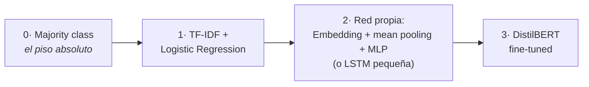

# 🏆 Proyecto final — Clasificador de texto reproducible

> **Un baseline simple, una red neuronal propia y un Transformer, comparados bajo el mismo contrato.**

**Peso en la evaluación:** 40% · **Equipos:** 3–4 estudiantes · **Entrega:** repositorio GitHub + demo + model card + pitch

## Qué vas a entregar

1. Un **repositorio GitHub ejecutable**: cualquier persona puede clonarlo, crear el entorno y reproducir tus resultados.
2. **Tres modelos comparados** con los mismos splits y la misma métrica (ver abajo).
3. La **tabla comparativa** llena, con análisis de los errores más graves.
4. Una **model card** ([plantilla](model-card-template.md)): qué hace el modelo, con qué datos, qué límites y riesgos tiene.
5. Un **pitch de 7 minutos** con evidencia (no solo la interfaz).

## Elige tu ruta

### Ruta guiada (recomendada) — clasificador de sentimiento

Una organización recibe reseñas y necesita clasificarlas como positivas o negativas para priorizar su análisis. ¿Cuánto valor agrega el Deep Learning frente a un método simple, y a qué costo?

**Dataset:** [`cornell-movie-review-data/rotten_tomatoes`](https://huggingface.co/datasets/cornell-movie-review-data/rotten_tomatoes) — 10,662 reseñas de cine en inglés, sentimiento binario, clases balanceadas y splits train/validation/test ya definidos. Cero fricción: todo el material del curso (el [baseline](baseline.md), el [Lab 06](../notebooks/06_hf_finetuning.ipynb), la [config](../configs/transformer.yaml)) ya funciona con él.

### Propuesta propia — tu problema, tu dataset

¿Tienes un problema de clasificación de texto que te importa más? Propónlo: completa la [plantilla de propuesta](propuesta-template.md) y consigue la **aprobación del docente antes del Checkpoint 1**. Sin aprobación explícita, el equipo sigue la ruta guiada. El contrato mínimo de modelos (abajo) aplica igual en ambas rutas.

## Los tres modelos obligatorios (en ambas rutas)

1. **Baseline no neuronal:** TF-IDF + Logistic Regression ([código de partida](baseline.md)). Sin baseline no hay evidencia de valor.
2. **Modelo neuronal propio:** `MeanEmbeddingClassifier` de [`src/models.py`](../src/models.py) (o una LSTM pequeña) con el training loop de [`src/train.py`](../src/train.py).
3. **Transformer:** DistilBERT fine-tuned siguiendo el [Lab 06](../notebooks/06_hf_finetuning.ipynb), u otro checkpoint justificado por escrito.

> **Regla sagrada del curso:** toda iteración (hiperparámetros, elección de checkpoint, comparaciones intermedias) se hace contra **validation**. El **test** se usa **UNA sola vez**, al final, para la tabla definitiva.

## Checkpoints

### Checkpoint 1 — Datos y baseline

- Repositorio con entorno documentado y un smoke test (p. ej. `python -c "import torch, transformers, datasets"`).
- Problema definido: entrada, salida, labels, licencia del dataset, riesgos de leakage.
- EDA (*Exploratory Data Analysis*: mirar los datos antes de modelar — distribución de labels, longitudes, ejemplos raros).
- **Hipótesis escritas ANTES de ver resultados** (¿quién ganará y por qué?).
- Majority-class + TF-IDF + Logistic Regression evaluados en validation.
- *Ruta propia:* la propuesta aprobada, commiteada como `propuesta.md` en el repo del equipo.

### Checkpoint 2 — Modelos neuronales

- Modelo neuronal propio con curvas train/validation y **una ablación** (cambiar una sola cosa — hidden size, dropout o learning rate —, reentrenar y comparar).
- Transformer fine-tuned, con el mejor checkpoint elegido en validation.
- Tabla comparativa preliminar **solo con validation** (test sigue intocado).

### Checkpoint 3 — Entrega final

- Evaluación única en test → tabla comparativa definitiva.
- Diez errores de alta confianza, con taxonomía de errores y acción recomendada.
- Demo (app Gradio local o notebook de inferencia) + model card + README completo.
- Pull request final revisado por otro equipo.

## Tabla comparativa obligatoria

| Modelo | Parámetros entrenables | Tiempo de entrenamiento | Accuracy test | Macro-F1 test | Latencia aprox. | Fortalezas | Limitaciones |
|---|---:|---:|---:|---:|---:|---|---|
| Majority | — | — | | | | | |
| TF-IDF + LR | | | | | | | |
| Embedding + MLP/LSTM | | | | | | | |
| DistilBERT fine-tuned | | | | | | | |

> **Protocolo de latencia:** ms por ejemplo, batch=1, en CPU, promediando sobre 1000
> ejemplos; declarar el hardware. No comparar tiempos obtenidos en hardware diferente
> sin declararlo.

## Rúbrica — 100 puntos

| Dimensión | Puntos | Qué evaluamos | Condición limitante |
|---|---:|---|---|
| Datos y diseño experimental | 20 | problema y labels claros; splits y licencia; EDA; riesgos de leakage; hipótesis escritas ANTES de ver resultados; mismo protocolo (splits + métrica) para los tres modelos | usar **test** para elegir hiperparámetros o modelos ⇒ máx. **10/20** aquí y máx. **10/25** en Evaluación |
| Modelos | 30 | los tres modelos obligatorios entrenados correctamente: baseline reproducible, modelo propio con curvas y **una** ablación, Transformer con checkpoint elegido en validation | falta el baseline no neuronal ⇒ máx. **10/30** (sin piso no hay evidencia de valor) |
| Evaluación y análisis de errores | 25 | tabla comparativa completa; matrices de confusión; macro-F1 además de accuracy; diez errores de alta confianza con taxonomía y acciones; discusión de costo/latencia | reportar solo accuracy ⇒ máx. **20/25**; métricas no reproducibles ⇒ máx. **10/25** |
| Reproducibilidad y entrega | 15 | otra persona puede clonar, crear el entorno, correr el smoke test y reproducir el baseline y la inferencia del mejor modelo; model card con sesgo, privacidad, licencia y límites | repositorio no ejecutable o sin instrucciones ⇒ **0/15** y nota total del proyecto limitada a **59/100** |
| Demo y comunicación | 10 | pitch con evidencia (no solo la UI), visuales claros, respuestas técnicas del equipo | — |

> **Integridad:** resultados fabricados anulan el proyecto (0/100). Subir secretos o
> datos sensibles al repositorio exige retirada inmediata y descuenta 5 puntos.

## Presentación final — 7 minutos + 3 de preguntas

1. **Problema y decisión** — 45 s · 2. **Datos y riesgos** — 45 s · 3. **Baseline** — 45 s ·
4. **Modelos y experimento** — 90 s · 5. **Resultados comparativos** — 75 s ·
6. **Errores y limitaciones** — 60 s · 7. **Demo y recomendación** — 60 s

> Mostrar **evidencia**, no solo la UI.

## Definición de terminado ✅

El proyecto está terminado cuando otra persona puede:

1. clonar el repositorio;
2. crear el entorno;
3. ejecutar un smoke test;
4. reproducir al menos el baseline y la inferencia del mejor modelo;
5. encontrar las configuraciones y métricas;
6. comprender usos y limitaciones **sin hablar con el equipo**.

---

| [🏠 Inicio](../README.md) | [Baseline de partida](baseline.md) | [Plantilla de propuesta](propuesta-template.md) | [Plantilla de model card](model-card-template.md) |
|---|---|---|---|
