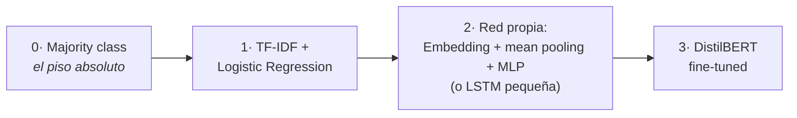

# 🏆 Proyecto final — Clasificador de texto reproducible

> **Baseline, red neuronal propia y Transformer, comparados bajo el mismo contrato.**

**Peso en la evaluación:** 40% · **Equipos:** 3–4 estudiantes · **Entrega:** repositorio GitHub + demo + model card

## Contexto

Una organización necesita clasificar mensajes o reseñas para priorizar análisis y respuesta.
El equipo debe demostrar que una solución basada en Deep Learning **aporta valor frente a un
baseline**, y debe documentar límites, errores y condiciones de uso.

## Pregunta central

> ¿Qué combinación de representación, arquitectura y estrategia de entrenamiento ofrece el
> mejor equilibrio entre desempeño, costo, reproducibilidad e interpretabilidad para el problema?

## Dataset

**Principal:** [`rotten_tomatoes`](https://huggingface.co/datasets/rotten_tomatoes) —
clasificación binaria de sentimiento, tamaño manejable, splits listos, clases balanceadas.

**Alternativas** (verificar disponibilidad, licencia y costo antes):
`ag_news` (multiclase, más cómputo), un dataset de reseñas en español del Hub que el
docente valide ese semestre (`amazon_reviews_multi` fue retirado del Hub — no contar con
él), o un dataset institucional anonimizado **solo** con autorización y control de
privacidad.

## Modelos mínimos (los tres son obligatorios)

1. **Baseline no neuronal:** TF-IDF + Logistic Regression ([código de partida](baseline.md)).
2. **Modelo neuronal propio:** `MeanEmbeddingClassifier` de [`src/models.py`](../src/models.py)
   (o una LSTM pequeña) con el training loop de [`src/train.py`](../src/train.py).
3. **Transformer:** DistilBERT fine-tuned siguiendo el [Lab 06](../notebooks/06_hf_finetuning.ipynb).

## Hipótesis sugeridas

- El Transformer superará al baseline en macro-F1, especialmente en frases contextuales
  (donde el sentido depende del orden: *"not bad at all"*).
- El baseline será mucho más barato y competitivo en ejemplos lexicalmente simples
  (donde una sola palabra decide: *"terrible movie"*).
- El Transformer cometerá errores de alta confianza en ironía y frases fuera de dominio.
- Dynamic padding reducirá los tokens procesados frente a padding global.

## Roles del equipo

| Rol | Responsabilidad |
|---|---|
| **Data/experiment lead** | splits, EDA (*Exploratory Data Analysis*: mirar los datos antes de modelar — distribuciones, longitudes, ejemplos raros), baseline, reproducibilidad |
| **Model lead** | arquitectura neuronal y Transformer |
| **Evaluation lead** | métricas, errores, visualizaciones, riesgos |
| **Delivery lead** | GitHub, README, app, pitch, model card |

En equipos de tres, combinar evaluación y entrega.

## Milestones

### M0 — Repositorio listo
README inicial · entorno documentado · branch por integrante · issue por milestone · smoke test de imports (un script o test que importa las librerías del entorno y corre un forward con datos falsos; p. ej. `pytest tests/ -k smoke` o `python -c "import torch, transformers, datasets"`).

### M1 — Problema y datos
Definición de entrada/salida · dataset, licencia y splits · distribución de labels y longitudes · riesgos de leakage y representatividad.

### M2 — Baseline
Majority-class · TF-IDF + Logistic Regression · accuracy, macro-F1 y matriz de confusión · tiempos aproximados.

### M3 — Modelo neuronal propio
Tokenización/vocabulario · Embedding + pooling/MLP o LSTM · curvas train/validation · una ablación (cambiar **una sola cosa** — hidden size, dropout o LR —, reentrenar y comparar, para saber qué aporta cada pieza).

### M4 — Transformer
Justificación del checkpoint · tokenizer y dynamic padding · fine-tuning reproducible · mejor checkpoint elegido con validation.

### M5 — Evaluación y error analysis
Tabla comparativa de los tres modelos · confusion matrices · diez errores de alta confianza · taxonomía de errores y acción recomendada · discusión de costo/latencia.

### M6 — Entrega
App Gradio local o notebook de inferencia · README completo · [model card](model-card-template.md) · pitch de demo · pull request final revisado por otro equipo.

## Tabla comparativa obligatoria

| Modelo | Parámetros entrenables | Tiempo de entrenamiento | Accuracy test | Macro-F1 test | Latencia aprox. | Fortalezas | Limitaciones |
|---|---:|---:|---:|---:|---:|---|---|
| Majority | — | — | | | | | |
| TF-IDF + LR | | | | | | | |
| Embedding + MLP/LSTM | | | | | | | |
| DistilBERT fine-tuned | | | | | | | |

> **Protocolo de latencia:** ms por ejemplo, batch=1, en CPU, promediando sobre 1000
> ejemplos; declarar el hardware. No comparar tiempos obtenidos en hardware diferente
> sin declararlo.

## Rúbrica — 100 puntos

| Dimensión | Puntos | Criterios |
|---|---:|---|
| Definición del problema y datos | 10 | objetivo, labels, splits, licencia, EDA, leakage |
| Baseline y diseño experimental | 12 | baseline entrenado solo con train y evaluado en el mismo test que los demás; hipótesis escritas ANTES de ver resultados; los tres modelos comparten splits, métrica y protocolo |
| Modelo neuronal propio | 13 | implementación correcta, training loop, curvas, ablation |
| Transformer y fine-tuning | 15 | selección justificada, tokenización, configuración, checkpoint |
| Evaluación | 15 | métricas adecuadas; comparación justa = mismos splits y misma métrica para los tres modelos; test protegido = usado UNA sola vez al final (toda iteración va contra validation) |
| Análisis de errores | 10 | taxonomía, ejemplos, causas probables, acciones |
| Reproducibilidad y GitHub | 10 | README, entorno, config, commits, PR, ejecución clara |
| Riesgos y model card | 7 | sesgo, privacidad, licencia, usos, límites |
| Demo y comunicación | 8 | narrativa, visuales, evidencia, respuestas técnicas |

### Penalizaciones

| Falta | Puntos |
|---|---:|
| Usar test para seleccionar hiperparámetros | −10 |
| No incluir baseline | −10 |
| Repositorio no ejecutable o sin instrucciones | −10 |
| Reportar solo accuracy en un caso desbalanceado | −5 |
| Subir secretos, datos sensibles o artifacts sin autorización | −5 |
| Resultados no reproducibles o inventados | hasta −15 (−5 por métrica no reproducible; −15 si hay evidencia de fabricación) |

## Presentación final — 7 minutos + 3 de preguntas

1. **Problema y decisión** — 45 s
2. **Datos y riesgos** — 45 s
3. **Baseline** — 45 s
4. **Modelos y experimento** — 90 s
5. **Resultados comparativos** — 75 s
6. **Errores y limitaciones** — 60 s
7. **Demo y recomendación** — 60 s

> Mostrar **evidencia**, no solo la UI.

## Definición de terminado ✅

El proyecto está terminado cuando otra persona puede:

1. clonar el repositorio;
2. crear el entorno;
3. ejecutar un smoke test;
4. reproducir al menos el baseline y la inferencia del mejor modelo;
5. encontrar las configuraciones y métricas;
6. comprender usos y limitaciones **sin hablar con el equipo**.

---

| [🏠 Inicio](../README.md) | [Baseline de partida](baseline.md) | [Plantilla de model card](model-card-template.md) |
|---|---|---|
