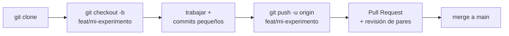

# 🌿 Flujo de Git/GitHub del curso

GitHub no es solo donde vive el código: es donde vive la **evidencia** de tus experimentos.
Este flujo mínimo es obligatorio en laboratorios y proyecto.

## El ciclo de trabajo



## Comandos esenciales

```bash
# Clonar y crear tu branch de trabajo
git clone https://github.com/<usuario>/<repositorio>.git
cd <repositorio>
git checkout -b feat/mlp-experiment

# Ciclo diario: revisar, preparar, confirmar, publicar
git status
git add notebooks/02_mlp_training.ipynb reports/figures/
git commit -m "feat: add reproducible mlp experiment"
git push -u origin feat/mlp-experiment
```

## Convención de mensajes de commit

| Prefijo | Uso |
|---|---|
| `feat:` | nueva capacidad o experimento |
| `fix:` | corrección de un error |
| `docs:` | documentación |
| `test:` | pruebas |
| `refactor:` | reorganización sin cambiar comportamiento |
| `chore:` | mantenimiento/configuración |

**Commits pequeños y frecuentes.** Un commit = un cambio con sentido. "avances" no es un
mensaje de commit.

## Pull requests

Usa la [plantilla del repositorio](../.github/PULL_REQUEST_TEMPLATE.md): objetivo, cambios,
cómo reproducir, evidencia (métricas y figuras), riesgos y checklist. La revisión de pares
del proyecto final se hace comentando el PR de otro equipo: pregunta por la evidencia, no
solo por el estilo.

## Lo que NUNCA se sube

- Tokens, credenciales, archivos `.env`.
- Datos personales o sensibles.
- Checkpoints grandes (`*.pt`, `*.safetensors`) — usa Git LFS (*Large File Storage*, extensión de git para archivos grandes: https://git-lfs.com) o el HF Hub si hace falta.
- La carpeta `data/` cruda y los `artifacts/` de entrenamiento (ya están en
  [`.gitignore`](../.gitignore)).

## Issues y milestones

En el proyecto final: **un issue por milestone (M0–M6)**, asignado a un responsable, cerrado
desde el PR que lo completa (`Closes #4`). El tablero de issues ES el estado del proyecto.
