# 📔 Sesión 0 — Fundamentos de Machine Learning (nivelación)

> **Pregunta detonante:** un filtro de spam, un sistema que agrupa clientes parecidos y
> un programa que aprende a jugar ajedrez son los tres "Machine Learning" — pero
> aprenden de señales completamente distintas. ¿Cuáles?

**Duración sugerida:** 4 horas (nivelación, antes de la Sesión 1) ·
**Laboratorio:** modelos clásicos sobre `make_moons` + Q-learning en miniatura ·
**Notebooks:** [`00_ml_clasico.ipynb`](../notebooks/00_ml_clasico.ipynb) (el lab) y
[`00b_guia_modelos_clasicos.ipynb`](../notebooks/00b_guia_modelos_clasicos.ipynb)
(la guía de campo: cada modelo con su fórmula, código comentado y visualización)

**Objetivos de la sesión**

1. Distinguir los tres paradigmas del aprendizaje automático: supervisado, no supervisado y reforzado.
2. Conocer los modelos clásicos más comunes de cada paradigma y su intuición.
3. Entrenar y comparar varios modelos de scikit-learn sobre un mismo dataset.
4. Entender el flujo de un proyecto de ML y cuándo conviene (y cuándo no) usar Deep Learning.

---

## 1. Aprender de los datos (en vez de programar las reglas)

En la programación clásica, una persona escribe las reglas: *"si el correo contiene
'GRATIS!!!' → spam"*. Funciona hasta que el mundo cambia o las reglas se vuelven
imposibles de enumerar (¿qué reglas escribes para reconocer un gato en una foto?).

**Machine Learning (ML, aprendizaje automático)** invierte el contrato: en lugar de
escribir las reglas, muestras **ejemplos** y un algoritmo encuentra las reglas por ti.
El producto de ese proceso se llama **modelo**: una función con parámetros ajustados a
los datos, lista para responder sobre casos nuevos.

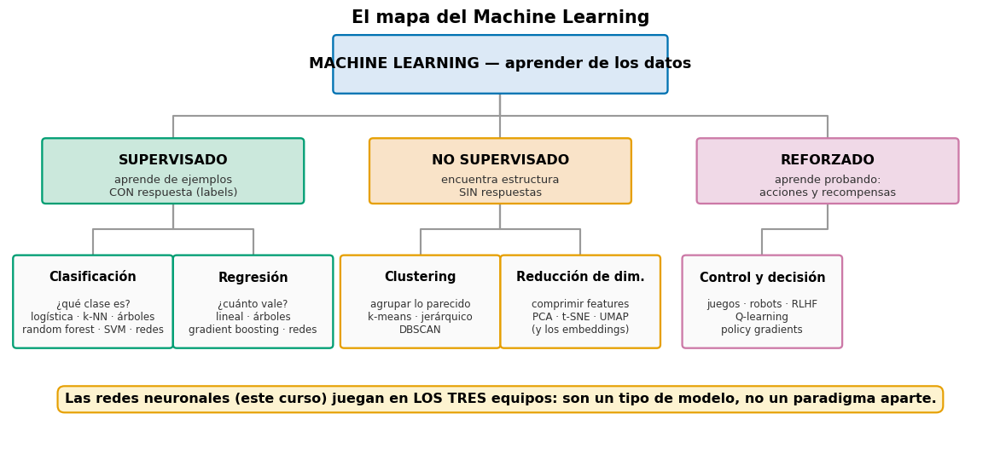

Guarda este mapa: el resto de la sesión lo recorre rama por rama, y el curso entero
(Sesiones 1–4) vive dentro de la nota amarilla — las **redes neuronales** son un tipo
de modelo que puede jugar en los tres equipos, no un paradigma aparte.

---

## 2. Los tres paradigmas: ¿de qué señal se aprende?

La diferencia entre paradigmas NO es el tipo de dato ni el tipo de modelo — es **qué
señal de aprendizaje existe**:

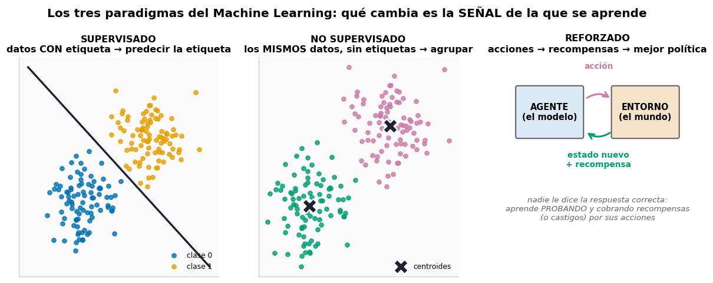

| Paradigma | La señal | Pregunta típica | Ejemplos |
|---|---|---|---|
| **Supervisado** | cada ejemplo trae su **respuesta correcta** (label) | "¿qué es esto?" / "¿cuánto vale?" | spam/no-spam, precio de una casa, diagnóstico |
| **No supervisado** | **no hay respuestas** — solo los datos | "¿qué estructura hay aquí?" | segmentar clientes, comprimir features, detectar anomalías |
| **Reforzado** | **recompensas** (o castigos) por las acciones tomadas | "¿qué debo HACER?" | juegos, robots, recomendar contenido, afinar LLMs (RLHF) |

> 🧩 **Respuesta a la pregunta detonante:** el filtro de spam aprende de correos
> *etiquetados* (supervisado), el agrupador de clientes solo tiene los datos de compra
> (no supervisado) y el ajedrecista aprende de *ganar o perder partidas* (reforzado).

---

## 3. Aprendizaje supervisado: los modelos clásicos

Dos sabores según la respuesta que se predice (los reencontrarás en la Sesión 1 al
elegir la capa de salida): **clasificación** (la respuesta es una categoría) y
**regresión** (la respuesta es un número).

### La galería de modelos

Cada familia de modelos tiene una "personalidad": una forma característica de partir
el espacio. Aquí están seis clásicos sobre el **mismo dataset que usarás en el Lab 1**
(`make_moons`):

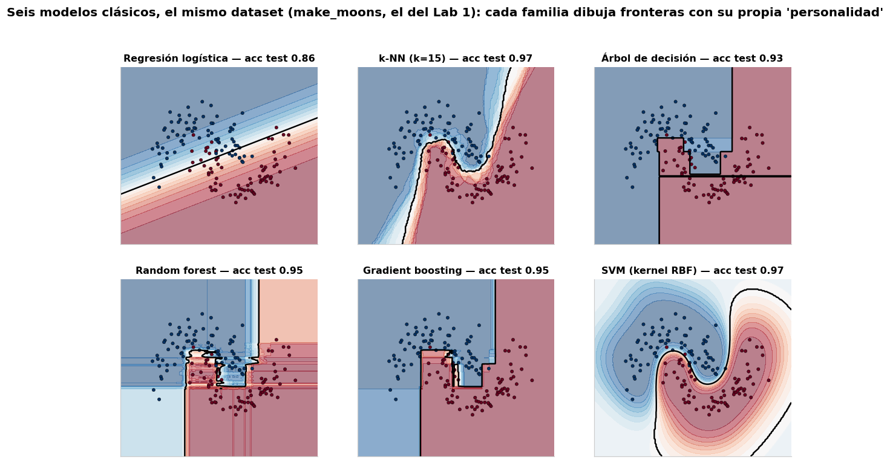

| Modelo | Intuición en una línea | Cuándo brilla |
|---|---|---|
| **Regresión lineal** | la recta que mejor pasa por los puntos: `y = w·x + b` | regresión simple e interpretable |
| **Regresión logística** | una recta que separa dos clases, con probabilidad — *es exactamente la neurona de la Sesión 1* | clasificación con pocos datos, baseline obligado |
| **k-NN** (k vecinos más cercanos) | "dime a qué se parecen tus k vecinos y te diré quién eres" — no entrena nada, solo memoriza | pocos datos, fronteras raras |
| **Árbol de decisión** | una cascada de preguntas si/no sobre las features — de ahí sus fronteras "escalonadas" | interpretabilidad total |
| **Random forest** | cientos de árboles entrenados con trocitos distintos de los datos, que **votan** | tabulares medianos, robusto sin tuning |
| **Gradient boosting** | árboles en cadena donde cada uno corrige los errores del anterior | el rey de los datos tabulares (XGBoost, LightGBM) |
| **SVM** (máquinas de vectores de soporte) | la frontera que deja el **margen** más ancho entre clases; con *kernels* dibuja curvas | datasets medianos, alta dimensión |

**Lectura de la figura:** la logística solo puede trazar UNA recta (86% — le queda
grande la luna); los árboles y bosques hacen escaleras de cortes paralelos a los ejes;
k-NN y SVM-RBF dibujan curvas suaves y aciertan ~97%. Ningún modelo es "el mejor" en
general — cada dataset premia una personalidad distinta (por eso siempre se comparan
contra un baseline, regla de oro del curso).

### La fórmula esencial de cada modelo

#### Regresión lineal

$$\hat{y} = wx + b$$

- $\hat{y}$ = la predicción (un número)
- $x$ = la feature de entrada
- $w$ = la pendiente: cuánto cambia $\hat{y}$ por cada unidad de $x$
- $b$ = el intercepto: el valor base cuando $x=0$
- **Cómo se entrena:** encontrar la $w$ y la $b$ que minimizan el MSE de los
  residuos — los segmentos grises de la figura.

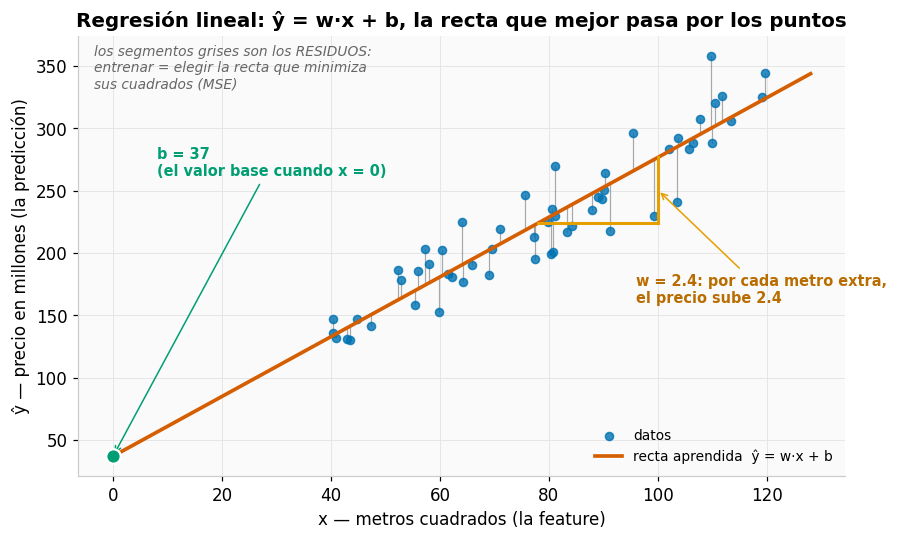

#### Regresión logística

$$p = \sigma(wx + b)$$

- $p$ = probabilidad de la clase positiva
- $\sigma$ = la sigmoide: aplasta cualquier número al rango (0, 1)
- $w, b$ = los mismos pesos y bias de la lineal
- **Frontera de decisión:** donde $p = 0.5$ — es decir, donde $wx+b=0$.

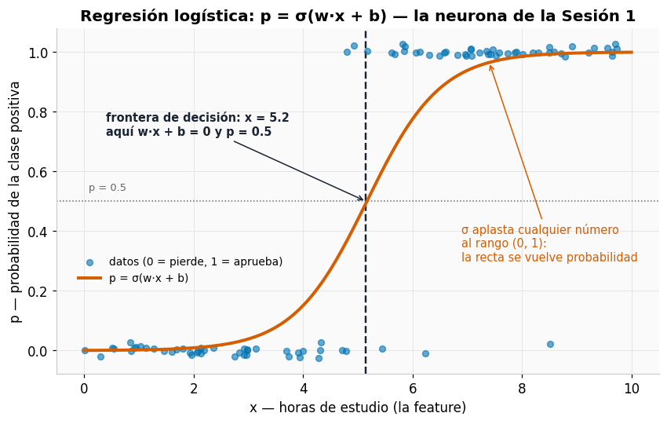

#### k-NN

$$d(a,b)=\sqrt{\sum_i (a_i-b_i)^2}$$

- $d(a,b)$ = distancia euclidiana entre los puntos $a$ y $b$ (Pitágoras generalizado)
- $a_i, b_i$ = la feature i-ésima de cada punto
- $k$ = cuántos vecinos votan
- **Predicción:** el voto mayoritario de los $k$ puntos con menor $d$.

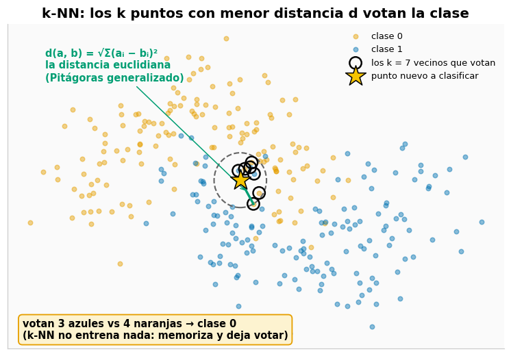

#### Árbol de decisión

$$G = 1 - \sum_k p_k^2$$

- $G$ = impureza Gini del nodo: 0 si es puro (una sola clase), 0.5 si está
  50/50 con dos clases (con K clases el máximo es 1−1/K)
- $p_k$ = proporción de ejemplos de la clase $k$ en el nodo
- **Cómo se entrena:** cada pregunta del árbol se elige para BAJAR $G$ lo más
  posible.

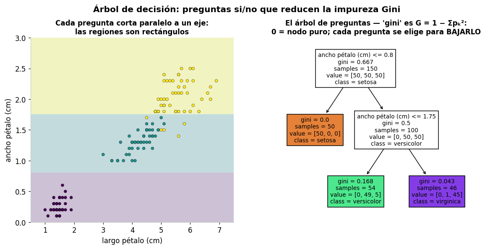

#### Random forest

$$\hat{y} = \mathrm{voto}\left(\mathrm{arbol}_1(x),\ \dots,\ \mathrm{arbol}_B(x)\right)$$

- $B$ = número de árboles (el `n_estimators`)
- cada árbol se entrena con una muestra *bootstrap* distinta (muestrear con
  reemplazo) y features al azar
- **Predicción:** el voto mayoritario — los errores individuales se cancelan.

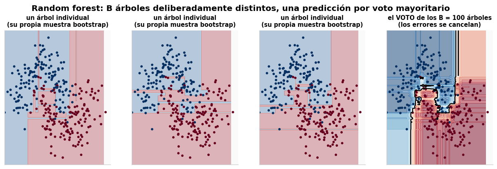

#### Gradient boosting

$$F_m = F_{m-1} + \eta h_m$$

- $F_m$ = el modelo acumulado tras $m$ árboles
- $h_m$ = el árbol nuevo, entrenado sobre los RESIDUOS (errores) de $F_{m-1}$
- $\eta$ = learning rate: cuánto confiar en cada corrección (un concepto que
  reencontrarás en la Sesión 1)

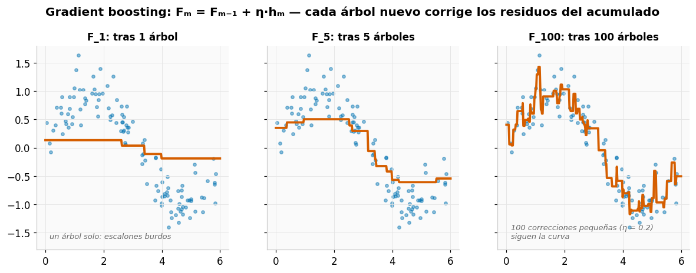

#### SVM

$$\mathrm{margen} = 2/\Vert w \Vert$$

- margen = el ancho de la "calle" entre las dos clases
- $w$ = los pesos que definen la frontera
- $\Vert w \Vert$ = el tamaño (norma) de $w$
- **Cómo se entrena:** maximizar el margen = encontrar la $w$ más pequeña que
  aún separa; solo los puntos que tocan la calle (los **vectores de soporte**)
  la definen.

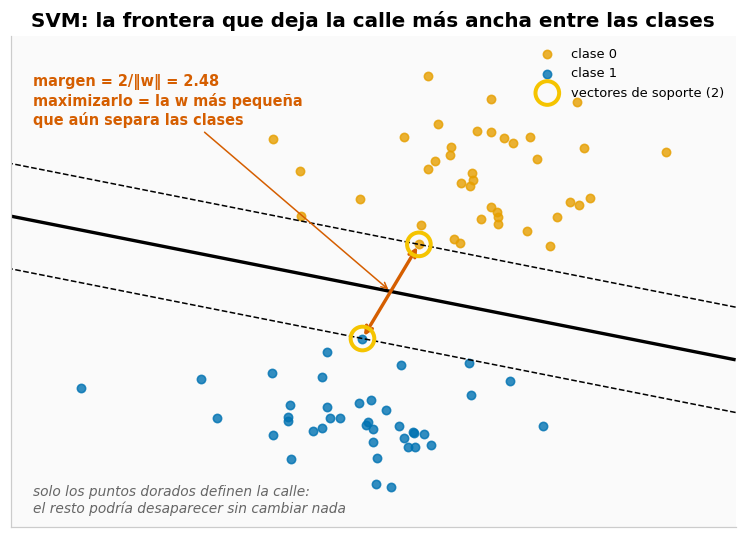

> 🧑‍🏫 **Para la clase — la guía de campo:** cada uno de estos modelos tiene su
> sección en el [**notebook 00b**](../notebooks/00b_guia_modelos_clasicos.ipynb), con
> la fórmula desarrollada, código comentado línea a línea y su **visualización
> característica** (los residuos de la recta, la sigmoide sobre los datos, el círculo
> de vecinos que votan, el árbol de preguntas dibujado, los árboles individuales vs el
> voto del bosque, el boosting mejorando etapa a etapa, y la calle de la SVM con sus
> vectores de soporte).

> ⚠️ **Momento honestidad:** para datos **tabulares** (filas y columnas), gradient
> boosting sigue ganándole al Deep Learning la mayoría de las veces — la evidencia
> sistemática está en [Grinsztajn et al., 2022](https://arxiv.org/abs/2207.08815)
> (comentado en [papers.md](../recursos/papers.md)). El DL domina cuando los datos son
> **no estructurados**: imágenes, texto, audio. Elegir la herramienta por evidencia —
> no por moda — es una competencia central de este curso.

---

## 4. Aprendizaje no supervisado: estructura sin respuestas

Sin etiquetas no se puede "acertar" — el objetivo cambia: **descubrir estructura**.
Las dos tareas estrella:

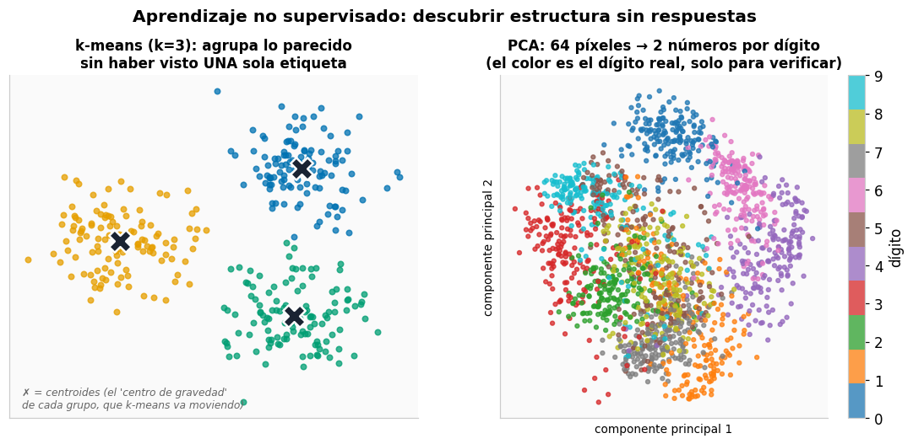

- **Clustering (agrupar):** juntar lo parecido. **k-means** es el clásico: eliges
  cuántos grupos quieres (k), el algoritmo pone k **centroides** al azar y repite dos
  pasos hasta converger — (1) cada punto se une al centroide más cercano, (2) cada
  centroide se muda al centro de sus puntos. Simple, rápido y sorprendentemente útil
  (segmentación de clientes, organización de documentos).
- **Reducción de dimensionalidad (comprimir):** representar datos de muchas features
  con pocas, perdiendo lo mínimo. **PCA** (*Principal Component Analysis*, análisis de
  componentes principales) encuentra las direcciones en las que los datos más varían
  y proyecta sobre ellas: en la figura, los 64 píxeles de cada dígito quedan reducidos
  a **2 números** — y los dígitos iguales siguen cayendo juntos.

Las fórmulas de ambos, leídas en palabras.

**k-means** minimiza:

$$J = \sum_i \min_k \Vert x_i - \mu_k \Vert^2$$

- $J$ = el costo total a minimizar
- $x_i$ = cada punto de los datos
- $\mu_k$ = el centroide (centro de gravedad) del grupo $k$
- $\min_k$ = "elige el centroide más cercano"
- $\Vert \cdot \Vert^2$ = la distancia al cuadrado
- **En palabras:** *"la suma, para cada punto, del cuadrado de su distancia al
  centroide más cercano"* — buenos grupos = puntos pegados a su centroide.

**PCA** no necesita fórmula nueva:

- la componente 1 es *la dirección donde los datos más varían*; la 2, la
  perpendicular que más varía de lo que queda
- el número a reportar es la **varianza explicada**: "con 2 de 64 dimensiones
  conservo el X% de la información".

> 🧑‍🏫 **Para la clase:** en la [guía de campo (notebook 00b)](../notebooks/00b_guia_modelos_clasicos.ipynb),
> k-means está implementado **a mano en numpy** (~10 líneas) con los centroides
> moviéndose iteración a iteración, y PCA con sus componentes dibujadas como flechas
> sobre la nube de datos.

> 🔗 **Conexión con el curso:** los **embeddings** de la Sesión 3 son la versión
> *aprendida* de esta idea — comprimir un token a un vector denso donde "cerca"
> significa "parecido". Y el análisis de errores del proyecto final usa la misma
> mirada: buscar estructura en lo que el modelo falla.

---

## 5. Aprendizaje reforzado: aprender probando

Aquí no hay dataset: hay un **agente** que actúa en un **entorno** y aprende de las
consecuencias.

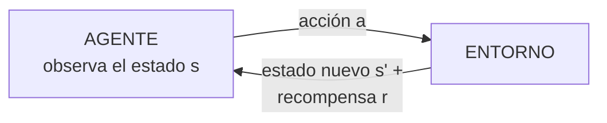

| Pieza | Qué es | En el gridworld del Lab 0 |
|---|---|---|
| **Estado** (s) | lo que el agente ve del mundo | la casilla donde está |
| **Acción** (a) | lo que puede hacer | moverse ↑ ↓ ← → |
| **Recompensa** (r) | el puntaje inmediato | meta +1, pozo −1, paso −0.02 |
| **Política** | la estrategia: qué acción tomar en cada estado | las flechas de la figura |

El algoritmo más didáctico es **Q-learning**. La idea, antes de la fórmula: el
agente lleva una **libreta de apuntes** — la tabla `Q[casilla, acción]` — con una
nota por cada jugada posible: *"hacer esto aquí, ¿qué tan bien me ha resultado?"*.
Tras cada paso corrige la nota de la jugada que acaba de hacer, y con suficientes
partidas la libreta se llena de buenos consejos: seguir siempre la mejor nota ES
la política (las flechas de la figura).

La corrección de cada nota es esta fórmula:

$$
Q(s,a) \leftarrow Q(s,a) + \alpha\left[r + \gamma \max_{a'} Q(s',a') - Q(s,a)\right]
$$

**Cómo leerla:**

- $Q(s,a)$ = la nota apuntada para "hacer la acción $a$ en la casilla $s$"
- $r$ = la recompensa que acabo de cobrar por ese paso
- $\max_{a'} Q(s',a')$ = la mejor nota de la casilla donde caí: lo que promete
  el futuro desde ahí
- $\gamma$ (gamma, ≈0.95) = cuánto pesa ese futuro frente a lo inmediato
- $\alpha$ = el tamaño de la corrección: cuánto muevo la nota vieja hacia lo que
  acabo de vivir (en la Sesión 1 reaparecerá con su nombre técnico: *learning rate*)
- **En palabras:** *"ajusta tu apunte hacia lo que viviste: la recompensa
  inmediata más lo mejor que promete el siguiente estado"*.

Con los números del gridworld, paso a paso: mi apunte viejo para esa jugada es
$Q(s,a) = 0.50$; doy el paso, cobro $r = -0.02$ y caigo en una casilla cuya
mejor nota es $0.9$. La misma fórmula, con cada símbolo reemplazado por su
número:

$$
Q(s,a) \leftarrow \underbrace{0.50}_{\text{nota vieja}} +
\underbrace{0.2}_{\alpha}\big[\underbrace{-0.02}_{r} +
\underbrace{0.95}_{\gamma} \cdot \underbrace{0.9}_{\text{mejor nota de } s'} -
\underbrace{0.50}_{\text{nota vieja}}\big]
$$

**El cálculo, en tres pasos:**

1. Lo que acabo de vivir vale $-0.02 + 0.95 \cdot 0.9 = 0.835$ — la recompensa
   del paso más lo que promete la casilla donde caí.
2. La distancia entre eso y mi apunte viejo: $0.835 - 0.50 = 0.335$.
3. Corrijo solo el 20% de esa distancia ($\alpha = 0.2$):
   $Q(s,a) \leftarrow 0.50 + 0.2 \cdot 0.335 \approx 0.57$.

La nota sube de 0.50 a 0.57. Nada más: miles de correcciones pequeñas como esa
producen la política de la figura.

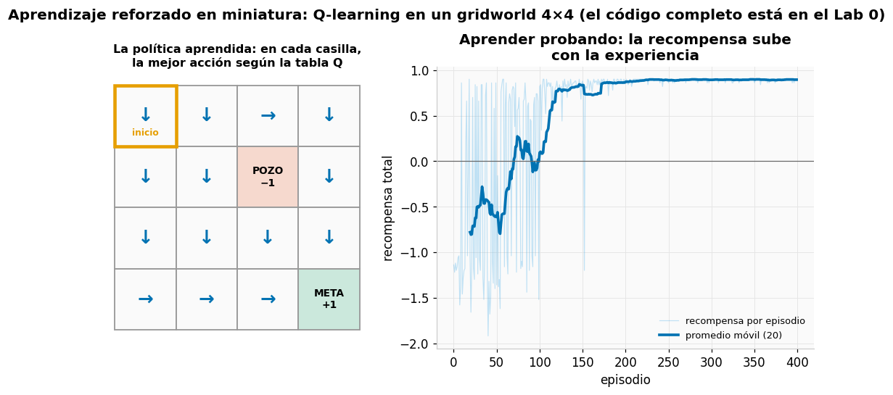

El dilema central del paradigma es **explorar vs explotar**: probar acciones nuevas
(que podrían ser mejores) o repetir la que ya funciona. El Lab 0 lo implementa con
**ε-greedy**: con probabilidad ε actúa al azar (explora), si no, elige lo mejor
conocido (explota) — y ε se reduce con la experiencia.

> 🔗 **Conexión con el curso:** cuando en la Sesión 4 mencionemos **RLHF**
> (*Reinforcement Learning from Human Feedback*), es esto mismo a escala LLM: el
> "entorno" son evaluaciones humanas y la "política" es el modelo de lenguaje.
> En este curso el RL se queda en lo conceptual + el mini-lab; profundizarlo es una
> extensión de posgrado en sí misma.

---

## 6. El flujo de un proyecto de ML (el que repetiremos todo el curso)

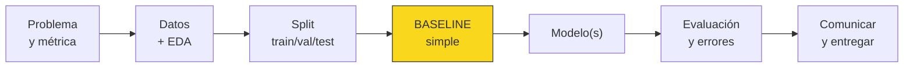

Dos reglas de este flujo son sagradas en el curso y se desarrollan a fondo en la
[Sesión 1 §7](01-fundamentos.md): los **splits** (validation ajusta, test se toca UNA
vez) y el **baseline** (sin un modelo simple de referencia, no hay evidencia de que la
complejidad aporte).

### ¿Cuándo Machine Learning clásico y cuándo Deep Learning?

| Situación | Herramienta razonable |
|---|---|
| Datos tabulares (filas × columnas), miles de ejemplos | gradient boosting / random forest |
| Pocas features, interpretabilidad requerida | regresión logística/lineal, árboles |
| Imágenes, texto, audio, video | **Deep Learning** (Sesiones 1–4) |
| Poco dato no estructurado | DL **preentrenado** + fine-tuning (Sesión 4) |
| Agrupar/comprimir sin etiquetas | k-means, PCA (y embeddings) |
| Decisiones secuenciales con recompensa | aprendizaje reforzado |

---

## 7. 🧪 Laboratorio 0 — Modelos clásicos y un agente que aprende

**Notebook:** [`00_ml_clasico.ipynb`](../notebooks/00_ml_clasico.ipynb)

1. **Supervisado:** majority baseline → regresión logística → k-NN → árbol → random
   forest sobre `make_moons`, con tabla comparativa y fronteras de decisión. *En la
   Sesión 1, una red neuronal atacará exactamente este dataset — guarda tus números.*
2. **No supervisado:** k-means sobre los mismos puntos SIN etiquetas y PCA sobre los
   dígitos.
3. **Reforzado:** Q-learning en un gridworld 4×4, en numpy puro y comentado línea a
   línea.

**Evidencia a entregar:** tabla de accuracy/F1 de los 5 modelos supervisados, el
heatmap/fronteras, la política aprendida por tu agente y una conclusión de ≤100
palabras: ¿qué modelo elegirías para moons y por qué? Commit:
`feat: complete ml fundamentals lab`.

---

## 🎟️ Exit ticket de la Sesión 0

Responde sin mirar notas — y solo después despliega cada respuesta para validarte:

1. ¿Qué diferencia fundamental hay entre aprendizaje supervisado, no supervisado y reforzado?
   

Ver respuesta
La señal de la que se aprende: el supervisado tiene la respuesta correcta de cada ejemplo (labels); el no supervisado solo tiene los datos y busca estructura; el reforzado aprende de recompensas y castigos por sus acciones — nadie le muestra la acción correcta.

2. ¿Por qué la regresión logística no puede resolver bien `make_moons`?
   

Ver respuesta
Porque es un modelo lineal: solo puede trazar UNA recta como frontera, y las dos lunas están entrelazadas — ninguna recta las separa. Se necesitan fronteras curvas (k-NN, SVM con kernel, árboles... o una red neuronal, Sesión 1).

3. ¿Qué hace k-means en cada iteración y qué necesita que le digas de antemano?
   

Ver respuesta
Repite dos pasos: asignar cada punto a su centroide más cercano y mover cada centroide al centro de sus puntos asignados. Hay que darle k (el número de grupos) de antemano — el algoritmo no lo descubre.

4. En Q-learning, ¿qué guarda la tabla Q y qué es la política?
   

Ver respuesta
Q[estado, acción] estima cuánta recompensa futura esperar si se toma esa acción en ese estado. La política es la estrategia resultante: en cada estado, elegir la acción con mayor Q (con algo de exploración durante el entrenamiento).

5. Tienes una tabla de 5000 filas y 20 columnas para predecir impago de crédito, y el banco exige explicar cada decisión. ¿Deep Learning?
   

Ver respuesta
Probablemente no: es un problema tabular pequeño con requisito de interpretabilidad — regresión logística o árboles/gradient boosting son la elección razonable. El DL brilla con datos no estructurados y volumen (o transfer learning); usarlo aquí es matar moscas a cañonazos.

---

| ⬅️ | [🏠 Inicio](../README.md) | [Sesión 1: Fundamentos de Deep Learning ➡️](01-fundamentos.md) |
|---|---|---|
