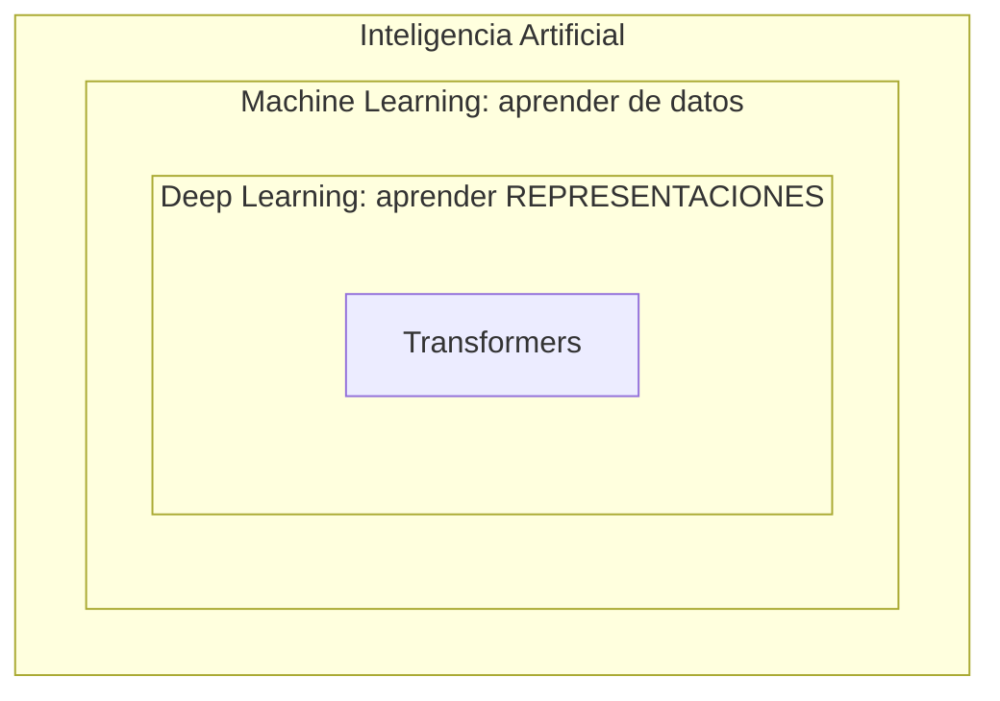
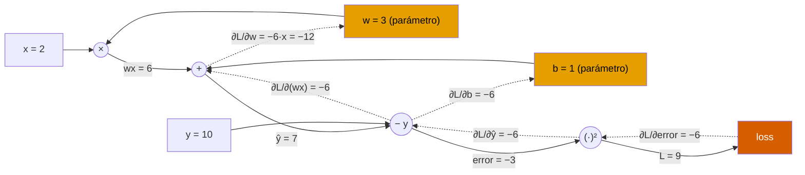
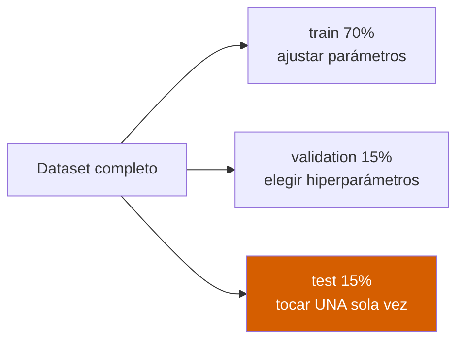

# 📘 Sesión 1 — Fundamentos de Deep Learning, MLP y backpropagation

> **Pregunta detonante:** ¿qué debe *aprender* una red y qué debemos *especificar* nosotros?

**Duración:** 8 horas · **Laboratorio:** MLP sobre `make_moons` · **Notebooks:** [`01_tensors_autograd`](../notebooks/01_tensors_autograd.ipynb) y [`02_mlp_training`](../notebooks/02_mlp_training.ipynb)

**Objetivos de la sesión**

1. Dominar tensores, shapes, dispositivos y vectorización.
2. Explicar una neurona, una MLP y las funciones de activación.
3. Relacionar función de pérdida, gradiente, regla de la cadena y backpropagation.
4. Escribir un ciclo de entrenamiento y evaluación manual en PyTorch.
5. Construir un clasificador MLP reproducible y analizar su frontera de decisión.

---

## 1. El mapa: IA → ML → Deep Learning



**Intuición.** En programación clásica, nosotros escribimos las reglas. En Machine Learning,
especificamos la *tarea* y el algoritmo encuentra las reglas a partir de ejemplos. En Deep
Learning, además, el modelo aprende las **representaciones intermedias**: de píxeles a bordes,
de bordes a formas, de formas a objetos. "Deep" (profundo) significa exactamente eso:
**composición de transformaciones**, capa sobre capa.

**¿Cuándo usar Deep Learning?** Cuando los datos son no estructurados (imágenes, texto,
audio), los patrones son complejos y hay volumen suficiente (o transfer learning disponible).
Para una tabla de 500 filas con 10 columnas, un gradient boosting suele ganar; usar DL ahí
es matar moscas a cañonazos.

### Notación del aprendizaje supervisado

Todo el curso usa este vocabulario:

$$
\mathcal{D} = \{(x_i, y_i)\}_{i=1}^{N} \qquad \hat{y} = f_\theta(x) \qquad \mathcal{L}(\hat{y}, y)
$$

| Símbolo | Nombre | Qué es |
|---|---|---|
| $x_i$ | features | la entrada (imagen, texto, medidas) |
| $y_i$ | label | la respuesta correcta |
| $f_\theta$ | modelo | una función con **parámetros** $\theta$ ajustables |
| $\hat{y}$ | predicción | lo que el modelo cree |
| $\mathcal{L}$ | loss | qué tan mal está la predicción (un número) |

Entrenar = encontrar los $\theta$ que minimizan la loss promedio sobre los datos
(**riesgo empírico**). Todo lo demás son detalles de *cómo*.

---

## 2. Tensores: el idioma de los datos

**Intuición.** Un tensor es una caja de números con ejes etiquetados. Todo lo que entra o
sale de una red es un tensor, y **el shape es un contrato**: si no cuadra, nada funciona.

| Objeto | Shape | Ejemplo |
|---|---|---|
| Escalar | `()` | una loss: `0.693` |
| Vector | `(d,)` | un embedding de 768 dims |
| Matriz | `(n, d)` | batch de 32 muestras con 10 features: `(32, 10)` |
| Tensor 4D | `(B, C, H, W)` | batch de imágenes: `(32, 3, 224, 224)` |

> 🧩 **Ejercicio mental.** `(32, 3, 224, 224)` se lee: *32 imágenes por batch, 3 canales
> (RGB), 224 píxeles de alto, 224 de ancho.* Si puedes leer un shape en voz alta, ya
> entiendes la mitad de los errores que verás este curso.

### Vectorización y broadcasting

Las GPUs son rápidas haciendo **la misma operación sobre muchos datos a la vez**. Por eso
nunca recorremos muestras con un `for`: operamos sobre el batch completo.

```python
import torch

x = torch.tensor([
    [1.0, 2.0, 3.0],
    [4.0, 5.0, 6.0],
])                                    # shape (2, 3): batch de 2, 3 features

w = torch.tensor([0.2, -0.1, 0.5])    # shape (3,): un peso por feature
b = torch.tensor(0.3)                 # escalar

logits = x @ w + b                    # @ = producto matricial
                                      # (2,3) @ (3,) → (2,)  y  b se "broadcast"
print(logits)                         # tensor([1.8000, 3.6000])
```

**Broadcasting**: PyTorch estira automáticamente dimensiones compatibles (aquí el escalar
`b` se suma a cada elemento). Poderoso, pero también fuente de bugs silenciosos: verificar
shapes siempre.

### Dispositivo y precisión

```python
# El modelo Y los datos deben vivir en el MISMO dispositivo.
if torch.cuda.is_available():
    device = torch.device('cuda')          # GPU NVIDIA
elif torch.backends.mps.is_available():
    device = torch.device('mps')           # Apple Silicon
else:
    device = torch.device('cpu')
```

En el repo esto ya está encapsulado: [`src/utils.py → detectar_dispositivo()`](../src/utils.py).

---

## 3. La neurona y la MLP

### Neurona lineal


El perceptrón nació como una **analogía** de la neurona biológica: las dendritas reciben
señales (entradas $x_j$), cada sinapsis las pondera con una fuerza aprendida (pesos $w_j$),
el soma las integra (suma $\Sigma$) y el axón dispara si se supera un umbral (activación
$\varphi$). La analogía es inspiración histórica, no equivalencia: una neurona real es
mucho más compleja que una suma ponderada.

$$
z = \mathbf{w}^\top \mathbf{x} + b
$$

**Intuición.** Cada peso $w_j$ dice *cuánto importa* la feature $x_j$; el bias $b$ desplaza
el umbral de decisión. Geométricamente, $z = 0$ define un **hiperplano**: la neurona separa
el espacio en dos mitades. Eso es todo lo que puede hacer una neurona sola — y por eso el
perceptrón nunca pudo con XOR.

### Capa densa (muchas neuronas en paralelo)

$$
\mathbf{Z}^{(l)} = \mathbf{H}^{(l-1)}\mathbf{W}^{(l)} + \mathbf{b}^{(l)} \qquad
\mathbf{H}^{(l)} = \phi\left(\mathbf{Z}^{(l)}\right)
$$

**Contrato de shapes** (batch-first): si $H$ es `(B, d_in)` y $W$ es `(d_in, d_out)`,
la salida es `(B, d_out)`.

### ¿Por qué necesitamos activaciones no lineales?

Componer transformaciones lineales da... otra transformación lineal:
$W_2(W_1 x) = (W_2 W_1)x$. Cien capas lineales apiladas tienen exactamente el poder de una.
La **no linealidad** $\phi$ entre capas es lo que permite doblar el espacio y crear
fronteras curvas.

$$
\sigma(z)=\frac{1}{1+e^{-z}} \qquad
\tanh(z)=\frac{e^z-e^{-z}}{e^z+e^{-z}} \qquad
\operatorname{ReLU}(z)=\max(0,z)
$$


> 🔎 **Lee el panel derecho:** la derivada es lo que viaja hacia atrás en backpropagation.
> Sigmoid y tanh se **saturan** (derivada ≈ 0 en los extremos → el aprendizaje se detiene).
> ReLU no se satura para $z>0$, pero tiene una zona muerta para $z<0$ ("dead ReLU").
> GELU es la versión suave que usan los Transformers.

🕹️ **Simulador:** [Funciones de activación interactivas](https://felmco.github.io/deeplearning-class/interactivos/activaciones.html) — mueve el punto y observa el valor de la derivada en vivo.

### La capa de salida depende de la tarea

| Tarea | Salida | Activación final | Loss |
|---|---|---|---|
| Regresión | 1 número real | identidad (ninguna) | MSE |
| Clasificación binaria | 1 logit | *(sigmoid dentro de la loss)* | `BCEWithLogitsLoss` |
| Clasificación multiclase | K logits | *(softmax dentro de la loss)* | `CrossEntropyLoss` |

### Softmax: de logits a probabilidades

$$
p_k = \frac{e^{z_k}}{\sum_{j=1}^{K}e^{z_j}}
$$

En implementación se resta $\max(z)$ antes de exponenciar (estabilidad numérica); softmax es
invariante a esa traslación.

🕹️ **Simulador:** [Softmax y temperatura](https://felmco.github.io/deeplearning-class/interactivos/softmax-temperatura.html) — ajusta los logits y la temperatura y observa la distribución.


---

## 4. La función de pérdida: la brújula

**Intuición.** La loss NO es la métrica que reportas (accuracy, F1): es la **señal de
aprendizaje**, la brújula diferenciable que le dice al optimizador hacia dónde moverse.
Métrica = tablero de resultados; loss = brújula.

### MSE (regresión)

$$
\mathcal{L}_{MSE}=\frac{1}{N}\sum_{i=1}^{N}(y_i-\hat y_i)^2
$$

Penalización cuadrática: errores grandes duelen desproporcionadamente (sensible a outliers).

### Binary cross-entropy (clasificación binaria)

$$
\mathcal{L}_{BCE}=-\frac{1}{N}\sum_i \left[y_i\log p_i+(1-y_i)\log(1-p_i)\right]
$$

> ⚠️ **En PyTorch usar siempre `BCEWithLogitsLoss`** (recibe logits crudos): combina
> sigmoid + BCE de forma numéricamente estable.

### Cross-entropy multiclase

$$
\mathcal{L}_{CE}=-\frac{1}{N}\sum_i \log p(y_i\mid x_i)
$$

Es la **máxima verosimilitud** disfrazada: maximizar la probabilidad del label correcto =
minimizar $-\log p$.

> ⚠️ **Error clásico #1 del curso:** `CrossEntropyLoss` recibe **logits**, no probabilidades.
> Aplicar softmax antes de la loss es un bug que *casi* funciona — el modelo aprende, pero
> peor, y nadie entiende por qué.

---

## 5. Gradiente, regla de la cadena y backpropagation

### Descenso por gradiente

$$
\theta_{t+1}=\theta_t-\eta\,\nabla_\theta \mathcal{L}(\theta_t)
$$

**Intuición.** La loss define un paisaje montañoso sobre el espacio de parámetros. El
gradiente $\nabla_\theta \mathcal{L}$ apunta cuesta *arriba*; caminamos en dirección
contraria con pasos de tamaño $\eta$ (el **learning rate**).


🕹️ **Simulador:** [Descenso de gradiente interactivo](https://felmco.github.io/deeplearning-class/interactivos/descenso-gradiente.html) — cambia el learning rate y el momentum, y suelta la bolita donde quieras.

### Regla de la cadena

Si $y=f(u)$ y $u=g(x)$:

$$
\frac{dy}{dx}=\frac{dy}{du}\cdot\frac{du}{dx}
$$

Una red es una composición gigante de funciones. La regla de la cadena dice que el gradiente
de la composición es el **producto de las derivadas locales**. Backpropagation es simplemente
aplicar esto de forma organizada y eficiente, desde la loss hacia atrás.

### El grafo computacional

Ejemplo: $L = (wx + b - y)^2$ con $x=2, w=3, b=1, y=10$.



Flechas sólidas = **forward** (calcular valores). Flechas punteadas = **backward**
(propagar gradientes multiplicando derivadas locales).

Derivación manual que verificaremos con autograd:

$$
\hat y=wx+b,\quad L=(\hat y-y)^2 \quad\Rightarrow\quad
\frac{\partial L}{\partial w}=2(\hat y-y)\,x = -12, \qquad
\frac{\partial L}{\partial b}=2(\hat y-y) = -6
$$

### Autograd: backpropagation automática

```python
import torch

x = torch.tensor(2.0)
w = torch.tensor(3.0, requires_grad=True)   # "rastréame para gradientes"
b = torch.tensor(1.0, requires_grad=True)
y_true = torch.tensor(10.0)

y_pred = w * x + b                          # forward: construye el grafo
loss = (y_pred - y_true) ** 2

loss.backward()                             # backward: llena .grad

print('dL/dw:', w.grad.item())              # -12.0  ✓ coincide con la derivación
print('dL/db:', b.grad.item())              # -6.0   ✓
```

🎬 **Animación:** el video recorre este mismo grafo con valores animados — primero el
forward pass (azul, valores), luego el backward pass (naranja, gradientes).

[](https://felmco.github.io/deeplearning-class/videos/forward-backward.mp4)

▶️ [Reproducir el video](https://felmco.github.io/deeplearning-class/videos/forward-backward.mp4) · [código fuente de la animación](../remotion/README.md)

---

## 6. El training loop: el corazón de todo

Este pseudocódigo es **universal** — desde una MLP de juguete hasta GPT:

```python
for epoch in range(epochs):
    model.train()                          # modo entrenamiento (dropout ON)
    for x, y in train_loader:
        optimizer.zero_grad()              # 1. limpiar gradientes acumulados
        y_hat = model(x)                   # 2. forward
        loss = criterion(y_hat, y)         # 3. medir el error
        loss.backward()                    # 4. backward: calcular gradientes
        optimizer.step()                   # 5. actualizar: θ ← θ − η·∇L

    model.eval()                           # modo evaluación (dropout OFF)
    with torch.inference_mode():           # sin grafo: rápido y sin memoria extra
        evaluar(model, val_loader)
```

La implementación completa y comentada del curso vive en [`src/train.py`](../src/train.py).

### Conceptos operativos

- **Batch / iteración / epoch:** un *batch* es un subconjunto de muestras; una *iteración*
  procesa un batch; un *epoch* recorre todo el dataset. Batches pequeños → gradiente ruidoso
  pero regularizador; grandes → estable pero costoso en memoria.
- **Inicialización:** romper la simetría con valores aleatorios bien escalados
  (Xavier para tanh/sigmoid, He para ReLU). Inicializar todo en cero = todas las neuronas
  aprenden lo mismo = red inútil.
- **Learning rate:** el hiperparámetro más importante. Alto → diverge; bajo → eterno.

---

## 7. Generalización: la única cosa que de verdad importa

Un modelo que memoriza el train set no sirve. La evidencia clave es la **brecha
train–validation**:


| Régimen | Síntoma | Remedios típicos |
|---|---|---|
| **Underfitting** | ambas curvas altas | más capacidad, más epochs, mejor LR |
| **Good fit** | brecha pequeña y estable | 🎉 guardar checkpoint |
| **Overfitting** | val sube mientras train baja | regularización, más datos, early stopping |

### Regularización (control de capacidad)

| Método | Qué hace | Riesgo si se abusa |
|---|---|---|
| **Weight decay** | penaliza pesos grandes (L2) | underfitting |
| **Dropout** | apaga neuronas al azar en train | underfitting, más epochs necesarios |
| **Early stopping** | detiene al estancarse validation | detenerse ante ruido (usar patience) |
| **Data augmentation** | crea variantes plausibles de los datos | destruir la señal de la etiqueta |

### Splits y data leakage



**Regla de hierro:** todo preprocesamiento que *aprende* de los datos (scaler, vocabulario,
estadísticas de normalización) se ajusta **solo con train**. Ajustarlo con todo el dataset
filtra información del test al modelo → métricas infladas → **data leakage**.

---

## 8. Errores conceptuales que debes anticipar

1. Confundir la dimensión del batch con el número de features.
2. Aplicar softmax antes de `CrossEntropyLoss`.
3. Olvidar `optimizer.zero_grad()` → los gradientes se ACUMULAN entre iteraciones.
4. Evaluar sin `model.eval()` o sin `torch.inference_mode()`.
5. Mover el modelo a GPU pero no los datos (o viceversa).
6. Reportar solo accuracy sin mirar desbalance ni ejemplos de error.
7. Usar el test set para elegir hiperparámetros (leakage de decisión).

---

## 9. 🧪 Laboratorio 1 — MLP para clasificación no lineal

**Pregunta experimental:**

> ¿Cómo cambia la frontera de decisión al aumentar la capacidad de una MLP y qué evidencia
> indica overfitting?

**Notebook:** [`02_mlp_training.ipynb`](../notebooks/02_mlp_training.ipynb) ·
**Config:** [`configs/mlp.yaml`](../configs/mlp.yaml)


🕹️ **Antes de codificar:** juega 10 minutos con el
[MLP Playground](https://felmco.github.io/deeplearning-class/interactivos/mlp-playground.html)
del curso (o con [TensorFlow Playground](https://playground.tensorflow.org/)) y formula tu
hipótesis por escrito.

### Experimentos obligatorios

Cada equipo ejecuta dos variantes cambiando **una sola variable**:

| Variable | Valores a comparar |
|---|---|
| `hidden_dim` | 4 vs 64 |
| dropout | 0 vs 0.4 |
| weight decay | 0 vs `1e-3` |
| learning rate | `1e-4` vs `1e-2` |
| profundidad | 1 capa oculta vs 4 |

### Evidencia a entregar

- Tabla de configuración.
- Curvas train/validation.
- F1 y matriz de confusión en test.
- Frontera de decisión.
- Conclusión ≤150 palabras: hipótesis → evidencia → limitación → decisión.
- Commit: `feat: complete mlp experiment`.

---

## 🎟️ Exit ticket de la Sesión 1

Responde sin mirar notas:

1. ¿Por qué una red sin activaciones no lineales equivale a una transformación lineal?
2. ¿Por qué `CrossEntropyLoss` debe recibir logits?
3. ¿Qué ocurre si no se limpian los gradientes?
4. ¿Qué diferencia hay entre `model.train()` y `model.eval()`?
5. ¿Qué evidencia permite distinguir underfitting de overfitting?

---

| ⬅️ | [🏠 Inicio](../README.md) | [Sesión 2: CNN y visión ➡️](02-cnn-vision.md) |
|---|---|---|
