# 📘 Sesión 1 — Fundamentos de Deep Learning, MLP y backpropagation

> **Pregunta detonante:** ¿qué debe *aprender* una red y qué debemos *especificar* nosotros?

**Duración:** 8 horas · **Laboratorio:** MLP sobre `make_moons` · **Notebooks:** [`01_tensors_autograd`](../notebooks/01_tensors_autograd.ipynb) y [`02_mlp_training`](../notebooks/02_mlp_training.ipynb)

**Objetivos de la sesión**

1. Dominar tensores, shapes, dispositivos y vectorización.
2. Explicar una neurona, una MLP y las funciones de activación.
3. Relacionar función de pérdida, gradiente, regla de la cadena y backpropagation.
4. Escribir un ciclo de entrenamiento y evaluación manual en PyTorch.
5. Construir un clasificador MLP reproducible y analizar su frontera de decisión.

---

## 1. El mapa: IA → ML → Deep Learning

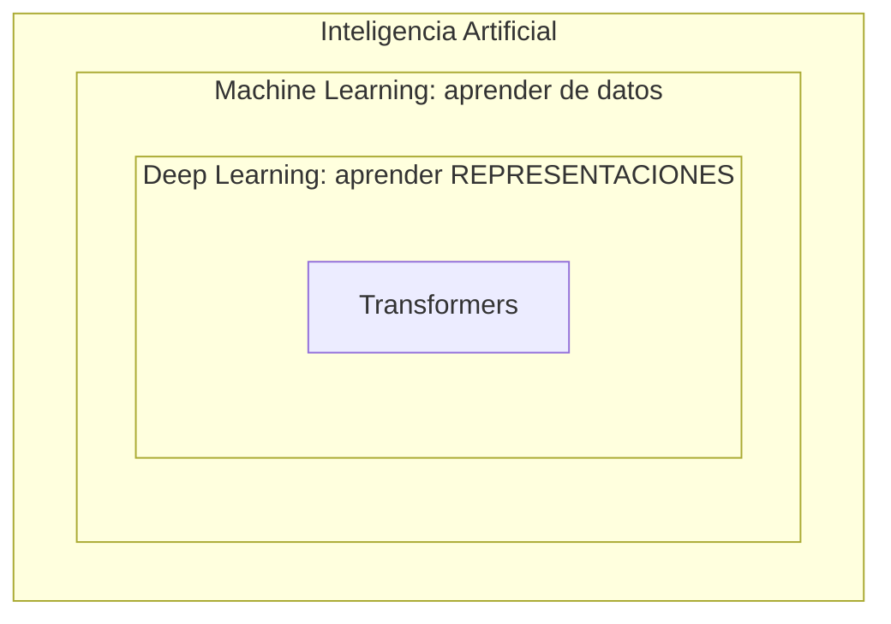

**Intuición.** En programación clásica, nosotros escribimos las reglas. En Machine Learning,
especificamos la *tarea* y el algoritmo encuentra las reglas a partir de ejemplos. En Deep
Learning, además, el modelo aprende las **representaciones intermedias**: de píxeles a bordes,
de bordes a formas, de formas a objetos. "Deep" (profundo) significa exactamente eso:
**composición de transformaciones**, capa sobre capa.

**¿Cuándo usar Deep Learning?** Cuando los datos son no estructurados (imágenes, texto,
audio), los patrones son complejos y hay volumen suficiente (o transfer learning disponible).
Para una tabla de 500 filas con 10 columnas, un gradient boosting suele ganar; usar DL ahí
es matar moscas a cañonazos.

### Notación del aprendizaje supervisado

Todo el curso usa este vocabulario:

$$
\mathcal{D} = \lbrace (x_i, y_i)\rbrace_{i=1}^{N} \qquad \hat{y} = f_\theta(x) \qquad \mathcal{L}(\hat{y}, y)
$$

| Símbolo | Nombre | Qué es |
|---|---|---|
| $x_i$ | features | la entrada (imagen, texto, medidas) |
| $y_i$ | label | la respuesta correcta |
| $f_\theta$ | modelo | una función con **parámetros** $\theta$ ajustables |
| $\hat{y}$ | predicción | lo que el modelo cree |
| $\mathcal{L}$ | loss | qué tan mal está la predicción (un número) |
| $\sum_{i=1}^{N}$ | sumatoria | "suma esto para cada ejemplo, del 1 al N" |
| $e^z$, $\log$ | exponencial y logaritmo | aparecen dentro de las losses; abajo hay una caja que explica lo único que necesitas saber de ellos |

Entrenar = encontrar los $\theta$ que minimizan la loss promedio sobre los datos
(los estadísticos llaman a esto **riesgo empírico**: "riesgo" = pérdida esperada,
"empírico" = medido sobre tus datos y no sobre una fórmula ideal). Todo lo demás
son detalles de *cómo*.

> 📐 **Matemática mínima del curso.** Este curso NO asume cálculo, álgebra lineal ni
> estadística. Cada símbolo se explica cuando aparece, en cajas como esta. Si quieres
> nivelarte con calma: [derivadas en Khan Academy (español)](https://es.khanacademy.org/math/differential-calculus),
> [vectores y producto punto](https://es.khanacademy.org/math/linear-algebra) y la serie
> [Essence of linear algebra de 3Blue1Brown](https://www.youtube.com/playlist?list=PLZHQObOWTQDPD3MizzM2xVFitgF8hE_ab).

---

## 2. Tensores: el idioma de los datos

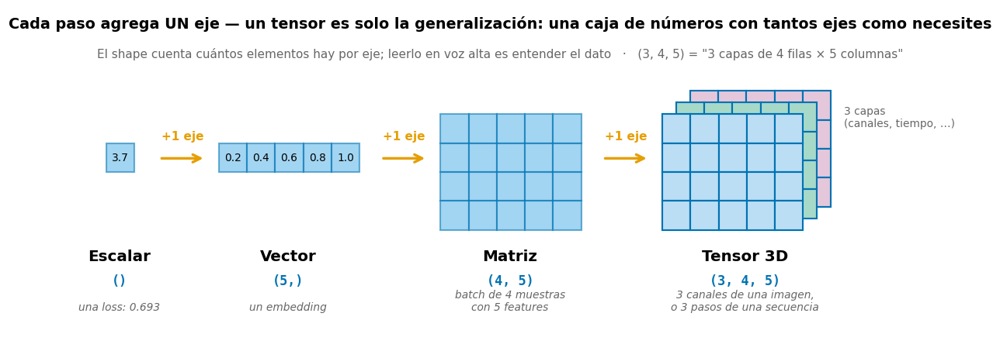

**Intuición.** Un tensor es una caja de números con ejes etiquetados, y la figura cuenta
toda la historia: un **escalar** es un solo número (cero ejes); ponlo en fila y tienes un
**vector** (1 eje); apila filas y tienes una **matriz** (2 ejes); apila matrices en capas
y tienes un **tensor 3D** — y puedes seguir agregando ejes cuantas veces necesites. Todo
lo que entra o sale de una red es un tensor, y **el shape es un contrato**: si no cuadra,
nada funciona.

| Objeto | Shape | Ejemplo |
|---|---|---|
| Escalar | `()` | una loss: `0.693` |
| Vector | `(d,)` | un embedding de 768 dims (*embedding*: representar algo — una palabra, una imagen — como lista de números; lo veremos a fondo en la Sesión 3) |
| Matriz | `(n, d)` | batch de 32 muestras con 10 features: `(32, 10)` (*batch*: grupo de muestras que se procesan juntas de un solo golpe) |
| Tensor 4D | `(B, C, H, W)` | batch de imágenes: `(32, 3, 224, 224)` |

> 🧩 **Ejercicio mental.** `(32, 3, 224, 224)` se lee: *32 imágenes por batch, 3 canales
> (RGB: rojo-verde-azul), 224 píxeles de alto, 224 de ancho.* Si puedes leer un shape en
> voz alta, ya entiendes la mitad de los errores que verás este curso.

### Vectorización y broadcasting

Las GPUs (procesadores gráficos, especializados en operar miles de números en paralelo)
son rápidas haciendo **la misma operación sobre muchos datos a la vez**. Por eso
nunca recorremos muestras con un `for`: operamos sobre el batch completo.

```python
import torch

x = torch.tensor([
    [1.0, 2.0, 3.0],
    [4.0, 5.0, 6.0],
])                                    # shape (2, 3): batch de 2, 3 features

w = torch.tensor([0.2, -0.1, 0.5])    # shape (3,): un peso por feature
b = torch.tensor(0.3)                 # escalar

logits = x @ w + b                    # @ = producto matricial
                                      # (2,3) @ (3,) → (2,)  y  b se "broadcast"
print(logits)                         # tensor([1.8000, 3.6000])
```

> 📖 **Dos palabras nuevas.** Un **logit** es el puntaje crudo que sale del modelo:
> cualquier número real, todavía sin convertir en probabilidad — piénsalo como "evidencia
> acumulada" a favor de una clase. Y `@` multiplica matrices: para cada fila de `x`,
> multiplica cada feature por su peso y suma todo. Esa operación de "multiplicar
> pareja a pareja y sumar" se llama **producto punto** y la reencontrarás en cada
> rincón de este curso.

**Broadcasting**: PyTorch estira automáticamente dimensiones compatibles (aquí el escalar
`b` se suma a cada elemento). Poderoso, pero también fuente de bugs silenciosos: verificar
shapes siempre.

### Dispositivo y precisión

```python
# El modelo Y los datos deben vivir en el MISMO dispositivo.
if torch.cuda.is_available():
    device = torch.device('cuda')          # GPU NVIDIA
elif torch.backends.mps.is_available():
    device = torch.device('mps')           # Apple Silicon
else:
    device = torch.device('cpu')
```

En el repo esto ya está encapsulado: [`src/utils.py → detectar_dispositivo()`](../src/utils.py).

---

## 3. La neurona y la MLP

Una **MLP** (*Multi-Layer Perceptron*, perceptrón multicapa) es la red neuronal más
simple: varias capas de neuronas apiladas, donde cada capa transforma la salida de la
anterior. Empecemos por su pieza básica.

### Neurona lineal

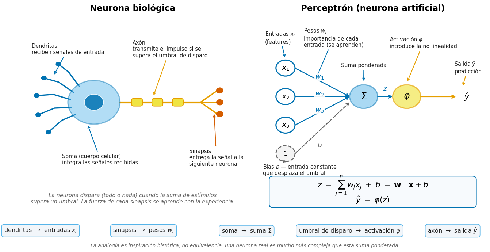

El perceptrón nació como una **analogía** de la neurona biológica, y los números de la
figura siguen esa correspondencia: las dendritas reciben las señales ① (entradas $x_j$),
cada sinapsis de entrada las pondera con una fuerza que se aprende ② (pesos $w_j$), el
soma integra todo lo que recibe ③ (suma $\Sigma$), el cono axónico dispara si se supera
el umbral ④ (activación $\varphi$) y el axón lleva el impulso a la siguiente neurona ⑤
(salida $\hat{y}$).

Ojo con ②: lo que corresponde a los pesos son las sinapsis de **entrada**, no los
terminales del axón — esos son la salida. Y la analogía es inspiración histórica, no
equivalencia: una neurona real es mucho más compleja que una suma ponderada.

$$
z = \mathbf{w}^\top \mathbf{x} + b
$$

**Cómo leer la fórmula.** $\mathbf{w}^\top \mathbf{x}$ es el **producto punto** que ya
viste: multiplicar cada feature por su peso y sumar todo, $w_1x_1 + w_2x_2 + \dots$
El símbolo $\top$ (transpuesta) solo "acuesta" el vector para que la multiplicación
cuadre — no cambia sus números.

**Intuición.** Una neurona hace algo muy simple: **dibuja una línea recta que parte el
espacio en dos mitades**. De un lado, $z > 0$ (predice clase 1); del otro, $z < 0$
(clase 0). La línea misma es donde $z = 0$: la frontera de decisión.

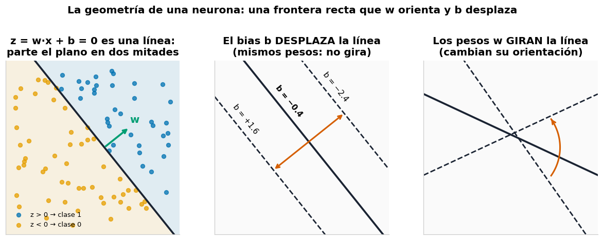

Los dos ingredientes tienen roles distintos, y la figura los separa:

- **Los pesos $\mathbf{w}$ GIRAN la línea** (panel derecho): deciden hacia dónde mira la
  frontera. Además, $\mathbf{w}$ siempre apunta perpendicular a la línea, hacia el lado
  de la clase 1 (flecha verde del panel izquierdo).
- **El bias $b$ DESPLAZA la línea** (panel central): la mueve más cerca o más lejos
  **sin cambiar su ángulo** — como correr una cerca sin rotarla. Sin bias, la línea
  estaría condenada a pasar por el origen $(0,0)$, estuviera donde estuviera lo que
  quieres separar.

En 3D la línea se convierte en un plano, y con más dimensiones se llama **hiperplano** —
el mismo concepto con más ejes; solo que ya no podemos dibujarlo. Y eso es todo lo que
puede hacer una neurona sola: una frontera recta — por eso el perceptrón nunca pudo
con XOR.

> 🧩 **¿Qué es XOR?** El "o exclusivo": clase 1 si *exactamente una* de las dos entradas
> está activa. Sus cuatro puntos — (0,0)→0, (1,1)→0, (0,1)→1, (1,0)→1 — no pueden
> separarse con ninguna línea recta. Pruébalo en el
> [MLP Playground](https://felmco.github.io/deeplearning-class/interactivos/mlp-playground.html).

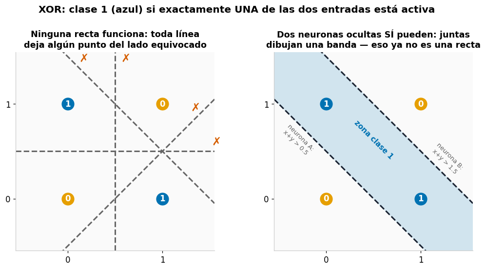

Míralo tú mismo: en el panel izquierdo, prueba mentalmente cualquier recta — horizontal,
vertical, diagonal — y siempre queda un punto del color equivocado en cada lado. El panel
derecho es el adelanto de toda la sesión: **dos neuronas ocultas cooperando** (una traza
la línea "x+y > 0.5", la otra "x+y > 1.5") encierran una **banda diagonal** que separa
XOR perfectamente. Eso es exactamente lo que ganas al apilar capas: fronteras que una
recta sola jamás podría dibujar.

### Capa densa (muchas neuronas en paralelo)

$$
\mathbf{Z}^{(l)} = \mathbf{H}^{(l-1)}\mathbf{W}^{(l)} + \mathbf{b}^{(l)} \qquad
\mathbf{H}^{(l)} = \phi\left(\mathbf{Z}^{(l)}\right)
$$

**Cómo leerla.** El superíndice $(l)$ numera la capa. Cada **columna** de $W$ es una
neurona; la multiplicación matricial calcula *todas las neuronas para todas las muestras
del batch* de un solo golpe — por eso es tan rápida en GPU.

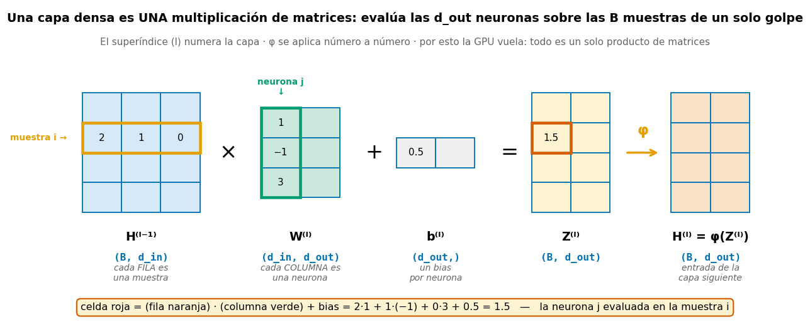

Sigue los colores: la **fila naranja** de $H$ es una muestra, la **columna verde** de $W$
es una neurona, y su producto punto (más el bias) produce la **celda roja** de $Z$ — esa
neurona evaluada en esa muestra. La multiplicación matricial hace eso para *todas* las
combinaciones fila×columna a la vez, y $\phi$ luego pasa número por número. Verifica el
cálculo de la celda roja a mano: es el mismo producto punto de la neurona lineal de
arriba.

**Contrato de shapes** (batch-first): si $H$ es `(B, d_in)` y $W$ es `(d_in, d_out)`,
la salida es `(B, d_out)`.

### ¿Por qué necesitamos activaciones no lineales?

Componer transformaciones lineales da... otra transformación lineal:
$W_2(W_1 x) = (W_2 W_1)x$. Cien capas lineales apiladas tienen exactamente el poder de una.
La **no linealidad** $\phi$ entre capas es lo que permite doblar el espacio y crear
fronteras curvas.

$$
\sigma(z)=\frac{1}{1+e^{-z}} \qquad
\tanh(z)=\frac{e^z-e^{-z}}{e^z+e^{-z}} \qquad
\mathrm{ReLU}(z)=\max(0,z)
$$

**En palabras:** sigmoid (σ) aplasta cualquier número al rango (0, 1); tanh lo
aplasta a (−1, 1); ReLU deja pasar lo positivo tal cual y anula lo negativo. (La $e$ es
el número de Euler ≈ 2.718; $e^{-z}$ solo es una forma suave de "decaer hacia cero".)

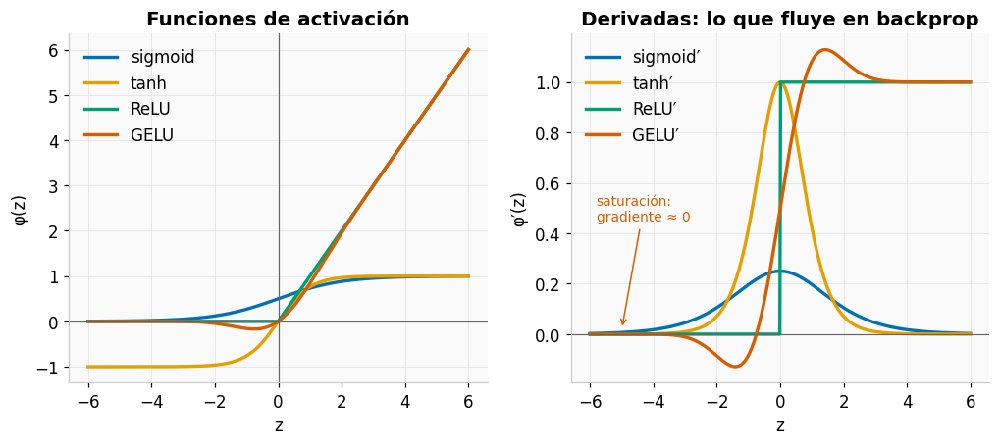

> 🔎 **Lee el panel derecho:** la derivada es lo que viaja hacia atrás en backpropagation.
> Sigmoid y tanh se **saturan** (derivada ≈ 0 en los extremos → el aprendizaje se detiene).
> ReLU no se satura para $z>0$, pero tiene una zona muerta para $z<0$ ("dead ReLU").
> GELU es la versión suave que usan los Transformers.

🕹️ **Simulador:** [Funciones de activación interactivas](https://felmco.github.io/deeplearning-class/interactivos/activaciones.html) — mueve el punto y observa el valor de la derivada en vivo.

### La capa de salida depende de la tarea

Hasta aquí, las capas ocultas transforman las features en representaciones cada vez más
útiles. Falta la última pieza: la **capa de salida**, la que traduce todo ese trabajo al
formato de la respuesta que buscas. Y ese formato depende de la *pregunta* que le haces
a la red:

- **"¿Cuánto?"** — el precio de una casa, la temperatura de mañana. La respuesta es un
  **número libre**, sin límites, y la red lo entrega tal cual (sin activación final).
  Esto se llama **regresión**.
- **"¿Sí o no?"** — ¿es spam?, ¿hay un gato en la foto? La respuesta útil es una
  **probabilidad entre 0 y 1**: la red produce un logit (recuerda la §2: el puntaje
  crudo, cualquier número real) y **sigmoid** lo aplasta a ese rango.
  **Clasificación binaria**.
- **"¿Cuál de estas K opciones?"** — ¿qué dígito es?, ¿qué animal aparece? La respuesta
  útil es **una probabilidad por opción, y que sumen 1**: la red produce K logits y
  **softmax** los reparte. **Clasificación multiclase**.

| Tarea | Pregunta típica | La red entrega | Cómo se vuelve respuesta |
|---|---|---|---|
| Regresión | "¿cuánto costará?" | 1 número real | se usa tal cual |
| Clasificación binaria | "¿es spam?" | 1 logit | sigmoid → probabilidad |
| Clasificación multiclase | "¿qué dígito es?" | K logits | softmax → K probabilidades que suman 1 |

> ⚠️ **En PyTorch, la sigmoid/softmax final vive DENTRO de la loss**
> (`BCEWithLogitsLoss`, `CrossEntropyLoss`) por estabilidad numérica — los detalles en
> la sección 4. Por ahora recuerda solo esto: **la red entrega logits crudos**.

### Softmax: de logits a porciones de una torta

Supón que la red mira una foto y dice: *gato: 2.0, perro: 1.0, pez: −1.0*. Puntajes
útiles, pero incómodos — hay negativos y no suman nada especial. Softmax los convierte
en probabilidades en dos movimientos:

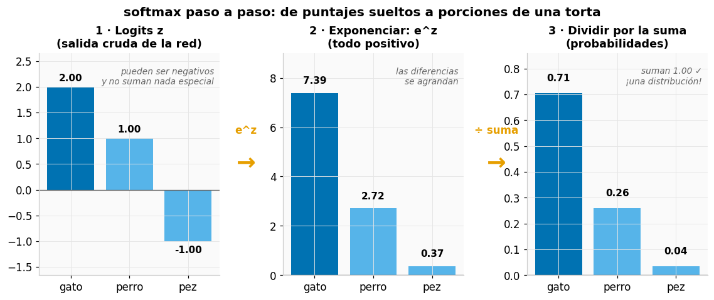

1. **Exponenciar** (eᶻ): todo se vuelve positivo y las diferencias se agrandan — el
   favorito se separa del pelotón.
2. **Dividir por la suma**: ahora el total es exactamente 1. Cada clase se queda con su
   "porción de la torta": una **distribución de probabilidad**.

La fórmula dice exactamente eso y nada más:

$$
p_k = \frac{e^{z_k}}{\sum_{j=1}^{K}e^{z_j}}
$$

— arriba, el paso 1 aplicado a la clase $k$; abajo, la suma de todos para repartir.

> 🔧 **Detalle de implementación:** antes de exponenciar se le resta a todos los logits
> el más grande, `max(z)`. El resultado no cambia — softmax solo mira las *diferencias*
> entre logits — pero evita que $e^z$ desborde con logits grandes.

🕹️ **Simulador:** [Softmax y temperatura](https://felmco.github.io/deeplearning-class/interactivos/softmax-temperatura.html) — ajusta los logits y la temperatura y observa la distribución. (*Temperatura*: divide los logits antes del softmax — T alta aplana la distribución, T baja la afila. La usarás para generar texto en la Sesión 3.)

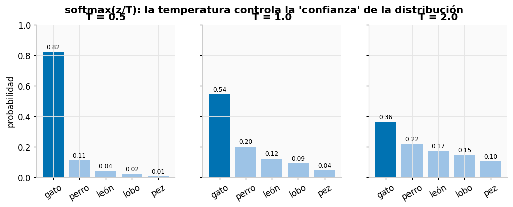

---

## 4. La función de pérdida: la brújula

La red ya sabe producir predicciones. El siguiente eslabón: **medir qué tan malas
son** — sin esa medida no hay nada que mejorar.

**Intuición.** La loss NO es la métrica que reportas (accuracy, F1): es la **señal de
aprendizaje**, la brújula diferenciable que le dice al optimizador hacia dónde moverse.
Métrica = tablero de resultados; loss = brújula.

La idea más simple para entender cualquier loss: es una **curva de castigo**. Le dices
cuánto te equivocaste y te devuelve cuánto duele. Lo único que cambia entre una loss y
otra es la *forma* de ese castigo:

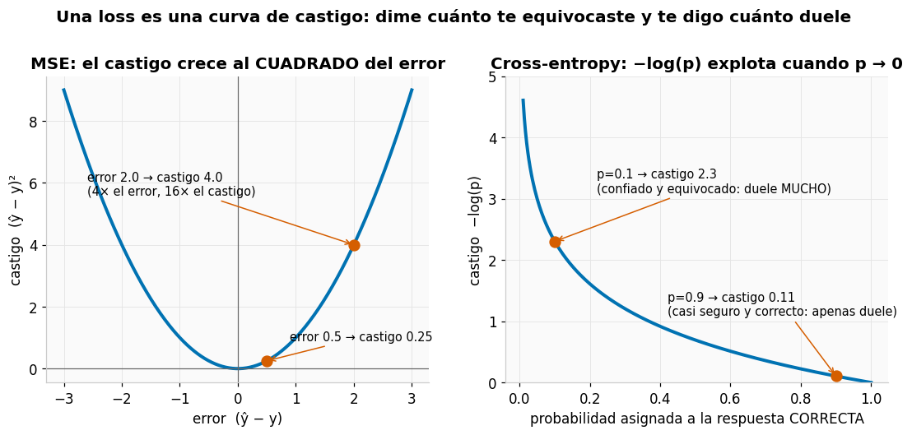

- **Izquierda (MSE, para regresión):** duplicar el error *cuadruplica* el castigo —
  fíjate en los dos puntos rojos: un error 4× más grande recibe un castigo 16× mayor.
- **Derecha (cross-entropy, para clasificación):** el castigo depende solo de la
  probabilidad que le diste a la respuesta correcta. Con $p = 0.9$ casi no duele; con
  $p = 0.1$ — confiado y equivocado — la curva explota.

### MSE — Mean Squared Error (regresión)

$$
\mathcal{L}_{MSE}=\frac{1}{N}\sum_{i=1}^{N}(y_i-\hat y_i)^2
$$

El error cuadrático medio: para cada ejemplo, la diferencia entre lo real y lo predicho,
al cuadrado, promediada. Penalización cuadrática: errores grandes duelen
desproporcionadamente (sensible a outliers — valores atípicos o extremos).

### Binary cross-entropy — BCE (clasificación binaria)

> 📐 **Lo único que necesitas saber del logaritmo aquí:** $-\log(p)$ es casi 0 cuando
> $p \approx 1$ y **explota hacia infinito** cuando $p \to 0$. Es un castigo que crece
> brutalmente cuanto menos probabilidad le diste a la respuesta correcta: estar confiado
> y equivocado sale carísimo. ([logaritmos en Khan Academy](https://es.khanacademy.org/math/algebra2/x2ec2f6f830c9fb89:logs), por si quieres la base completa.)

$$
\mathcal{L}_{BCE}=-\frac{1}{N}\sum_i \left[y_i\log p_i+(1-y_i)\log(1-p_i)\right]
$$

**Cómo leerla:** si el label es 1, solo sobrevive el término $-\log p_i$ (castiga que $p$
sea baja); si es 0, solo $-\log(1-p_i)$. Un solo término se activa por ejemplo — es el
"castigo por no creer en la respuesta correcta".

> ⚠️ **En PyTorch usar siempre `BCEWithLogitsLoss`** (recibe logits crudos): combina
> sigmoid + BCE de forma numéricamente estable.

### Cross-entropy multiclase

$$
\mathcal{L}_{CE}=-\frac{1}{N}\sum_i \log p(y_i\mid x_i)
$$

**En palabras:** mira únicamente la probabilidad que el modelo le dio a la clase
*correcta* y cobra $-\log$ de ella; ignorar el resto es deliberado. Premiar al modelo por
asignar probabilidad alta a la respuesta correcta es lo que los estadísticos llaman
**máxima verosimilitud** — mismo principio, otro nombre.

> 🎥 Si quieres la historia completa de por qué el logaritmo:
> [StatQuest — Cross Entropy claramente explicado](https://www.youtube.com/watch?v=6ArSys5qHAU).

> ⚠️ **Error clásico #1 del curso** (el detalle prometido en la §3):
> `CrossEntropyLoss` **ya aplica softmax por dentro** — por eso recibe **logits crudos**.
>
> ```python
> loss = criterion(softmax(logits), y)   # ✗ BUG: softmax dos veces
> loss = criterion(logits, y)            # ✓ la loss hace el softmax por ti
> ```
>
> Es un bug traicionero porque *casi* funciona: el modelo aprende, pero peor. ¿Por qué?
> El doble softmax aplasta los logits al rango (0, 1) — la loss recibe "logits" diminutos,
> los gradientes se encogen y el aprendizaje queda lento y con techo. Como no lanza ningún
> error, puede vivir semanas sin que nadie lo note.

---

## 5. Gradiente, regla de la cadena y backpropagation

Ya sabemos *cuánto* nos equivocamos (la loss). Este es el eslabón que faltaba: saber
**en qué dirección mover cada peso** para equivocarnos menos. Para eso necesitamos una
sola herramienta matemática.

### 5.0 — ¿Qué es una derivada? (2 minutos)

La **derivada** responde una sola pregunta: *si muevo la entrada un poquito, ¿cuánto
cambia la salida?* Es la pendiente de la curva en ese punto.

Ejemplo numérico: si subo $w$ de 3.00 a 3.01 y la loss baja de 9.00 a 8.88 (cambió
−0.12 al mover 0.01), la derivada es ≈ −12. Signo negativo = "subir $w$ baja la loss".

- **Derivada parcial** ($\partial$, la "d curvada"): lo mismo, pero moviendo *solo una*
  variable y dejando el resto quieto. $\partial L/\partial w$ = "¿cuánto cambia $L$ si
  muevo solo $w$?"
- **Gradiente** (∇): el paquete con todas las derivadas parciales juntas, una por
  parámetro. Apunta hacia donde la loss *sube* más rápido.
- Derivada ≈ 0 significa "mover esto casi no cambia nada" → no hay señal para aprender.

> 🎥 **Para verlo animado** (muy recomendado): 3Blue1Brown,
> [Gradient descent](https://www.youtube.com/watch?v=IHZwWFHWa-w) y
> [Backpropagation, intuitively](https://www.youtube.com/watch?v=Ilg3gGewQ5U)
> (subtítulos en español disponibles).

### Descenso por gradiente

$$
\theta_{t+1}=\theta_t-\eta \nabla_\theta \mathcal{L}(\theta_t)
$$

Pieza por pieza:

| Símbolo | Nombre | Qué es |
|---|---|---|
| $\theta_t$ | parámetros actuales | todos los pesos y biases de la red en el paso $t$ |
| $\theta_{t+1}$ | parámetros nuevos | los mismos parámetros, después de dar un paso |
| $\eta$ | learning rate (se lee "eta") | el tamaño del paso: cuánto nos movemos |
| $\nabla_\theta \mathcal{L}$ | gradiente de la loss | la dirección en la que la loss más *sube* (§5.0) |
| $-$ | el signo menos | caminar exactamente al revés del gradiente: cuesta abajo |

**En palabras:** *"los parámetros nuevos son los actuales, menos un paso de tamaño η
en la dirección donde la loss sube más rápido".* Repetir miles de veces.

**Intuición.** La loss define un paisaje montañoso sobre el espacio de parámetros. El
gradiente $\nabla_\theta \mathcal{L}$ apunta cuesta *arriba*; caminamos en dirección
contraria con pasos de tamaño $\eta$ (el **learning rate**, abreviado **LR**).

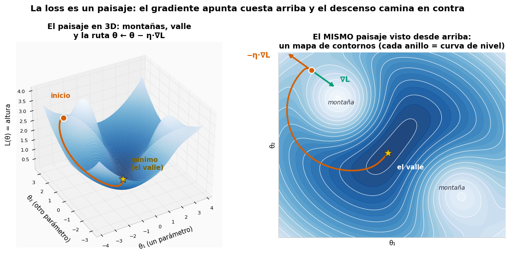

El panel derecho es el mismo paisaje **visto desde arriba** — un mapa de contornos, como
los mapas topográficos. Así dibujaremos el paisaje en el resto del curso (y así lo dibuja
el simulador): cada anillo es una "curva de nivel" y el centro del anillo más profundo es
el valle que buscamos.

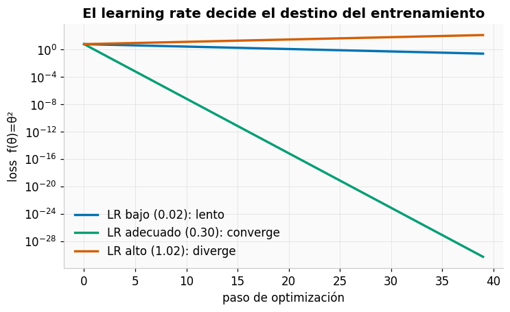

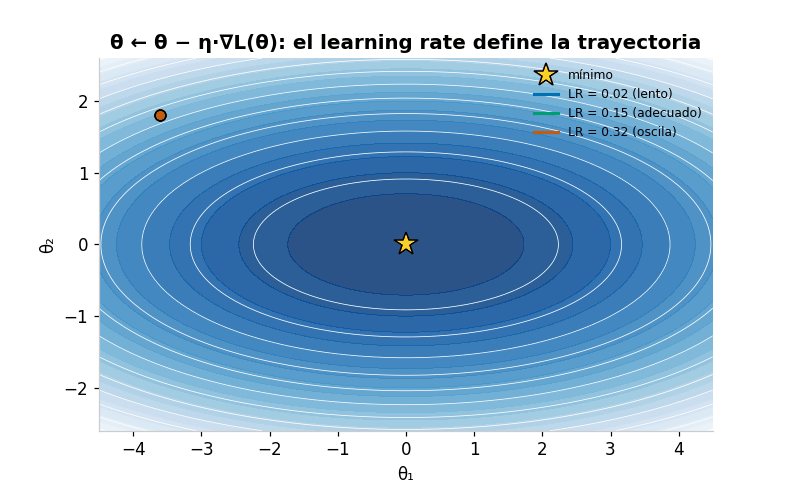

🕹️ **Simulador:** [Descenso de gradiente interactivo](https://felmco.github.io/deeplearning-class/interactivos/descenso-gradiente.html) — cambia el learning rate y el momentum (la "inercia" de la bolita; se explica en la Sesión 2), y suelta la bolita donde quieras.

### Regla de la cadena

Si $y=f(u)$ y $u=g(x)$:

$$
\frac{dy}{dx}=\frac{dy}{du}\cdot\frac{du}{dx}
$$

Una red es una composición gigante de funciones. La regla de la cadena dice que el gradiente
de la composición es el **producto de las derivadas locales**. Backpropagation es simplemente
aplicar esto de forma organizada y eficiente, desde la loss hacia atrás.

### El grafo computacional

Ejemplo: $L = (wx + b - y)^2$ con $x=2, w=3, b=1, y=10$.

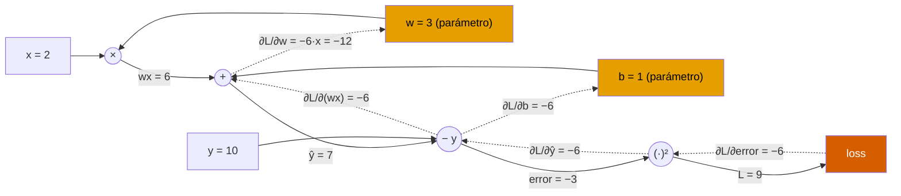

Flechas sólidas = **forward** (calcular valores). Flechas punteadas = **backward**
(propagar gradientes multiplicando derivadas locales).

Derivación manual que verificaremos con autograd:

$$
\hat y=wx+b,\quad L=(\hat y-y)^2 \quad\Rightarrow\quad
\frac{\partial L}{\partial w}=2(\hat y-y)x = -12, \qquad
\frac{\partial L}{\partial b}=2(\hat y-y) = -6
$$

### Autograd: backpropagation automática

```python
import torch

x = torch.tensor(2.0)
w = torch.tensor(3.0, requires_grad=True)   # "rastréame para gradientes"
b = torch.tensor(1.0, requires_grad=True)
y_true = torch.tensor(10.0)

y_pred = w * x + b                          # forward: construye el grafo
loss = (y_pred - y_true) ** 2

loss.backward()                             # backward: llena .grad

print('dL/dw:', w.grad.item())              # -12.0  ✓ coincide con la derivación
print('dL/db:', b.grad.item())              # -6.0   ✓
```

🎬 **Animación:** el video recorre este mismo grafo con valores animados — primero el
forward pass (azul, valores), luego el backward pass (naranja, gradientes).

[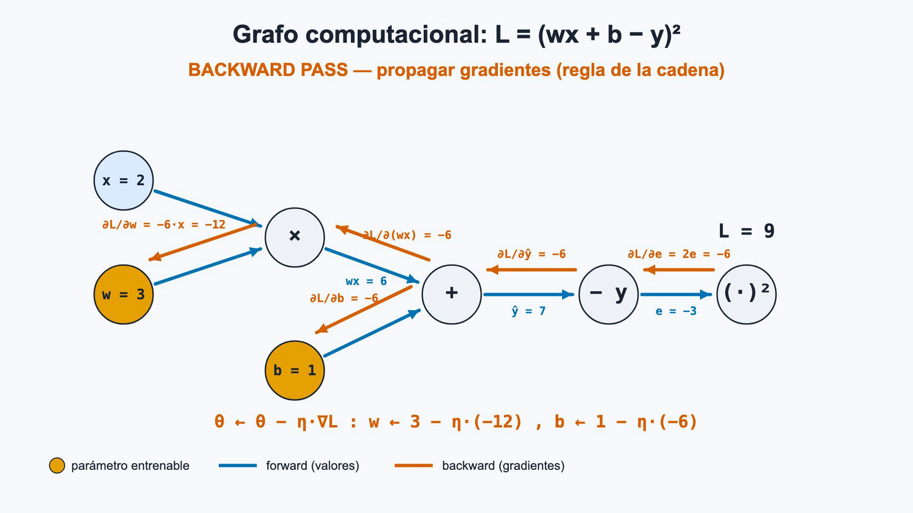](https://felmco.github.io/deeplearning-class/videos/forward-backward.mp4)

▶️ [Reproducir el video](https://felmco.github.io/deeplearning-class/videos/forward-backward.mp4) · [código fuente de la animación](../remotion/README.md)

---

## 6. El training loop: el corazón de todo

Ya están todas las piezas: predicción (§3), medida del error (§4) y dirección de
mejora (§5). El training loop solo las repite en círculo, miles de veces. Este
pseudocódigo es **universal** — desde una MLP de juguete hasta GPT:

```python
for epoch in range(epochs):
    model.train()                          # modo entrenamiento (dropout ON)
    for x, y in train_loader:
        optimizer.zero_grad()              # 1. limpiar gradientes acumulados
        y_hat = model(x)                   # 2. forward
        loss = criterion(y_hat, y)         # 3. medir el error
        loss.backward()                    # 4. backward: calcular gradientes
        optimizer.step()                   # 5. actualizar: θ ← θ − η·∇L

    model.eval()                           # modo evaluación (dropout OFF)
    with torch.inference_mode():           # sin grafo: rápido y sin memoria extra
        evaluar(model, val_loader)
```

La implementación completa y comentada del curso vive en [`src/train.py`](../src/train.py).

### Conceptos operativos

- **Batch / iteración / epoch:** un *batch* es un subconjunto de muestras; una *iteración*
  procesa un batch; un *epoch* recorre todo el dataset. Batches pequeños → gradiente ruidoso
  pero regularizador; grandes → estable pero costoso en memoria.
- **Inicialización:** romper la simetría con valores aleatorios bien escalados.
  *Xavier* y *He* son reglas para elegir el tamaño típico de los pesos iniciales según
  la activación (Xavier para tanh/sigmoid, He para ReLU). Inicializar todo en cero =
  todas las neuronas aprenden lo mismo = red inútil.
- **Learning rate:** el hiperparámetro más importante. Alto → diverge; bajo → eterno.

---

## 7. Generalización: la única cosa que de verdad importa

Un modelo que memoriza el train set no sirve. La evidencia clave es la **brecha
train–validation**:

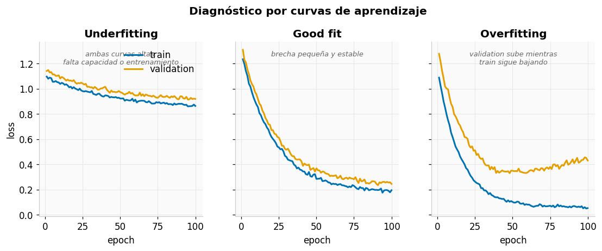

| Régimen | Síntoma | Remedios típicos |
|---|---|---|
| **Underfitting** | ambas curvas altas | más capacidad, más epochs, mejor LR |
| **Good fit** | brecha pequeña y estable | 🎉 guardar checkpoint |
| **Overfitting** | val sube mientras train baja | regularización, más datos, early stopping |

### Regularización (control de capacidad)

| Método | Qué hace | Riesgo si se abusa |
|---|---|---|
| **Weight decay** | penaliza pesos grandes ("L2": castigar la suma de los cuadrados de los pesos, empujándolos hacia valores pequeños) | underfitting |
| **Dropout** | apaga neuronas al azar en cada paso de train, para que ninguna se vuelva imprescindible (detalle en Sesión 2) | underfitting, más epochs necesarios |
| **Early stopping** | detiene al estancarse validation | detenerse ante ruido (usar patience) |
| **Data augmentation** | crea variantes plausibles de los datos | destruir la señal de la etiqueta |

### Splits y data leakage

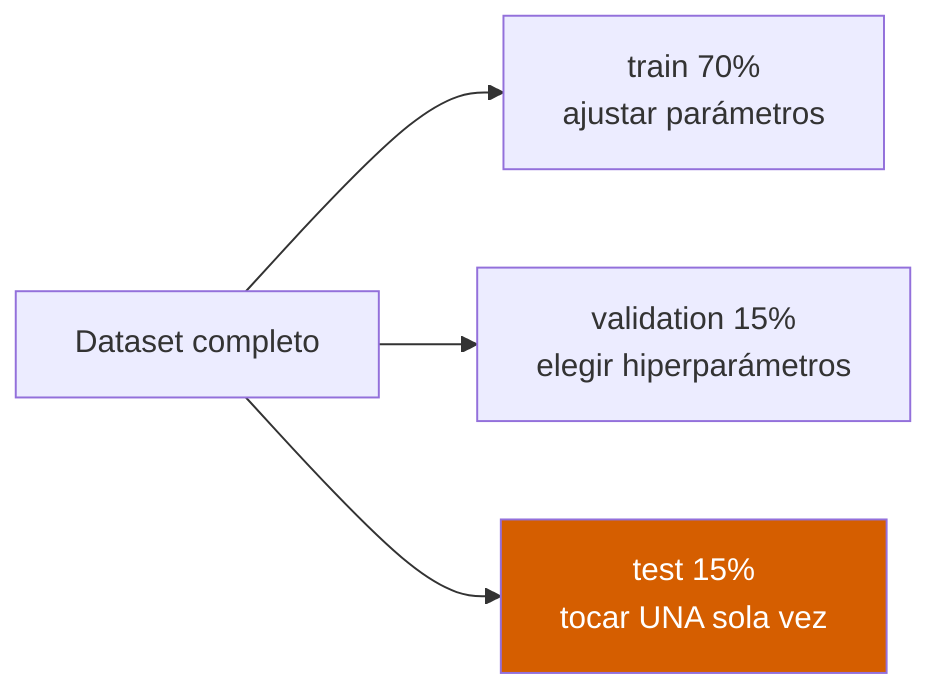

**Regla de hierro:** todo preprocesamiento que *aprende* de los datos (scaler, vocabulario,
estadísticas de normalización) se ajusta **solo con train**. Ajustarlo con todo el dataset
filtra información del test al modelo → métricas infladas → **data leakage**.

---

## 8. Errores conceptuales que debes anticipar

1. Confundir la dimensión del batch con el número de features.
2. Aplicar softmax antes de `CrossEntropyLoss`.
3. Olvidar `optimizer.zero_grad()` → los gradientes se ACUMULAN entre iteraciones.
4. Evaluar sin `model.eval()` o sin `torch.inference_mode()`.
5. Mover el modelo a GPU pero no los datos (o viceversa).
6. Reportar solo accuracy sin mirar desbalance ni ejemplos de error.
7. Usar el test set para elegir hiperparámetros (leakage de decisión).

---

## 9. 🧪 Laboratorio 1 — MLP para clasificación no lineal

**Pregunta experimental:**

> ¿Cómo cambia la frontera de decisión al aumentar la capacidad de una MLP y qué evidencia
> indica overfitting?

**Notebook:** [`02_mlp_training.ipynb`](../notebooks/02_mlp_training.ipynb) ·
**Config:** [`configs/mlp.yaml`](../configs/mlp.yaml)

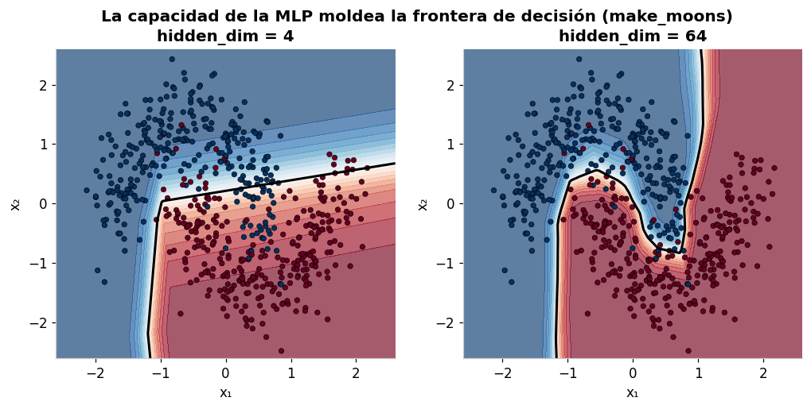

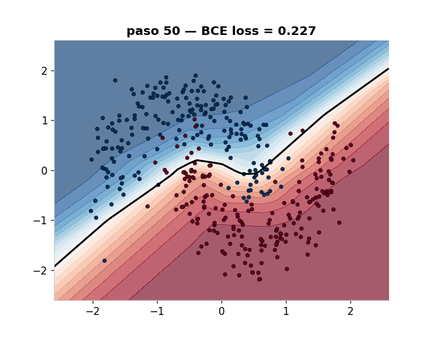

🕹️ **Antes de codificar:** juega 10 minutos con el
[MLP Playground](https://felmco.github.io/deeplearning-class/interactivos/mlp-playground.html)
del curso (o con [TensorFlow Playground](https://playground.tensorflow.org/)) y formula tu
hipótesis por escrito.

### Experimentos obligatorios

Cada equipo ejecuta dos variantes cambiando **una sola variable**:

| Variable | Valores a comparar |
|---|---|
| `hidden_dim` | 4 vs 64 |
| dropout | 0 vs 0.4 |
| weight decay | 0 vs `1e-3` |
| learning rate | `1e-4` vs `1e-2` |
| profundidad | 1 capa oculta vs 4 |

### Las métricas que vas a reportar

- **Matriz de confusión**: una tabla real-vs-predicho — cada celda cuenta cuántos
  ejemplos de la clase X el modelo clasificó como Y. La diagonal son los aciertos.
- **Precision**: de lo que marqué como positivo, ¿cuánto era verdad?
- **Recall**: de lo positivo real, ¿cuánto encontré?
- **F1**: el promedio (armónico) de precision y recall — solo es alto si *ambas* lo son.

Todo sale de la misma tabla. Con un detector de spam sobre 100 correos:

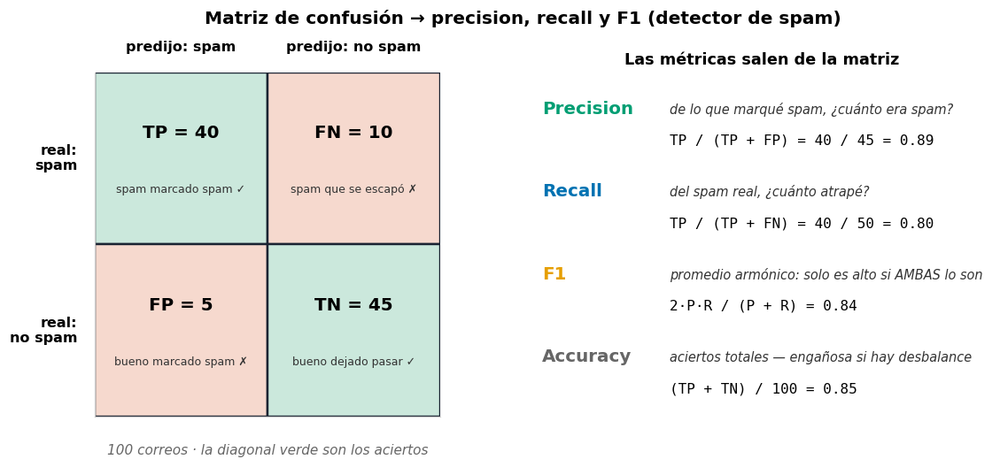

Nota cómo precision y recall miran celdas *distintas*: precision divide entre lo que el
modelo **marcó** como spam (columna izquierda); recall divide entre lo que **era** spam
de verdad (fila superior). Un modelo puede tener una alta y la otra baja — por eso el F1
las obliga a negociar.

> 🎥 Profundiza con el [Google ML Crash Course en español — clasificación](https://developers.google.com/machine-learning/crash-course/classification?hl=es).

### Evidencia a entregar

- Tabla de configuración.
- Curvas train/validation.
- F1 y matriz de confusión en test.
- Frontera de decisión.
- Conclusión ≤150 palabras: hipótesis → evidencia → limitación → decisión.
- Commit: `feat: complete mlp experiment`.

---

## 🎟️ Exit ticket de la Sesión 1

Responde sin mirar notas:

1. ¿Por qué una red sin activaciones no lineales equivale a una transformación lineal?
2. ¿Por qué `CrossEntropyLoss` debe recibir logits?
3. ¿Qué ocurre si no se limpian los gradientes?
4. ¿Qué diferencia hay entre `model.train()` y `model.eval()`?
5. ¿Qué evidencia permite distinguir underfitting de overfitting?

---

| ⬅️ | [🏠 Inicio](../README.md) | [Sesión 2: CNN y visión ➡️](02-cnn-vision.md) |
|---|---|---|
