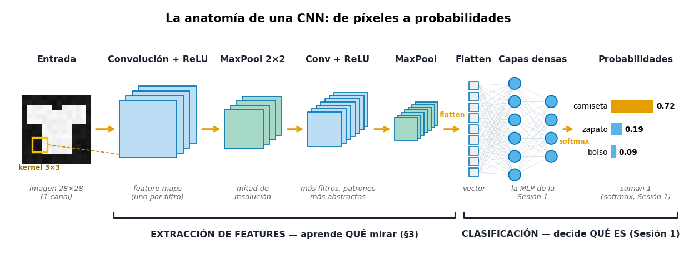
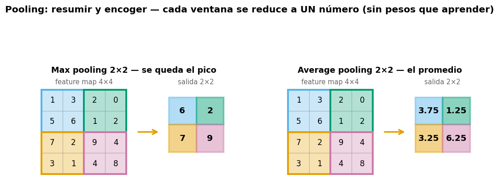
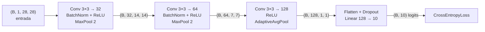
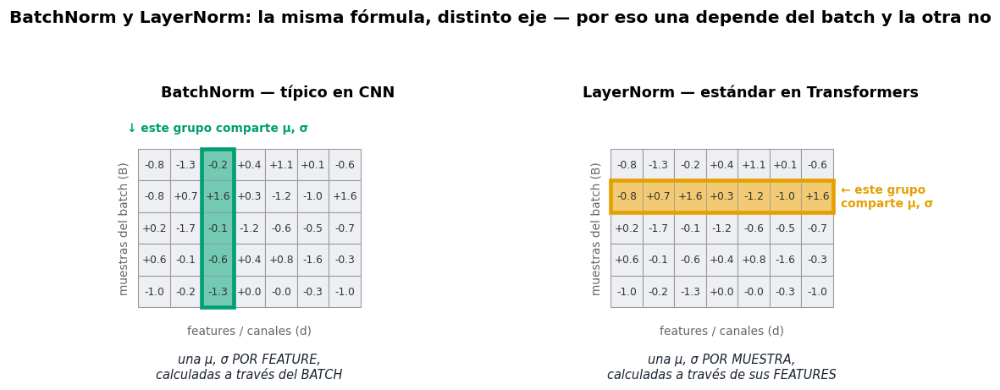
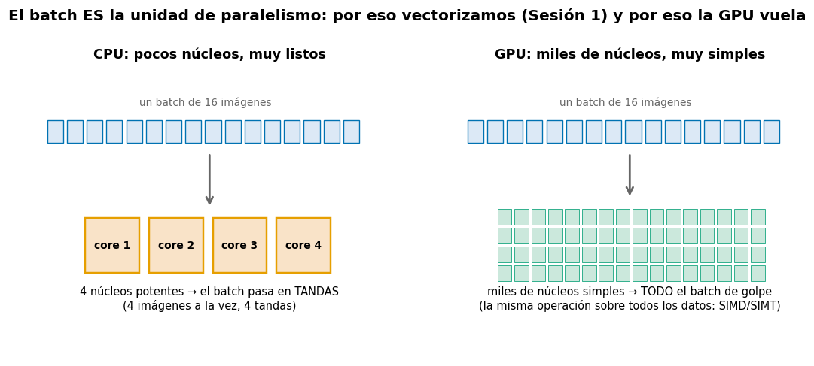
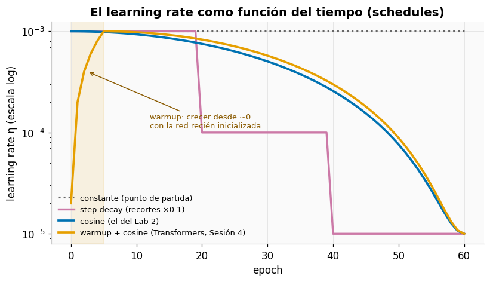
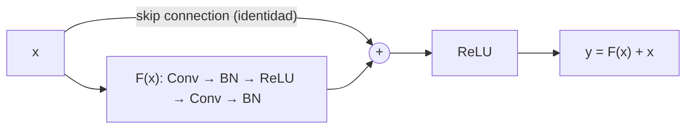

# 📗 Sesión 2 — CNN, optimización, regularización y transfer learning

Una **CNN** (*Convolutional Neural Network*, red neuronal convolucional) es la
arquitectura que dominó la visión por computadora: en lugar de conectar cada píxel con
cada neurona, desliza pequeños detectores por la imagen.

> **Pregunta detonante:** si aplanamos una imagen de 28×28 a un vector de 784 números,
> ¿qué acabamos de destruir?

**Duración:** 8 horas · **Laboratorio:** CNN sobre FashionMNIST · **Notebook:** [`03_cnn_fashionmnist.ipynb`](../notebooks/03_cnn_fashionmnist.ipynb)

**Objetivos de la sesión**

1. Identificar los componentes de una CNN de extremo a extremo.
2. Explicar convolución, kernels, feature maps, stride, padding y receptive field.
3. Calcular shapes y número de parámetros de una CNN.
4. Entrenar una CNN y diagnosticar errores con curvas y matriz de confusión.
5. Comparar regularización, optimizadores y schedules mediante experimentos controlados.
6. Comprender conexiones residuales y aplicar transfer learning.

---

## 1. La anatomía de una CNN, de un vistazo

El mapa completo antes de entrar pieza por pieza — una CNN es una **línea de
ensamblaje con dos mitades**:



- **Mitad 1 — extraer features** (lo nuevo de esta sesión): bloques de **convolución
  + ReLU + pooling** que responden *"¿qué patrones hay en la imagen y dónde?"*. Cada
  bloque produce **feature maps** — mapas de dónde se activó cada detector — cada vez
  más pequeños y más abstractos (de bordes a formas, de formas a partes de objeto).
  La §3 desarma esta mitad pieza por pieza.
- **Mitad 2 — clasificar** (ya la conoces completa): **Flatten** estira los feature
  maps finales a un vector, unas **capas densas** — la MLP de la Sesión 1 — producen
  los logits, y **softmax** los convierte en una probabilidad por clase.

La sesión entera cabe en una frase: *la mitad izquierda aprende QUÉ mirar; la mitad
derecha decide QUÉ ES con lo que se miró.*

---

## 2. Del MLP a la visión: por qué aplanar es destruir

Una imagen tiene **estructura espacial**: un píxel se parece a sus vecinos, un borde es una
relación local, un ojo está *cerca* de otro ojo. Al aplanar `(28, 28) → (784,)`, el píxel
`[3, 5]` y el `[4, 5]` — vecinos verticales — quedan a 28 posiciones de distancia y la MLP
tiene que redescubrir esa vecindad desde cero, con un peso independiente por píxel.

La convolución explota dos ideas:

- **Localidad:** los patrones útiles (bordes, texturas) son locales → basta mirar ventanas pequeñas.
- **Compartir pesos:** un detector de bordes sirve *en cualquier parte* de la imagen → el mismo kernel se desliza por toda ella.

Resultado: muchísimos menos parámetros y una **inductive bias** correcta para imágenes
(*inductive bias*: una suposición incorporada a la arquitectura — aquí, "los patrones
son locales y se repiten en cualquier parte de la imagen").

### La imagen como tensor

Un **canal** (channel) es una "capa" completa de la imagen: una imagen en escala de
grises tiene 1 canal; una RGB tiene 3 (uno por color). Dentro de la red la idea se
generaliza: cada filtro produce su propio canal de salida, así que una capa intermedia
puede tener 32, 64 o 128 canales — ya no son colores, son **detectores activados**.

Convención PyTorch **NCHW**: `(batch, channels, height, width)`. Una imagen RGB de 224×224
en un batch de 32 es `(32, 3, 224, 224)`.

---

## 3. La convolución, en cámara lenta

Dos términos primero, porque aparecen en cada párrafo que sigue:

- El **kernel** (también llamado **filtro** — son sinónimos) es una matriz pequeña de
  pesos, típicamente 3×3: un detector de UN patrón concreto (un borde, una textura).
- El **feature map** (mapa de características) es la imagen de salida que produce ese
  kernel: cada celda dice cuánto "respondió" el detector en esa posición.

### Definición (2D, un canal, simplificada)

$$
Y[i,j]=\sum_m\sum_n X[i+m, j+n] K[m,n]+b
$$

**Cómo leerla:** $X$ = la imagen de entrada, como matriz de píxeles · $K$ = el kernel ·
$Y[i,j]$ = la celda del feature map en la fila $i$, columna $j$ · $m, n$ = recorren la
ventana — para un kernel 3×3 van de 0 a 2 · $b$ = el bias del filtro. **En palabras:**
*"parado en la posición (i, j), multiplica la ventana por el kernel celda a celda,
suma todo y agrega el bias — ese número es una celda de la salida"*.

Una ventana del tamaño del kernel se coloca sobre la imagen, se multiplica **elemento a
elemento** con el kernel, se suma todo y ese número es UNA celda del **feature map**. Luego
la ventana se desliza y se repite. En una CNN real se suman además los canales de entrada.

> 📐 **Nota de rigor:** la operación tal como está escrita (sin "voltear" el kernel) es,
> matemáticamente, una **correlación cruzada**; la convolución estricta del análisis de
> señales voltea el kernel primero. Los frameworks de Deep Learning calculan la
> correlación y la llaman convolución — y como el kernel se *aprende*, la distinción no
> cambia absolutamente nada en la práctica.


🕹️ **Simulador:** [Convolución 2D interactiva](https://felmco.github.io/deeplearning-class/interactivos/convolucion.html) — elige el kernel, el stride y el padding, y avanza paso a paso.

> 🎥 Dos refuerzos visuales excelentes: [CNN Explainer](https://poloclub.github.io/cnn-explainer/)
> (una CNN real, capa por capa, en el navegador) y 3Blue1Brown,
> [But what is a convolution?](https://www.youtube.com/watch?v=KuXjwB4LzSA)

### Kernels clásicos: la antesala de los filtros aprendidos


Estos kernels (bordes, sharpen) fueron **diseñados a mano** durante décadas de visión por
computadora. La revolución de las CNN: los valores del kernel son **parámetros entrenables**
— backpropagation encuentra los detectores óptimos para la tarea.

### Stride, padding y el tamaño de salida

Dos perillas controlan cómo se desliza la ventana:

- **Stride (S):** cuántos píxeles salta la ventana entre una posición y la siguiente.
  Stride 1 = revisar cada posición; stride 2 = una de cada dos → el feature map sale
  de la mitad del tamaño (y las capas siguientes cuestan ~4× menos).
- **Padding (P):** un anillo de píxeles extra (normalmente ceros) que se agrega
  alrededor de la imagen antes de convolucionar. Sin padding, la salida encoge en
  cada capa y los píxeles del borde participan en menos ventanas que los del centro;
  con P=1 y kernel 3×3 ("same"), el tamaño se conserva.

Con eso, el tamaño de salida es pura aritmética:

$$
H_{out}=\left\lfloor\frac{H_{in}+2P-D(K-1)-1}{S}\right\rfloor+1
$$

donde $H_{in}$ y $H_{out}$ = alto de entrada y de salida (para el ancho aplica la misma
fórmula), $K$ = tamaño del kernel, $P$ = padding, $S$ = stride, $D$ = dilation (*dilation*:
separar los elementos del kernel dejando huecos; en este curso siempre $D=1$, con lo que
queda la forma familiar $\lfloor (H+2P-K)/S \rfloor + 1$). Los corchetes ⌊ ⌋
significan "redondear hacia abajo".


> 🧩 **Ejercicio:** `H=28, K=3, P=1, S=2` → $\lfloor(28+2-3)/2\rfloor+1 = 14$. Verifícalo
> en el simulador.

### Parámetros de una capa Conv2d

$$
N_\theta=C_{out}(C_{in}K_hK_w+1)
$$

**Cómo leerla:** $N_\theta$ = número de parámetros de la capa · $C_{in}, C_{out}$ =
canales de entrada y de salida (C_out = cuántos filtros tiene la capa) · $K_h, K_w$ =
alto y ancho del kernel · el `+1` es el bias por canal de salida. **En palabras:**
*cada uno de los $C_{out}$ filtros necesita $C_{in}\cdot K_h\cdot K_w$ pesos, más su
bias*. Comparación que lo dice todo, para una imagen 28×28:

| Capa | Parámetros |
|---|---:|
| `Linear(784, 128)` | 100 480 |
| `Conv2d(1, 32, kernel_size=3)` | **320** |

### Pooling y receptive field

El **pooling** es el paso de "resumir y encoger": una ventana (típicamente 2×2, con
stride 2) recorre el feature map y reduce cada ventana a UN solo número. No tiene
pesos — no aprende nada; solo comprime.



- **Max pooling** se queda con el máximo de la ventana: "¿el detector se activó en
  esta zona? me importa el pico, no el promedio". Es el estándar entre bloques
  convolucionales.
- **Average pooling** promedia la ventana: más suave. Su variante *global* (promediar
  el feature map COMPLETO a un número) aparece al final de la arquitectura del lab,
  en la §4.

Efectos: la resolución cae a la mitad (≈4× menos cómputo en las capas siguientes) y
aporta **invariancia local** — si la prenda se corre un píxel, el máximo de la ventana
suele ser el mismo y la red ni se entera.

**Receptive field:** la región de la imagen *original* que influye en una activación
profunda. Crece con la profundidad — por eso las capas tempranas detectan bordes y las
profundas, objetos.


---

## 4. Arquitectura CNN del laboratorio



Los tres actores del diagrama que aún no habíamos nombrado:

- **BatchNorm** normaliza las activaciones de cada mini-batch: estabiliza y acelera
  el entrenamiento. Su mecánica completa está en la §5 — por ahora basta saber que
  es un "estabilizador" entre la convolución y la ReLU.
- **AdaptiveAvgPool2d((1,1))** es el *global average pooling* que anticipamos en §3:
  promedia cada feature map COMPLETO a un solo número. De `(B, 128, 7, 7)` sale
  `(B, 128, 1, 1)` — un "resumen de activación" por filtro, funcione con el tamaño
  de imagen que funcione.
- **Flatten** solo reacomoda, sin parámetros: `(B, 128, 1, 1)` → `(B, 128)`, el
  vector que la capa densa final convierte en 10 logits.

Implementación comentada línea por línea: [`src/models.py → FashionCNN`](../src/models.py).
El **shape tracing** (anotar la shape tras cada capa, como en el diagrama) es la técnica #1
para depurar arquitecturas — practícalo en el notebook.

### FashionMNIST

10 clases de ropa, 28×28 en escala de grises, 60k train / 10k test. Es el "hello world"
honesto de visión: lo bastante fácil para entrenar en CPU, lo bastante difícil para que
`Shirt` vs `Pullover` produzca errores interesantes.

---

## 5. Entrenamiento robusto

### Normalización de entradas

Centrar y escalar los píxeles con estadísticas **calculadas solo en train**
(FashionMNIST: μ=0.2860, σ=0.3530; μ = la media de los valores, σ = la desviación
estándar, el "ancho" típico alrededor de esa media). Ver [`configs/cnn.yaml`](../configs/cnn.yaml).

### Data augmentation

Transformaciones **plausibles que preservan la etiqueta**: flips horizontales suaves,
rotaciones pequeñas. Una camiseta rotada 8° sigue siendo camiseta; un 6 rotado 180° ya no
es un 6 — el augmentation se diseña *por dataset*.

### Dropout

En entrenamiento, cada neurona se apaga lanzando una moneda cargada con probabilidad $p$
(los estadísticos lo llaman *máscara de Bernoulli*): la red no
puede depender de ninguna neurona individual → co-adaptación rota → mejor generalización.
En inferencia no se apaga nada (se compensa la escala). De ahí la importancia de
`model.train()` / `model.eval()`.

### Batch Normalization

$$
\hat x=\frac{x-\mu_B}{\sqrt{\sigma_B^2+\epsilon}} \qquad y=\gamma\hat x+\beta
$$

Normaliza las activaciones con las estadísticas del mini-batch (la μ y la σ calculadas
sobre ese batch) y luego las re-escala con parámetros aprendibles $\gamma, \beta$ — la
red puede "deshacer" la normalización si le conviene. La $\epsilon$ es una constante
diminuta (≈10⁻⁵) que solo evita dividir por cero cuando la varianza del batch es casi
nula. Efecto práctico: estabiliza y acelera el entrenamiento, tolera learning rates
mayores.

> ⚠️ **Train vs eval:** en entrenamiento usa estadísticas del batch; en evaluación usa
> promedios acumulados. Evaluar en modo train da métricas erráticas — bug clásico.

**LayerNorm vs BatchNorm:** misma fórmula, distinto **eje** — y el eje lo cambia todo:



**BatchNorm** normaliza cada feature *a través del batch* (una columna de la figura
comparte μ, σ): necesita el batch, y por eso se comporta distinto en train y eval —
típico en CNN. **LayerNorm** normaliza cada muestra *a través de sus propias features*
(una fila): no depende del batch en absoluto — el estándar en Transformers, la
reencontrarás en la Sesión 3.

### El cómputo: CPU, GPU y paralelización

Entrenar una CNN es multiplicar matrices millones de veces — y esa carga se puede
**repartir**. La clave: dentro de un batch, cada imagen se procesa con **exactamente
las mismas operaciones** y sin depender de las demás. Eso es paralelismo servido en
bandeja:



- **CPU:** pocos núcleos (4–16) muy potentes y flexibles — procesa el batch en tandas.
- **GPU:** miles de núcleos simples que ejecutan **la misma instrucción sobre muchos
  datos a la vez** (los términos técnicos: *SIMD*, Single Instruction Multiple Data,
  y su variante en GPUs modernas, *SIMT* — la misma instrucción sobre muchos *hilos*) —
  el batch completo pasa de un solo golpe. Es la misma razón por la que en la Sesión 1
  **vectorizamos** en vez de usar `for`.

Las palancas prácticas de paralelización, de la más barata a la más cara:

| Palanca | Qué paraleliza | En el curso |
|---|---|---|
| **Vectorización** | las operaciones dentro de cada tensor | Sesión 1 §2 — ya la usas |
| **Batch** | las muestras entre sí | todos los labs (subir batch = más paralelismo, más memoria) |
| **`DataLoader(num_workers=N)`** | la CARGA de datos en N procesos, mientras la GPU entrena | evita que la GPU espere al disco |
| **Mixed precision** (BF16/FP16) | no paraleliza: hace cada operación ~2× más barata | Sesión 4 §6 |
| **Multi-GPU** (DataParallel / DDP) | el batch se parte entre varias GPUs; cada una tiene una copia del modelo y los gradientes se promedian | conceptual — fuera del alcance del curso (Accelerate/FSDP como extensión) |

> 🧩 **Idea para llevarse:** casi todo el paralelismo del Deep Learning es **paralelismo
> de datos** — la misma operación sobre pedazos distintos del batch. Por eso el shape
> `(B, ...)` encabeza todos los tensores del curso: la dimensión B es la que se reparte.

---

## 6. Optimizadores y schedules

### SGD con momentum

**SGD** (*Stochastic Gradient Descent*): el descenso por gradiente de la Sesión 1,
calculado sobre mini-batches aleatorios — de ahí lo de "estocástico".

$$
v_t=\beta v_{t-1}+g_t,\qquad \theta_{t+1}=\theta_t-\eta v_t
$$

donde $g_t$ es el gradiente actual y $\beta$ (≈ 0.9) cuánta "velocidad" anterior se
conserva. El momentum acumula esa velocidad: amortigua oscilaciones perpendiculares al
valle y acelera en la dirección persistente del gradiente.

> 🎥 Para jugarlo visualmente: [Why Momentum Really Works (distill.pub)](https://distill.pub/2017/momentum/) — interactivo, opcional.

### Adam / AdamW

Adam mantiene **dos promedios móviles por parámetro**: el del gradiente (¿hacia dónde
suele apuntar?) y el de su cuadrado (¿qué tan grande suele ser?), y usa ambos para
adaptar el tamaño del paso de cada parámetro por separado. **AdamW**
desacopla el weight decay de la actualización adaptativa — es el default razonable del
curso.

| Situación | Elección práctica |
|---|---|
| Prototipo rápido, poco tuning | AdamW |
| Visión con presupuesto para tunear LR | SGD + momentum (a veces generaliza mejor) |
| Fine-tuning de Transformers | AdamW con warmup (Sesión 4) |

### Learning-rate schedules

Un **schedule** convierte el learning rate en una **función del tiempo**: pasos
grandes mientras se explora, pasos finos al aterrizar. El LR óptimo no es constante:
**warmup** al inicio (crecer desde ~0 durante las primeras epochs, para no dar pasos
enormes con una red recién inicializada) y decaimiento después (afinar la
convergencia).



- **Constante:** el punto de partida; suele dejar la convergencia "vibrando".
- **Step decay:** recortes bruscos (p. ej. ×0.1) cada N epochs.
- **Cosine:** descenso suave siguiendo un coseno, sin saltos. El laboratorio usa
  `CosineAnnealingLR` — exactamente esta curva.
- **Warmup + cosine:** el estándar al entrenar Transformers (la verás en la Sesión 4).

### Early stopping + checkpoint

Guardar el modelo **cuando la validation loss mejora**; si no mejora durante
`patience` epochs seguidas (la **paciencia**: cuántas epochs sin mejora estamos
dispuestos a tolerar antes de rendirnos — el lab usa 15–20), detener y **restaurar el
mejor** (no el último). Implementado en [`src/train.py → entrenar()`](../src/train.py).

---

## 7. Diagnóstico: curvas, confusión y errores

El flujo de evidencia del curso, en orden:

1. **Curvas train/validation** → ¿under/overfitting? ¿inestabilidad?
2. **Matriz de confusión** → ¿qué clases se confunden entre sí? (`Shirt` ↔ `T-shirt`…)
3. **Galería de errores de alta confianza** → ¿el error es del dato (etiqueta dudosa) o del
   modelo (límite real)?

Herramientas listas en [`src/evaluate.py`](../src/evaluate.py):
`predecir()`, `reporte_completo()`, `errores_alta_confianza()`.

---

## 8. Conexiones residuales y ResNet

**El problema:** apilar más capas *debería* ayudar, pero las redes muy profundas entrenaban
*peor* — el gradiente se degrada al atravesar decenas de transformaciones.

**La solución (He et al., 2015):**

$$
y=F(x;\theta)+x
$$

La capa aprende el **residuo** $F(x)$ — la *corrección* sobre la identidad — y el término
$+x$ crea una autopista directa para el gradiente. Si la capa no aporta, puede aprender
$F(x)\approx 0$ y no estorbar.



Esta idea reaparecerá **idéntica** en los bloques Transformer de la Sesión 3.

## 9. Transfer learning

**Intuición.** Una ResNet entrenada en ImageNet ya sabe ver: bordes, texturas, formas,
partes. Ese conocimiento se **transfiere**: se reemplaza la **cabeza** de clasificación
(la capa final que decide la clase) y se reutiliza el **backbone** (el "cuerpo" de la
red: todas las capas convolucionales que extraen features).

```python
from torchvision.models import ResNet18_Weights, resnet18
from torch import nn

model = resnet18(weights=ResNet18_Weights.DEFAULT)  # pesos de ImageNet

for parameter in model.parameters():
    parameter.requires_grad = False        # congelar el backbone

model.fc = nn.Linear(model.fc.in_features, 10)      # nueva cabeza (entrenable)
```

| Datos disponibles | Estrategia |
|---|---|
| Muy pocos | congelar todo, entrenar solo la cabeza |
| Moderados | descongelar las últimas capas, LR pequeño |
| Muchos | full fine-tuning con LR diferencial |

(*LR diferencial*: un learning rate distinto por profundidad — pequeño en las capas
tempranas, que traen conocimiento general que no queremos destruir, y mayor en las
finales, que deben adaptarse a la tarea nueva.)

> ⚠️ Para FashionMNIST habría que convertir 1 canal a 3 y redimensionar según los
> transforms de los pesos; para practicar transferencia es preferible CIFAR-10 o un dataset
> RGB propio (ver reto opcional del notebook).

---

## 10. 🧪 Laboratorio 2 — CNN para FashionMNIST

**Notebook:** [`03_cnn_fashionmnist.ipynb`](../notebooks/03_cnn_fashionmnist.ipynb) ·
**Config:** [`configs/cnn.yaml`](../configs/cnn.yaml)

### Experimento controlado

Cada equipo elige UNA hipótesis y la contrasta con **una sola variable cambiada**, mismos
splits y misma seed:

- Augmentation mejora la generalización.
- BatchNorm permite un learning rate mayor.
- AdamW converge más rápido que SGD+momentum en el presupuesto dado.
- Dropout alto puede producir underfitting.
- Cosine schedule mejora el mejor checkpoint frente a LR constante.

### Evidencia a entregar

- Curvas de ambos runs superpuestas.
- Matriz de confusión y classification report del mejor run.
- Galería de 10 errores de alta confianza con comentario.
- Conclusión: hipótesis → evidencia → decisión.
- Commit: `feat: complete cnn experiment`.

---

## 🎟️ Exit ticket de la Sesión 2

Responde sin mirar notas — y solo después despliega cada respuesta para validarte:

1. Calcula la salida de una conv con `H=28, K=3, P=1, S=2`.
   <details><summary>Ver respuesta</summary>⌊(28 + 2·1 − 3)/2⌋ + 1 = ⌊27/2⌋ + 1 = 13 + 1 = 14. La imagen de 28×28 sale de 14×14.</details>
2. ¿Por qué una CNN usa menos parámetros que una capa densa sobre una imagen?
   <details><summary>Ver respuesta</summary>Porque el kernel es pequeño (mira solo una ventana local) y se COMPARTE en toda la imagen: los mismos pesos se reutilizan en cada posición. El ejemplo de la sesión: Conv2d(1→32, 3×3) = 320 parámetros vs Linear(784→128) = 100 480.</details>
3. ¿Qué cambia en BatchNorm entre entrenamiento e inferencia?
   <details><summary>Ver respuesta</summary>En entrenamiento normaliza con la media y varianza del mini-batch actual; en inferencia usa los promedios acumulados durante el entrenamiento. Por eso evaluar sin model.eval() da métricas erráticas.</details>
4. ¿Qué evidencia mostraría que el augmentation fue demasiado agresivo?
   <details><summary>Ver respuesta</summary>Underfitting inducido: la train loss deja de bajar (o ambas curvas quedan altas) porque las transformaciones destruyen la señal de la etiqueta — por ejemplo, rotaciones tan fuertes que la prenda ya no se reconoce.</details>
5. ¿Cuándo congelarías el backbone y cuándo harías full fine-tuning?
   <details><summary>Ver respuesta</summary>Backbone congelado (solo entrenar la cabeza) con pocos datos; full fine-tuning con muchos datos y presupuesto de cómputo, siempre con learning rate pequeño (o diferencial por capas) para no destruir las features preentrenadas.</details>

---

| [⬅️ Sesión 1: Fundamentos](01-fundamentos.md) | [🏠 Inicio](../README.md) | [Sesión 3: Transformers ➡️](03-secuencias-transformers.md) |
|---|---|---|
