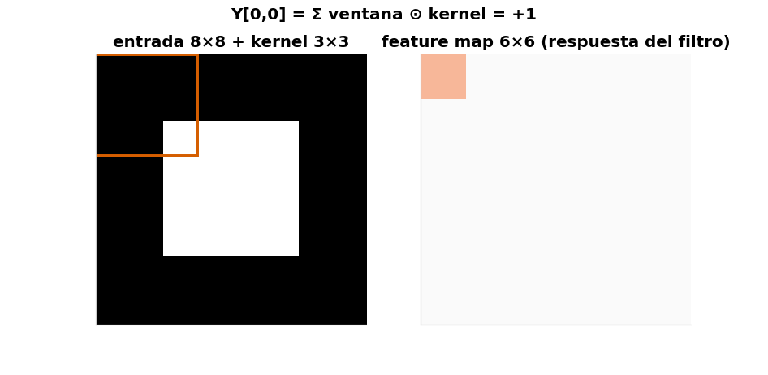
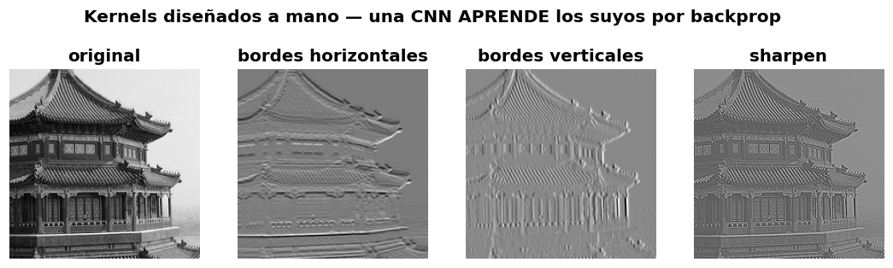
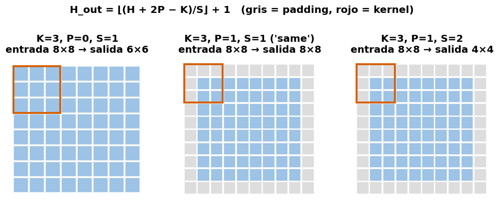
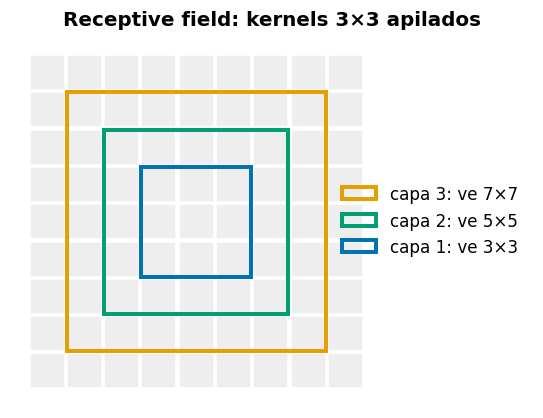
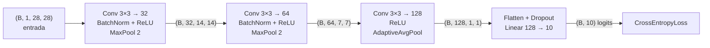
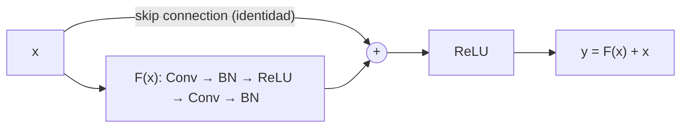

# 📗 Sesión 2 — CNN, optimización, regularización y transfer learning

Una **CNN** (*Convolutional Neural Network*, red neuronal convolucional) es la
arquitectura que dominó la visión por computadora: en lugar de conectar cada píxel con
cada neurona, desliza pequeños detectores por la imagen.

> **Pregunta detonante:** si aplanamos una imagen de 28×28 a un vector de 784 números,
> ¿qué acabamos de destruir?

**Duración:** 8 horas · **Laboratorio:** CNN sobre FashionMNIST · **Notebook:** [`03_cnn_fashionmnist.ipynb`](../notebooks/03_cnn_fashionmnist.ipynb)

**Objetivos de la sesión**

1. Explicar convolución, kernels, feature maps, stride, padding y receptive field.
2. Calcular shapes y número de parámetros de una CNN.
3. Entrenar una CNN y diagnosticar errores con curvas y matriz de confusión.
4. Comparar regularización, optimizadores y schedules mediante experimentos controlados.
5. Comprender conexiones residuales y aplicar transfer learning.

---

## 1. Del MLP a la visión: por qué aplanar es destruir

Una imagen tiene **estructura espacial**: un píxel se parece a sus vecinos, un borde es una
relación local, un ojo está *cerca* de otro ojo. Al aplanar `(28, 28) → (784,)`, el píxel
`[3, 5]` y el `[4, 5]` — vecinos verticales — quedan a 28 posiciones de distancia y la MLP
tiene que redescubrir esa vecindad desde cero, con un peso independiente por píxel.

La convolución explota dos ideas:

- **Localidad:** los patrones útiles (bordes, texturas) son locales → basta mirar ventanas pequeñas.
- **Compartir pesos:** un detector de bordes sirve *en cualquier parte* de la imagen → el mismo kernel se desliza por toda ella.

Resultado: muchísimos menos parámetros y una **inductive bias** correcta para imágenes
(*inductive bias*: una suposición incorporada a la arquitectura — aquí, "los patrones
son locales y se repiten en cualquier parte de la imagen").

### La imagen como tensor

Convención PyTorch **NCHW**: `(batch, channels, height, width)`. Una imagen RGB de 224×224
en un batch de 32 es `(32, 3, 224, 224)`.

---

## 2. La convolución, en cámara lenta

### Definición (2D, un canal, simplificada)

$$
Y[i,j]=\sum_m\sum_n X[i+m, j+n] K[m,n]+b
$$

Una ventana del tamaño del kernel se coloca sobre la imagen, se multiplica **elemento a
elemento** con el kernel, se suma todo y ese número es UNA celda del **feature map**. Luego
la ventana se desliza y se repite. En una CNN real se suman además los canales de entrada.



🕹️ **Simulador:** [Convolución 2D interactiva](https://felmco.github.io/deeplearning-class/interactivos/convolucion.html) — elige el kernel, el stride y el padding, y avanza paso a paso.

> 🎥 Dos refuerzos visuales excelentes: [CNN Explainer](https://poloclub.github.io/cnn-explainer/)
> (una CNN real, capa por capa, en el navegador) y 3Blue1Brown,
> [But what is a convolution?](https://www.youtube.com/watch?v=KuXjwB4LzSA)

### Kernels clásicos: la antesala de los filtros aprendidos



Estos kernels (bordes, sharpen) fueron **diseñados a mano** durante décadas de visión por
computadora. La revolución de las CNN: los valores del kernel son **parámetros entrenables**
— backpropagation encuentra los detectores óptimos para la tarea.

### Stride, padding y el tamaño de salida

$$
H_{out}=\left\lfloor\frac{H_{in}+2P-D(K-1)-1}{S}\right\rfloor+1
$$

donde $K$ = tamaño del kernel, $P$ = padding, $S$ = stride, $D$ = dilation (*dilation*:
separar los elementos del kernel dejando huecos; en este curso siempre $D=1$, con lo que
queda la forma familiar $\lfloor (H+2P-K)/S \rfloor + 1$). Los corchetes ⌊ ⌋
significan "redondear hacia abajo".



> 🧩 **Ejercicio:** `H=28, K=3, P=1, S=2` → $\lfloor(28+2-3)/2\rfloor+1 = 14$. Verifícalo
> en el simulador.

### Parámetros de una capa Conv2d

$$
N_\theta=C_{out}(C_{in}K_hK_w+1)
$$

$N_\theta$ = número de parámetros de la capa. El `+1` es el bias por canal de salida. Comparación que lo dice todo, para una imagen 28×28:

| Capa | Parámetros |
|---|---:|
| `Linear(784, 128)` | 100 480 |
| `Conv2d(1, 32, kernel_size=3)` | **320** |

### Pooling y receptive field

**MaxPool 2×2** toma el máximo de cada ventana: reduce resolución a la mitad, aporta
invariancia local a traslaciones pequeñas y abarata las capas siguientes.

**Receptive field:** la región de la imagen *original* que influye en una activación
profunda. Crece con la profundidad — por eso las capas tempranas detectan bordes y las
profundas, objetos.



---

## 3. Arquitectura CNN del laboratorio



Implementación comentada línea por línea: [`src/models.py → FashionCNN`](../src/models.py).
El **shape tracing** (anotar la shape tras cada capa, como en el diagrama) es la técnica #1
para depurar arquitecturas — practícalo en el notebook.

### FashionMNIST

10 clases de ropa, 28×28 en escala de grises, 60k train / 10k test. Es el "hello world"
honesto de visión: lo bastante fácil para entrenar en CPU, lo bastante difícil para que
`Shirt` vs `Pullover` produzca errores interesantes.

---

## 4. Entrenamiento robusto

### Normalización de entradas

Centrar y escalar los píxeles con estadísticas **calculadas solo en train**
(FashionMNIST: μ=0.2860, σ=0.3530; μ = la media de los valores, σ = la desviación
estándar, el "ancho" típico alrededor de esa media). Ver [`configs/cnn.yaml`](../configs/cnn.yaml).

### Data augmentation

Transformaciones **plausibles que preservan la etiqueta**: flips horizontales suaves,
rotaciones pequeñas. Una camiseta rotada 8° sigue siendo camiseta; un 6 rotado 180° ya no
es un 6 — el augmentation se diseña *por dataset*.

### Dropout

En entrenamiento, cada neurona se apaga lanzando una moneda cargada con probabilidad $p$
(los estadísticos lo llaman *máscara de Bernoulli*): la red no
puede depender de ninguna neurona individual → co-adaptación rota → mejor generalización.
En inferencia no se apaga nada (se compensa la escala). De ahí la importancia de
`model.train()` / `model.eval()`.

### Batch Normalization

$$
\hat x=\frac{x-\mu_B}{\sqrt{\sigma_B^2+\epsilon}} \qquad y=\gamma\hat x+\beta
$$

Normaliza las activaciones con las estadísticas del mini-batch (la μ y la σ calculadas sobre ese batch) y luego
las re-escala con parámetros aprendibles $\gamma, \beta$. Efecto práctico: estabiliza y
acelera el entrenamiento, tolera learning rates mayores.

> ⚠️ **Train vs eval:** en entrenamiento usa estadísticas del batch; en evaluación usa
> promedios acumulados. Evaluar en modo train da métricas erráticas — bug clásico.

**LayerNorm vs BatchNorm:** BatchNorm normaliza a través del *batch* (típico en CNN);
LayerNorm normaliza a través de las *features de cada muestra* (el estándar en
Transformers, lo veremos en la Sesión 3).

---

## 5. Optimizadores y schedules

### SGD con momentum

**SGD** (*Stochastic Gradient Descent*): el descenso por gradiente de la Sesión 1,
calculado sobre mini-batches aleatorios — de ahí lo de "estocástico".

$$
v_t=\beta v_{t-1}+g_t,\qquad \theta_{t+1}=\theta_t-\eta v_t
$$

donde $g_t$ es el gradiente actual y $\beta$ (≈ 0.9) cuánta "velocidad" anterior se
conserva. El momentum acumula esa velocidad: amortigua oscilaciones perpendiculares al
valle y acelera en la dirección persistente del gradiente.

> 🎥 Para jugarlo visualmente: [Why Momentum Really Works (distill.pub)](https://distill.pub/2017/momentum/) — interactivo, opcional.

### Adam / AdamW

Adam mantiene **dos promedios móviles por parámetro**: el del gradiente (¿hacia dónde
suele apuntar?) y el de su cuadrado (¿qué tan grande suele ser?), y usa ambos para
adaptar el tamaño del paso de cada parámetro por separado. **AdamW**
desacopla el weight decay de la actualización adaptativa — es el default razonable del
curso.

| Situación | Elección práctica |
|---|---|
| Prototipo rápido, poco tuning | AdamW |
| Visión con presupuesto para tunear LR | SGD + momentum (a veces generaliza mejor) |
| Fine-tuning de Transformers | AdamW con warmup (Sesión 4) |

### Learning-rate schedules

El LR óptimo no es constante: **warmup** al inicio (evita explosiones tempranas),
decaimiento después (afinar la convergencia). Formas típicas: step, **cosine**, one-cycle.
El laboratorio usa `CosineAnnealingLR`.

### Early stopping + checkpoint

Guardar el modelo **cuando la validation loss mejora**; si no mejora en `patience` epochs,
detener y restaurar el mejor. Implementado en [`src/train.py → entrenar()`](../src/train.py).

---

## 6. Diagnóstico: curvas, confusión y errores

El flujo de evidencia del curso, en orden:

1. **Curvas train/validation** → ¿under/overfitting? ¿inestabilidad?
2. **Matriz de confusión** → ¿qué clases se confunden entre sí? (`Shirt` ↔ `T-shirt`…)
3. **Galería de errores de alta confianza** → ¿el error es del dato (etiqueta dudosa) o del
   modelo (límite real)?

Herramientas listas en [`src/evaluate.py`](../src/evaluate.py):
`predecir()`, `reporte_completo()`, `errores_alta_confianza()`.

---

## 7. Conexiones residuales y ResNet

**El problema:** apilar más capas *debería* ayudar, pero las redes muy profundas entrenaban
*peor* — el gradiente se degrada al atravesar decenas de transformaciones.

**La solución (He et al., 2015):**

$$
y=F(x;\theta)+x
$$

La capa aprende el **residuo** $F(x)$ — la *corrección* sobre la identidad — y el término
$+x$ crea una autopista directa para el gradiente. Si la capa no aporta, puede aprender
$F(x)\approx 0$ y no estorbar.



Esta idea reaparecerá **idéntica** en los bloques Transformer de la Sesión 3.

## 8. Transfer learning

**Intuición.** Una ResNet entrenada en ImageNet ya sabe ver: bordes, texturas, formas,
partes. Ese conocimiento se **transfiere**: se reemplaza la **cabeza** de clasificación
(la capa final que decide la clase) y se reutiliza el **backbone** (el "cuerpo" de la
red: todas las capas convolucionales que extraen features).

```python
from torchvision.models import ResNet18_Weights, resnet18
from torch import nn

model = resnet18(weights=ResNet18_Weights.DEFAULT)  # pesos de ImageNet

for parameter in model.parameters():
    parameter.requires_grad = False        # congelar el backbone

model.fc = nn.Linear(model.fc.in_features, 10)      # nueva cabeza (entrenable)
```

| Datos disponibles | Estrategia |
|---|---|
| Muy pocos | congelar todo, entrenar solo la cabeza |
| Moderados | descongelar las últimas capas, LR pequeño |
| Muchos | full fine-tuning con LR diferencial |

> ⚠️ Para FashionMNIST habría que convertir 1 canal a 3 y redimensionar según los
> transforms de los pesos; para practicar transferencia es preferible CIFAR-10 o un dataset
> RGB propio (ver reto opcional del notebook).

---

## 9. 🧪 Laboratorio 2 — CNN para FashionMNIST

**Notebook:** [`03_cnn_fashionmnist.ipynb`](../notebooks/03_cnn_fashionmnist.ipynb) ·
**Config:** [`configs/cnn.yaml`](../configs/cnn.yaml)

### Experimento controlado

Cada equipo elige UNA hipótesis y la contrasta con **una sola variable cambiada**, mismos
splits y misma seed:

- Augmentation mejora la generalización.
- BatchNorm permite un learning rate mayor.
- AdamW converge más rápido que SGD+momentum en el presupuesto dado.
- Dropout alto puede producir underfitting.
- Cosine schedule mejora el mejor checkpoint frente a LR constante.

### Evidencia a entregar

- Curvas de ambos runs superpuestas.
- Matriz de confusión y classification report del mejor run.
- Galería de 10 errores de alta confianza con comentario.
- Conclusión: hipótesis → evidencia → decisión.
- Commit: `feat: complete cnn experiment`.

---

## 🎟️ Exit ticket de la Sesión 2

1. Calcula la salida de una conv con `H=28, K=3, P=1, S=2`.
2. ¿Por qué una CNN usa menos parámetros que una capa densa sobre una imagen?
3. ¿Qué cambia en BatchNorm entre entrenamiento e inferencia?
4. ¿Qué evidencia mostraría que el augmentation fue demasiado agresivo?
5. ¿Cuándo congelarías el backbone y cuándo harías full fine-tuning?

---

| [⬅️ Sesión 1: Fundamentos](01-fundamentos.md) | [🏠 Inicio](../README.md) | [Sesión 3: Transformers ➡️](03-secuencias-transformers.md) |
|---|---|---|
