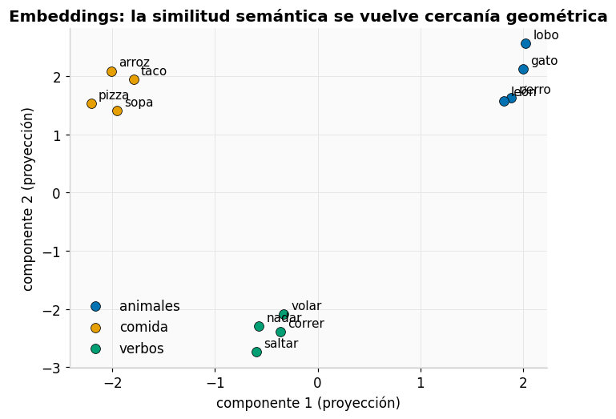
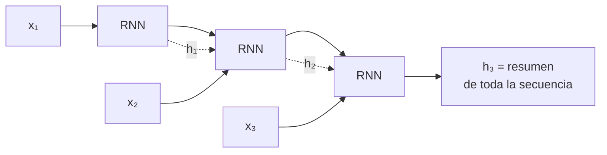
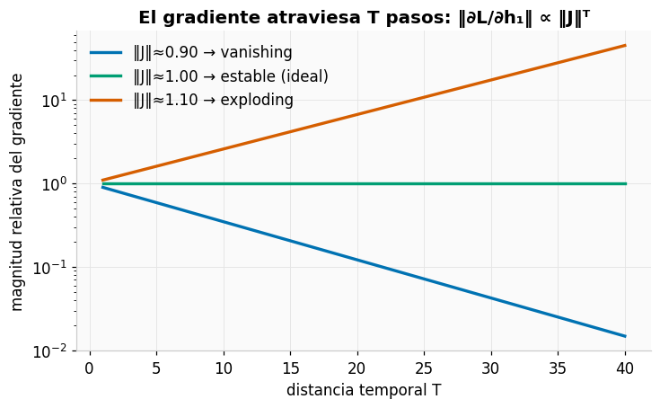
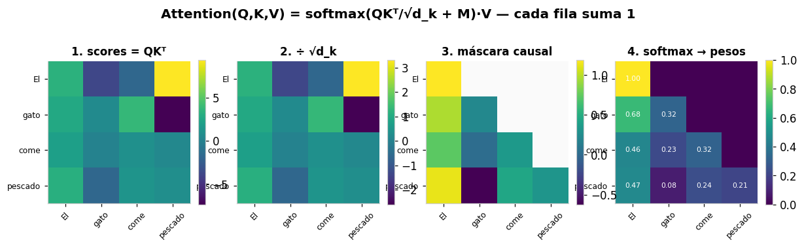
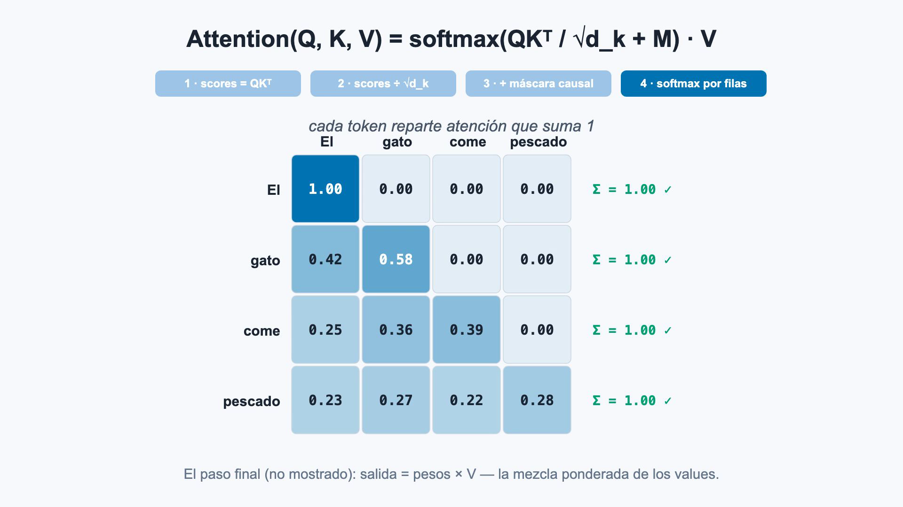
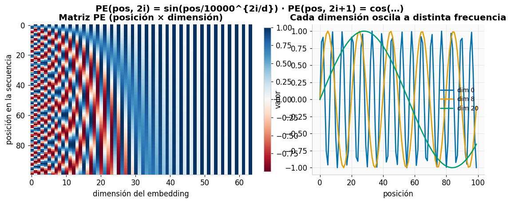
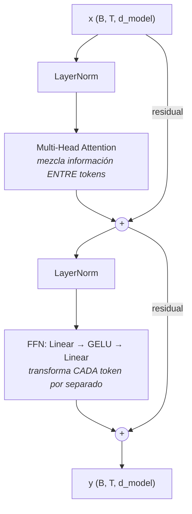
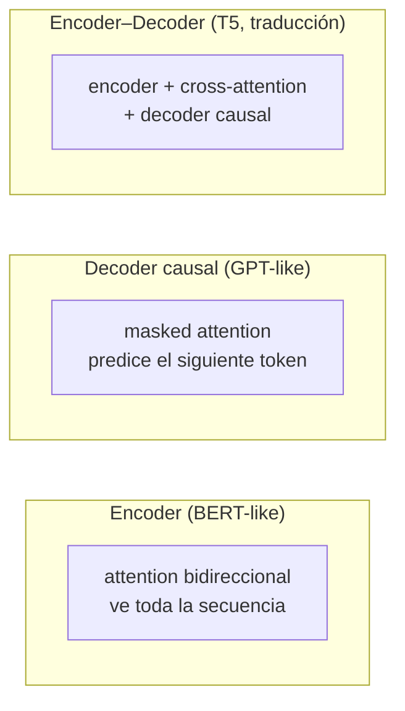
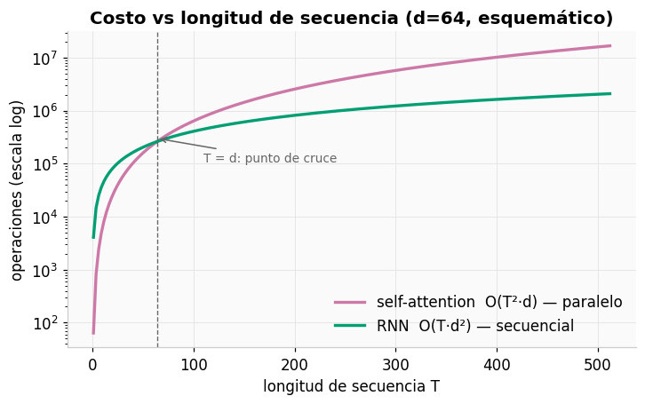

# 📙 Sesión 3 — Secuencias, atención y arquitectura Transformer

> **Pregunta detonante:** "no es bueno" y "es bueno" usan casi las mismas palabras.
> ¿Cómo hace un modelo para que el *orden* y el *contexto* importen?

**Duración:** 8 horas · **Laboratorio:** attention y bloque Transformer desde cero ·
**Notebooks:** [`04_sequences_rnn.ipynb`](../notebooks/04_sequences_rnn.ipynb) y [`05_attention_from_scratch.ipynb`](../notebooks/05_attention_from_scratch.ipynb)

**Objetivos de la sesión**

1. Comprender tokenización, vocabulario, embeddings y máscaras.
2. Explicar RNN, BPTT, LSTM/GRU y sus limitaciones.
3. Derivar scaled dot-product attention con shapes.
4. Explicar multi-head attention, positional encoding, residuals y LayerNorm.
5. Diferenciar encoder, decoder causal y encoder–decoder.
6. Implementar y probar attention y un bloque Transformer simplificado.

---

## 1. De texto a tensores

### Tokenización

Un modelo no ve palabras: ve **IDs enteros**. El tokenizer parte el texto en unidades
(tokens) y les asigna un ID de un **vocabulario**.

| Estrategia | "transformadores" se convierte en… | Trade-off |
|---|---|---|
| Por palabra | `[transformadores]` | vocabulario enorme, palabras raras = `<unk>` |
| Por carácter | `[t,r,a,n,s,...]` | vocabulario mínimo, secuencias larguísimas |
| **Subword** (BPE/WordPiece) | `[transform, ادores]`* | equilibrio: lo raro se descompone |

\* *ilustrativo; los cortes reales dependen del corpus de entrenamiento del tokenizer
(el **corpus**: la colección de textos con la que se entrenó). BPE (*Byte-Pair
Encoding*) y WordPiece son algoritmos que aprenden los cortes más frecuentes de ese
corpus; si quieres verlos por dentro:
[Let's build the GPT Tokenizer, de Karpathy](https://www.youtube.com/watch?v=zduSFxRajkE).*

### Embeddings: de IDs a geometría

Si $E\in\mathbb{R}^{|V|\times d}$ es la matriz de embeddings y el token tiene ID $i$:

$$
e_i=E[i]\in\mathbb{R}^{d}
$$

Un **lookup diferenciable**: cada token es una fila de una matriz *entrenable*. Con el
entrenamiento, tokens de uso similar terminan geométricamente cerca — la **semántica
distribuida**.



> ⚠️ La **similitud coseno** (medir el ángulo entre dos vectores: 1 ≈ misma dirección,
> 0 ≈ sin relación, −1 ≈ opuestos) y las analogías ("rey − hombre + mujer ≈ reina") son
> intuición útil, no garantía matemática.

### Longitud variable: padding y máscaras

Las secuencias de un batch tienen longitudes distintas; se rellenan con `<pad>` hasta la
más larga **del batch** (dynamic padding) y una **máscara booleana** marca qué posiciones
son reales. Sin máscara, el padding contamina el pooling, la loss y la attention.

```text
ids  = [ 12, 843,  7,  0,  0 ]      0 = <pad>
mask = [  1,   1,  1,  0,  0 ]      1 = token real
```

---

## 2. RNN: la primera respuesta al problema secuencial

Una **RNN** (*Recurrent Neural Network*, red neuronal recurrente) procesa la secuencia
token a token, arrastrando un "estado" que resume lo leído hasta el momento.

### La idea: un estado que se actualiza paso a paso

La receta: el estado nuevo se cocina mezclando la entrada actual con el estado anterior,
siempre con los mismos pesos.

$$
h_t=\tanh(W_{xh}x_t+W_{hh}h_{t-1}+b_h) \qquad y_t=W_{hy}h_t+b_y
$$



El estado $h_t$ es una **memoria comprimida** de todo lo visto hasta $t$. Los mismos pesos
$W$ se aplican en cada paso (compartir parámetros a través del *tiempo*, como la CNN los
comparte a través del *espacio*).

### Backpropagation Through Time (BPTT) y sus dos enfermedades

Entrenar una RNN = desplegar el grafo por $T$ pasos y aplicar backprop a través de todos
ellos (de ahí el nombre: *backpropagation through time*). La clave: el gradiente llega
al pasado **multiplicándose por un factor en cada paso**. Y las multiplicaciones
repetidas solo tienen dos destinos:

- factor un poco **menor que 1** → el producto colapsa: $0.9^{100} \approx 0.00003$.
  El gradiente **se desvanece** y es imposible aprender dependencias largas.
- factor un poco **mayor que 1** → el producto estalla: $1.1^{100} \approx 13{,}780$.
  El gradiente **explota** y el entrenamiento se vuelve inestable.
  *Parche:* `clip_grad_norm_` recorta los gradientes gigantes (resuelve la explosión,
  no el desvanecimiento).



> 📐 *Nota para quien tenga cálculo:* ese "factor" es en realidad una matriz de derivadas
> llamada **Jacobiano**, y $\|J\|$ (su norma) mide su "tamaño". La intuición escalar de
> arriba es exactamente la misma.

### LSTM: memoria con compuertas

Una **LSTM** (*Long Short-Term Memory*) es una RNN con "compuertas" que regulan qué se
guarda y qué se olvida.

> 📐 **Notación de las fórmulas:** $\sigma$ = sigmoid (aplasta a 0–1: funciona como una
> "perilla" de cuánto pasa); $\odot$ = multiplicación elemento a elemento;
> $[x_t, h_{t-1}]$ = pegar los dos vectores uno tras otro (concatenar).

$$
f_t=\sigma(W_f[x_t,h_{t-1}]+b_f) \qquad i_t=\sigma(W_i[x_t,h_{t-1}]+b_i)
$$

$$
\tilde c_t=\tanh(W_c[x_t,h_{t-1}]+b_c) \qquad c_t=f_t\odot c_{t-1}+i_t\odot\tilde c_t
$$

$$
o_t=\sigma(W_o[x_t,h_{t-1}]+b_o) \qquad h_t=o_t\odot\tanh(c_t)
$$

**Intuición por compuerta:** la celda $c_t$ es una cinta transportadora de memoria;
$f_t$ (forget) decide qué **borrar**, $i_t$ (input) qué **escribir**, $o_t$ (output) qué
**leer**. La suma $c_t=f_t\odot c_{t-1}+i_t\odot\tilde c_t$ crea un camino aditivo para el
gradiente — la misma medicina que las conexiones residuales.

**GRU** (*Gated Recurrent Unit*): la versión compacta (2 compuertas, sin celda separada).
Menos parámetros, desempeño a menudo comparable.

> 🎥 La explicación visual canónica de las compuertas:
> [Understanding LSTM Networks, de Chris Olah](https://colah.github.io/posts/2015-08-Understanding-LSTMs/).

### El cuello de botella que motiva todo lo demás

Aun con LSTM, quedan dos límites estructurales:

1. **Procesamiento secuencial:** $h_t$ necesita $h_{t-1}$ → imposible paralelizar sobre $T$.
2. **Memoria comprimida:** toda la historia debe caber en UN vector de estado.

---

## 3. Attention: acceso directo a todo el contexto

### La intuición Query–Key–Value

Cada token emite tres vectores mediante proyecciones aprendidas:

| Vector | Rol | Analogía de biblioteca |
|---|---|---|
| **Query** $q$ | lo que este token *busca* | tu pregunta al bibliotecario |
| **Key** $k$ | lo que este token *ofrece* como coincidencia | el título en el lomo del libro |
| **Value** $v$ | la información que *transporta* | el contenido del libro |

La compatibilidad entre una query y una key es su **producto punto** $q\cdot k$: grande si
apuntan en direcciones similares.

### La fórmula

$$
\mathrm{Attention}(Q,K,V)=\mathrm{softmax}\left(\frac{QK^\top}{\sqrt{d_k}}+M\right)V
$$

Paso a paso, con la matriz real calculada:



1. **$QK^\top$** — todas las compatibilidades query–key a la vez: shape `(T, T)`.
2. **$\div\sqrt{d_k}$** — cada score suma $d_k$ productos, así que con $d_k$ grande los
   scores crecen (más o menos como $\sqrt{d_k}$), el softmax concentra todo en un token
   ("se satura") y los gradientes mueren. Dividir por $\sqrt{d_k}$ los mantiene en un
   rango moderado. *(En términos estadísticos: mantiene la varianza ≈ 1.)*
3. **$+M$ (máscara)** — $M=0$ en posiciones permitidas y $-\infty$ en las bloqueadas
   (futuro, padding) → el softmax les asigna probabilidad ~0.
4. **softmax** por filas — cada query reparte una distribución de atención que **suma 1**.
5. **$\times V$** — mezcla ponderada de los values: la información fluye entre tokens.

**Shapes del contrato** (memorízalos):

```text
Q, K, V : (B, H, T, d_k)     B=batch, H=heads, T=tokens
QKᵀ     : (B, H, T, T)   ← cuadrático en T: el costo de ver todo
salida  : (B, H, T, d_k)
```

🕹️ **Simulador:** [Scaled dot-product attention](https://felmco.github.io/deeplearning-class/interactivos/atencion.html) — edita los vectores, activa la máscara causal y mira el softmax recalcularse.

🎬 **Animación:** el video anima este pipeline paso a paso — scores, escala, máscara causal
y softmax por filas, con los números recalculándose en cada etapa.

[](https://felmco.github.io/deeplearning-class/videos/flujo-atencion.mp4)

▶️ [Reproducir el video](https://felmco.github.io/deeplearning-class/videos/flujo-atencion.mp4) · [código fuente de la animación](../remotion/README.md)

### Máscara causal vs padding mask

| Máscara | Bloquea | Se usa en |
|---|---|---|
| **Causal** (triangular) | el futuro: la posición $t$ solo ve $\le t$ | decoders (GPT), generación |
| **Padding** | los tokens `<pad>` | cualquier batch con longitudes variables |

> ⚠️ Un peso de atención alto es un **patrón de ruteo de información**, no una prueba
> causal de "el modelo se fijó en X por la razón Y". Interpretar con humildad.

---

## 4. Multi-head attention y la cuestión de la posición

### Varias miradas en paralelo

$$
\mathrm{head}_i=\mathrm{Attention}(QW_i^Q,KW_i^K,VW_i^V) \qquad
\mathrm{MHA}(Q,K,V)=\mathrm{Concat}(\mathrm{head}_1,\dots,\mathrm{head}_h)\,W^O
$$

En lugar de una atención de dimensión $d_{model}$, se ejecutan $h$ atenciones de dimensión
$d_{model}/h$: cada head puede especializarse en relaciones distintas (sintaxis cercana,
correferencia lejana — saber que "ella" refiere a "María" cinco palabras atrás —,
posición). Sus salidas se concatenan y se proyectan con $W^O$. **MHA** = *multi-head
attention*, el nombre de todo este mecanismo.

> 🎥 **Si esta sección se te movió el piso, dos refuerzos excelentes:**
> [The Illustrated Transformer, de Jay Alammar](https://jalammar.github.io/illustrated-transformer/)
> (la derivación con figuras, paso a paso) y 3Blue1Brown,
> [Attention in transformers, visually explained](https://www.youtube.com/watch?v=eMlx5fFNoYc);
> su [But what is a GPT?](https://www.youtube.com/watch?v=wjZofJX0v4M) da el mapa general.

### La self-attention no sabe de orden

Permutar los tokens de entrada permuta la salida de la misma forma: la atención es
**permutacionalmente invariante**. "perro muerde hombre" = "hombre muerde perro". La
solución: **sumar** a cada embedding una señal que codifique su posición.

$$
PE(pos,2i)=\sin\!\left(\frac{pos}{10000^{2i/d_{model}}}\right) \qquad
PE(pos,2i+1)=\cos\!\left(\frac{pos}{10000^{2i/d_{model}}}\right)
$$



Cada posición recibe una "firma" única hecha de ondas de frecuencias distintas — como un
reloj con manecillas de horas, minutos y segundos. El $10000^{2i/d}$ solo gradúa esas
frecuencias: dimensiones bajas oscilan rápido (los "segundos"), altas oscilan lento (las
"horas"). (Los modelos modernos usan variantes aprendidas o rotatorias como RoPE,
*Rotary Position Embeddings*; la intuición es la misma.)

🕹️ **Simulador:** [Positional encoding](https://felmco.github.io/deeplearning-class/interactivos/positional-encoding.html).

---

## 5. El bloque Transformer completo

$$
x'=x+\mathrm{MHA}(\mathrm{LN}(x)) \qquad
y=x'+\mathrm{FFN}(\mathrm{LN}(x'))
$$

Donde **LN** = LayerNorm (Sesión 2) y **FFN** = *feed-forward network*: una mini-MLP de
dos capas que se aplica a cada token por separado.



**La división del trabajo, que hay que poder recitar:**

- La **attention** es la única parte que **mezcla información entre tokens** (comunicación).
- La **FFN** transforma cada token **independientemente** (computación por posición).
- Los **residuals** ($+x$) son la autopista del gradiente — la lección de ResNet, reciclada.
- **LayerNorm** (*pre-norm*: normalizar *antes* de cada subcapa, la variante moderna más
  estable) estabiliza cada subcapa normalizando las features de cada token.

### Las tres familias



*Cross-attention*: el decoder usa sus queries contra las keys/values del **encoder** —
así la traducción "consulta" la oración original mientras genera.

| | BERT-like (encoder) | GPT-like (decoder causal) |
|---|---|---|
| Atención | bidireccional | causal (solo pasado) |
| Objetivo de pretraining | masked language modeling (se ocultan tokens al azar y el modelo debe adivinarlos) | next-token prediction (predecir siempre el token siguiente) |
| Fortaleza típica | comprensión/clasificación | generación |

> 📖 Los nombres, por si te lo preguntabas: **GPT** = *Generative Pre-trained
> Transformer*; **BERT** = *Bidirectional Encoder Representations from Transformers*;
> **T5** = *Text-to-Text Transfer Transformer*.

### Complejidad



Self-attention: $O(T^2 d)$ pero **paralelo** en $T$. RNN: $O(T d^2)$ pero **secuencial**.
Con hardware masivamente paralelo, el Transformer gana en la práctica — pagando el costo
cuadrático en la longitud de secuencia (de ahí toda la investigación en atención eficiente).

---

## 6. ✍️ Actividad manual — una fila de attention

Con tres tokens y $d_k=2$:

$$
Q=K=\begin{bmatrix}1&0\\0&1\\1&1\end{bmatrix},\qquad
V=\begin{bmatrix}1&2\\3&0\\0&4\end{bmatrix}
$$

Calcula a mano: (1) `scores = Q @ K.T`, (2) `scores/√2`, (3) softmax de la primera fila,
(4) la combinación ponderada de $V$, (5) el efecto de una máscara causal. Luego verifica
cada paso en el [simulador de attention](https://felmco.github.io/deeplearning-class/interactivos/atencion.html).

## 7. 🔬 Laboratorio visual — Transformer Explainer

**URL:** <https://poloclub.github.io/transformer-explainer/> (GPT-2 small corriendo en tu navegador)

> 📖 **Tres controles de generación que verás en los pasos 9-10** (los usaremos a fondo
> en la Sesión 4):
> - **Temperatura**: cuánto se "aplana" la distribución antes de sortear el siguiente
>   token — baja (0.2) → conservador y repetitivo; alta (1.5) → creativo y arriesgado.
> - **Top-k**: solo se sortea entre los $k$ tokens más probables.
> - **Top-p**: solo entre los tokens que acumulan probabilidad $p$ (el grupo se agranda
>   o achica según la confianza del modelo).
>
> Profundiza: [How to generate text (blog de Hugging Face)](https://huggingface.co/blog/how-to-generate)
> y nuestro [simulador de softmax y temperatura](https://felmco.github.io/deeplearning-class/interactivos/softmax-temperatura.html).

Guion de 35–40 minutos:

1. Ingresa un prompt corto y observa la **tokenización**.
2. Inspecciona token embeddings y positional embeddings.
3. Confirma que GPT-2 small usa múltiples bloques y **12 attention heads**.
4. Elige una head y compara los pesos para dos tokens.
5. Observa la **máscara causal**: ninguna posición consulta tokens futuros.
6. Sigue el flujo completo: $QK^\top$ → escala → máscara → softmax → $\times V$.
7. Inspecciona la MLP, los residuals y LayerNorm.
8. Observa los **logits** y la distribución del siguiente token.
9. Cambia la **temperatura** con el mismo prompt.
10. Compara **top-k** y **top-p** y registra qué cambia.

**Preguntas de discusión:** ¿una head representa siempre una relación lingüística
interpretable? ¿Un peso alto demuestra causalidad? ¿Qué parte del bloque mezcla información
entre tokens y qué parte transforma cada token por separado?

---

## 8. 🧪 Laboratorio 3 — Attention y bloque Transformer desde cero

**Notebook:** [`05_attention_from_scratch.ipynb`](../notebooks/05_attention_from_scratch.ipynb) ·
**Implementación de referencia:** [`src/models.py`](../src/models.py) ·
**Pruebas:** [`tests/test_shapes.py`](../tests/test_shapes.py)

### Entregables

- Implementación de `scaled_dot_product_attention` con validaciones de shapes.
- Prueba de que cada fila de pesos suma ≈ 1.
- Prueba de que la máscara causal bloquea el futuro.
- Backpropagation exitoso a través del bloque completo.
- Heatmap de una attention head.
- Comparación de dos prompts en Transformer Explainer.
- Reflexión: qué puede inferirse y qué NO de un attention map.
- Commit: `feat: complete attention lab`.

---

## 🎟️ Exit ticket de la Sesión 3

1. ¿Qué representan Q, K y V?
2. ¿Por qué se divide por $\sqrt{d_k}$?
3. ¿Cuál es la diferencia entre padding mask y causal mask?
4. ¿Dónde se mezcla información entre tokens y dónde se transforma cada token?
5. ¿Por qué un decoder causal no puede usar información futura durante el entrenamiento?

---

| [⬅️ Sesión 2: CNN](02-cnn-vision.md) | [🏠 Inicio](../README.md) | [Sesión 4: Hugging Face ➡️](04-hugging-face-proyecto.md) |
|---|---|---|
