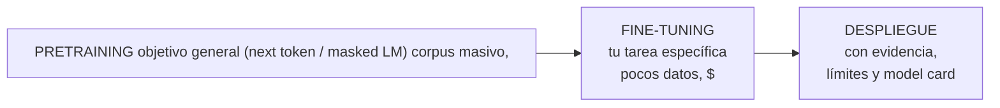
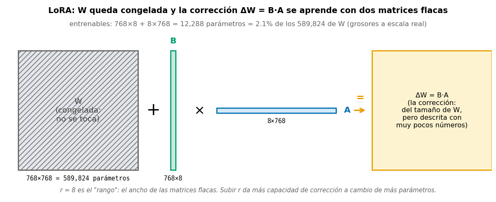

# 📕 Sesión 4 — Hugging Face, fine-tuning, evaluación responsable y entrega

> **Pregunta detonante:** ya nadie entrena desde cero para la mayoría de las tareas.
> ¿Cómo se **reutiliza** un modelo preentrenado con evidencia y responsabilidad?

**Duración:** 8 horas · **Laboratorio:** fine-tuning de DistilBERT + proyecto integrador ·
**Notebook:** [`06_hf_finetuning.ipynb`](../notebooks/06_hf_finetuning.ipynb)

**Objetivos de la sesión**

1. Seleccionar un checkpoint mediante evidencia, licencia y restricciones.
2. Tokenizar, cargar datasets y crear batches con dynamic padding.
3. Fine-tunear un Transformer para clasificación con Hugging Face.
4. Evaluar con accuracy, macro-F1, matriz de confusión y análisis de errores.
5. Introducir PEFT/LoRA y cuantización sin confundirlas con garantías de calidad.
6. Documentar reproducibilidad, riesgos, privacidad y limitaciones.

---

## 1. Pretraining y downstream tasks



**La idea económica de la década:** el pretraining aprende representaciones generales del
lenguaje una sola vez (costo enorme, lo pagan pocos); el fine-tuning las especializa a tu
tarea con pocos datos y poco cómputo. Los **modelos fundacionales** extienden esto a
visión, audio y multimodalidad.

> 🎥 El paradigma con figuras: [The Illustrated BERT, de Jay Alammar](https://jalammar.github.io/illustrated-bert/).

## 2. El ecosistema Hugging Face

| Pieza | Qué resuelve |
|---|---|
| **Hub** | repositorio de modelos, datasets y demos con versionado |
| **Transformers** | arquitecturas + checkpoints con API unificada |
| **Datasets** | carga, split, `map`, streaming de datos |
| **Tokenizers** | tokenización subword rápida |
| **Evaluate** | métricas estandarizadas |
| **Accelerate** | mismo código en CPU/GPU/multi-GPU |
| **PEFT** | *Parameter-Efficient Fine-Tuning*: ajustar solo una fracción diminuta de los parámetros (LoRA y compañía, ver §6) |
| **Spaces** | hospedar demos (Gradio) |

> 📖 **checkpoint**, en el Hub, significa "modelo preentrenado publicado con sus pesos"
> — no confundir con el checkpoint de los Labs 2-3 (el mejor modelo guardado *durante tu
> entrenamiento*). Misma palabra, dos costumbres.

### La model card: leer antes de usar

Antes de adoptar un checkpoint, la model card debe responder: ¿qué arquitectura y datos?
¿qué licencia? ¿para qué usos se evaluó? ¿qué límites y sesgos reporta? Elegir modelo sin
leer la model card es como recetar un fármaco sin leer el prospecto.

**Matriz de selección de checkpoint:** idioma ∩ tarea ∩ tamaño ∩ licencia ∩ contexto ∩
costo ∩ evidencia. Para el laboratorio: `distilbert-base-uncased` — pequeño, bien
documentado, entrenable en CPU/GPU modesta.

### Validación rápida con `pipeline`

```python
from transformers import pipeline

# pipeline valida en 3 líneas que la tarea "existe" y su contrato I/O
classifier = pipeline(
    task='sentiment-analysis',
    model='distilbert/distilbert-base-uncased-finetuned-sst-2-english',
)
print(classifier(['The labs are useful.', 'Nothing worked.']))
```

> `pipeline` sirve para explorar; **no** sustituye revisar model card, idioma, licencia,
> métricas y sesgos.

---

## 3. Tokenización en serio

**Regla de oro: tokenizer y modelo deben venir del MISMO checkpoint.** El modelo aprendió
con un vocabulario y unas reglas de segmentación concretas; mezclar tokenizers produce
embeddings sin sentido (y no lanza ningún error — falla en silencio).

```python
from transformers import AutoTokenizer

tokenizer = AutoTokenizer.from_pretrained('distilbert/distilbert-base-uncased')

salida = tokenizer('Deep learning is fascinating!')
# input_ids      → IDs del vocabulario (con [CLS] al inicio y [SEP] al final)
# attention_mask → 1 = token real, 0 = padding
```

| Concepto | Qué es |
|---|---|
| **Subwords** | palabras raras se parten: `fascinating → fascin + ##ating` |
| **Tokens especiales** | `[CLS]` (resumen), `[SEP]` (separador), `[PAD]`, o `BOS/EOS` según arquitectura |
| **attention_mask** | máscara de padding (≠ máscara causal de la Sesión 3) |
| **truncation** | cortar secuencias al máximo del modelo |
| **Dynamic padding** | `DataCollatorWithPadding` rellena al máximo del *batch*, no del dataset → menos cómputo |

---

## 4. Fine-tuning con `Trainer`

Flujo completo del laboratorio ([notebook 06](../notebooks/06_hf_finetuning.ipynb),
[config](../configs/transformer.yaml)) sobre **rotten_tomatoes** (reseñas de cine, binario):

```python
from datasets import load_dataset
from transformers import (AutoModelForSequenceClassification, AutoTokenizer,
                          DataCollatorWithPadding, EarlyStoppingCallback,
                          Trainer, TrainingArguments)

raw = load_dataset('rotten_tomatoes')
tokenizer = AutoTokenizer.from_pretrained('distilbert/distilbert-base-uncased')

def tokenize_batch(batch):
    return tokenizer(batch['text'], truncation=True, max_length=256)

tokenized = raw.map(tokenize_batch, batched=True)

model = AutoModelForSequenceClassification.from_pretrained(
    'distilbert/distilbert-base-uncased',
    num_labels=2,
    id2label={0: 'NEGATIVE', 1: 'POSITIVE'},
    label2id={'NEGATIVE': 0, 'POSITIVE': 1},
)

training_args = TrainingArguments(
    output_dir='artifacts/distilbert-rotten-tomatoes',
    learning_rate=2e-5,              # pequeño: no destruir lo preentrenado
    per_device_train_batch_size=16,
    num_train_epochs=3,
    weight_decay=0.01,
    warmup_ratio=0.1,                # warmup del LR
    eval_strategy='epoch',
    save_strategy='epoch',
    load_best_model_at_end=True,
    metric_for_best_model='macro_f1',
    report_to='none',
    seed=42,
)

trainer = Trainer(
    model=model,
    args=training_args,
    train_dataset=tokenized['train'],
    eval_dataset=tokenized['validation'],
    processing_class=tokenizer,
    data_collator=DataCollatorWithPadding(tokenizer=tokenizer),
    compute_metrics=compute_metrics,        # accuracy + macro-F1 (ver notebook)
    callbacks=[EarlyStoppingCallback(early_stopping_patience=2)],
)
trainer.train()
```

**Qué automatiza `Trainer` y qué NO:** automatiza el loop (que ya sabes escribir a mano
desde la Sesión 1 — por eso lo escribiste primero), el mixed precision, los checkpoints y
el logging. **No** automatiza el diseño experimental: splits, baseline, métricas y análisis
de errores siguen siendo tu trabajo.

> ⚙️ **Compatibilidad:** esta guía usa `processing_class=` y `eval_strategy=`, coherentes
> con Transformers 5.x. Ejecutar un smoke test (prueba mínima de "¿enciende sin
> explotar?": importar librerías y correr un batch) y congelar versiones antes de cada
> cohorte.

### Guardar, cargar, publicar

`save_pretrained` / `from_pretrained` guardan modelo + tokenizer + configuración juntos.
`push_to_hub` publica en el Hub — **no habilitarlo por defecto en clase**: primero revisar
autenticación, privacidad, licencia y model card.

---

## 5. Evaluación honesta y análisis de errores

### El baseline es obligatorio

Sin baseline no hay evidencia de valor: la escalera del proyecto es
**majority class → TF-IDF + Logistic Regression → red propia → Transformer**.

Los dos peldaños intermedios, en una frase cada uno: **TF-IDF** (*Term
Frequency–Inverse Document Frequency*) representa cada texto contando sus palabras, con
más peso a las poco comunes; **Logistic Regression** es un clasificador lineal clásico —
la misma idea de logits + sigmoid de la Sesión 1, sin capas ocultas. Es tu Sesión 1
antes del deep learning.

Si DistilBERT no supera con claridad al TF-IDF, esa *también* es una conclusión valiosa.
(*DistilBERT* es un BERT **destilado**: un modelo pequeño — *student* — entrenado para
imitar las salidas de uno grande — *teacher* —; 40% más chico a cambio de ~3% de
desempeño.)

### Métricas

Recuerda de la Sesión 1: **precision** = de lo que marqué positivo, ¿cuánto era verdad?;
**recall** = de lo positivo real, ¿cuánto encontré?; **F1** = su promedio armónico.

- **Accuracy**: engañosa con desbalance (95/5 → predecir siempre la mayoría da 95%).
- **Macro-F1**: calcula el F1 de cada clase y los promedia por igual, sin importar
  cuántos ejemplos tiene cada clase — la métrica principal del curso.
- **Matriz de confusión**: dónde exactamente se equivoca.
- **Validation ajusta, test reporta — una sola vez.** Iterar contra test = **benchmark
  overfitting**: tu "récord" ya no mide generalización, mide cuántas veces miraste la
  respuesta.

### Taxonomía de errores del curso

Etiquetar manualmente los 10–20 errores de mayor confianza:

| Categoría | Ejemplo | Acción típica |
|---|---|---|
| Negación | "not exactly a masterpiece" | más datos con negaciones |
| Ironía/sarcasmo | "brilliant, if you enjoy naps" | aceptar límite o modelo mayor |
| Ambigüedad real | reseña mixta | revisar guía de etiquetado |
| Etiqueta dudosa | label posiblemente errónea | auditar etiquetas |
| Truncation | la señal estaba después del corte | aumentar `max_length` |
| Fuera de dominio | vocabulario rarísimo | recolectar datos |

La conclusión debe recomendar UNA acción para la categoría dominante.

---

## 6. Eficiencia: PEFT/LoRA y cuantización

### LoRA (Low-Rank Adaptation): fine-tuning de bajo rango

En lugar de actualizar la matriz completa $W$, se aprende una corrección de **rango bajo**:

$$
W'=W+\Delta W,\qquad \Delta W\approx BA \quad\text{con } B\in\mathbb{R}^{d\times r},\quad A\in\mathbb{R}^{r\times k},\quad r\ll d
$$

**Intuición.** En vez de corregir la matriz gigante celda por celda, la corrección se
aprende como el producto de dos matrices flacas ($d\times r$ y $r\times k$; el símbolo
$\ll$ significa "muchísimo menor que"). Con $r=8$ describes el cambio completo con muy
pocos números — como comprimir una foto. "Rango bajo" quiere decir exactamente eso: el
cambio cabe en pocas direcciones independientes.



Los grosores de la figura están **a escala real** con $d=768$ y $r=8$: las dos tiras
flacas suman 12,288 parámetros entrenables — el **2.1%** de los 589,824 que tiene la
matriz que corrigen. Ese es todo el truco de LoRA.

```python
from peft import LoraConfig, TaskType, get_peft_model

lora_config = LoraConfig(
    task_type=TaskType.SEQ_CLS,
    r=8,                     # rango: la "capacidad" del adaptador
    lora_alpha=16,
    lora_dropout=0.05,
    target_modules=['q_lin', 'v_lin'],   # específico de DistilBERT:
)                                        # inspeccionar model.named_modules()

peft_model = get_peft_model(model, lora_config)
peft_model.print_trainable_parameters()  # típicamente <1% de los parámetros
```

**Qué reduce LoRA:** parámetros entrenables, memoria del optimizador, tamaño del artifact.
**Qué NO garantiza:** calidad, ausencia de sesgos ni validación — eso sigue siendo tu trabajo.

### Cuantización y otras palancas

**Cuantizar** = guardar los pesos con menos bits: INT8 usa enteros de 8 bits en lugar de
decimales de 32 — un cuarto de la memoria a cambio de perder finura. BF16/FP16 son
formatos decimales de 16 bits ("media precisión").

| Técnica | Beneficio | Costo |
|---|---|---|
| Mixed precision (BF16/FP16) | ~2× memoria y velocidad | detalles numéricos |
| Cuantización INT8/INT4 | memoria de inferencia | posible degradación — **medirla** |
| Gradient accumulation | batch efectivo grande en GPU chica | más pasos |
| Gradient checkpointing | menos memoria de activaciones | ~30% más lento |
| Modelos distilled (DistilBERT) | 40% más chico, 60% más rápido | ~3% menos desempeño |

---

## 7. Riesgos, ética y documentación

- **Sesgo y representatividad:** los datos y etiquetas heredan sesgos; evaluar por
  subgrupos/slices cuando sea posible y documentar a quién podría dañar un error.
- **Privacidad y seguridad:** no subir PII (*Personally Identifiable Information*: datos
  que identifican a una persona) ni secretos; los modelos pueden memorizar datos
  de entrenamiento; cuidado con dependencias y supply chain (ataques que llegan a través
  de los paquetes que instalas).
- **Licencias:** revisar model card y dataset card; restricciones comerciales y atribución.
- **Explicabilidad:** attention maps, saliency (mapas de qué partes de la entrada
  influyeron más en la salida) y perturbaciones son **evidencia parcial**,
  no explicación causal.

### Checklist de reproducibilidad de la entrega

- [ ] Seed registrada y splits determinísticos.
- [ ] Versiones de librerías congeladas (`pip freeze`).
- [ ] Configuración centralizada ([`configs/`](../configs/)).
- [ ] Mejor checkpoint identificado y guardado.
- [ ] Métricas en JSON/CSV, commit hash en el reporte.
- [ ] README con comandos exactos.
- [ ] [Model card](../proyecto/model-card-template.md) con limitaciones.
- [ ] Sin tokens, credenciales ni datos sensibles en el repo.

### Demo con Gradio

Una UI mínima ([`app/gradio_app.py`](../app/gradio_app.py)) permite probar entradas reales,
ver confianzas y mostrar disclaimers. La demo enseña más errores en 10 minutos que mil
métricas agregadas.

---

## 8. 🏆 Proyecto integrador

El resto de la sesión se dedica al [**proyecto final**](../proyecto/README.md):
clasificador de texto reproducible con baseline, red propia y Transformer fine-tuned,
comparados bajo el mismo contrato. Ahí están el brief completo, los milestones M0–M6,
la rúbrica de 100 puntos y la plantilla de model card.

---

## 🎟️ Exit ticket de la Sesión 4

1. ¿Qué debe coincidir entre tokenizer y modelo, y por qué?
2. ¿Por qué dynamic padding ahorra cómputo?
3. ¿Qué dataset se usa para ajustar y cuál para reportar el resultado final?
4. ¿Qué reduce LoRA y qué no garantiza?
5. ¿Qué debe incluir una model card?

---

| [⬅️ Sesión 3: Transformers](03-secuencias-transformers.md) | [🏠 Inicio](../README.md) | [Proyecto final ➡️](../proyecto/README.md) |
|---|---|---|
